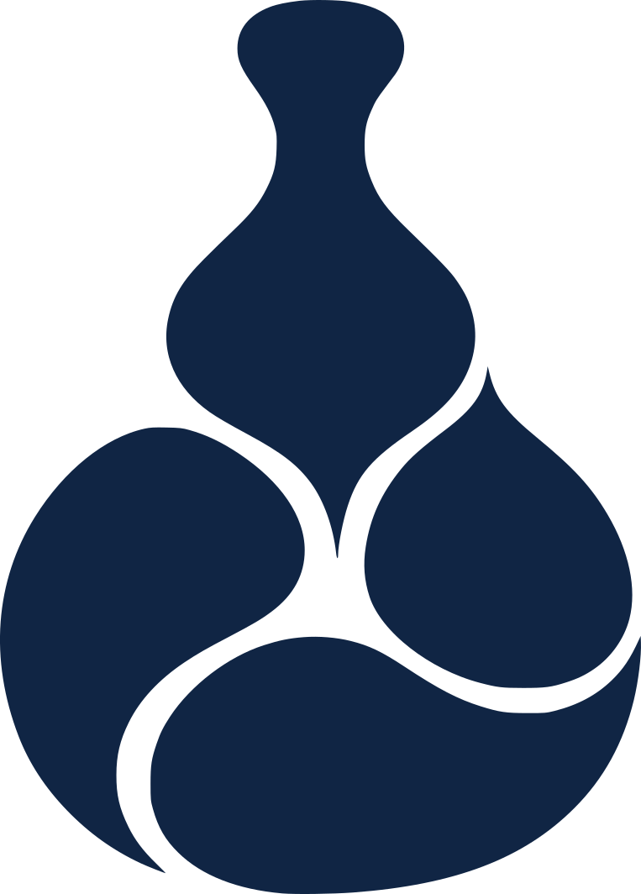
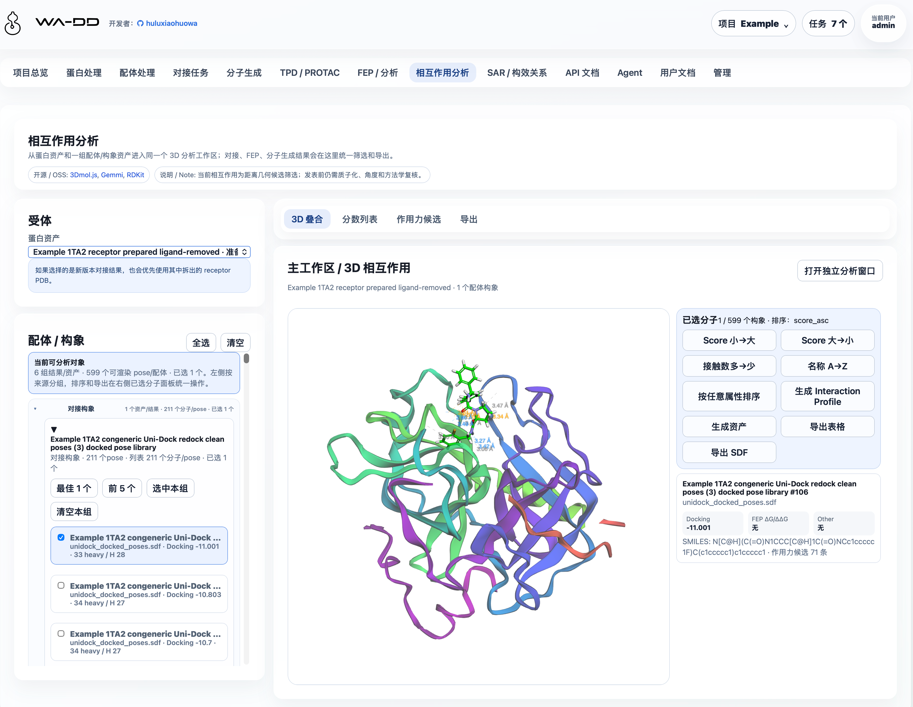
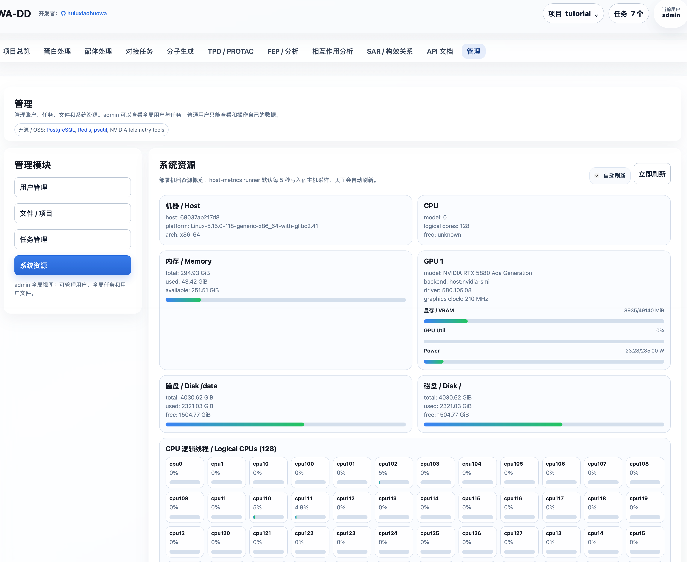
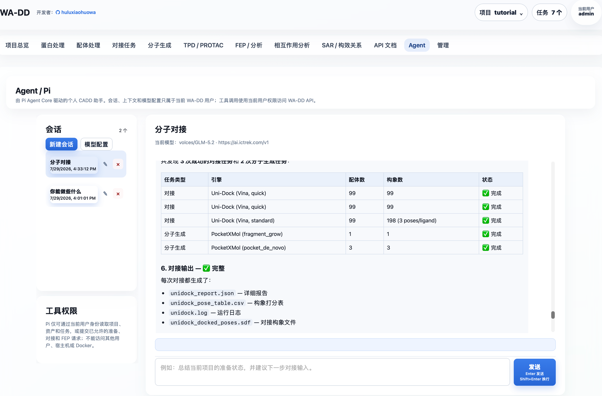

# WA-DD

<a id="chinese-guide"></a>

<p align="center">
  
</p>

## 面向药物研发的一体化分子设计工作台



WA-DD 专为计算机辅助药物设计（CADD）研究人员打造，将已可用的靶点蛋白处理、配体准备、分子对接、分子生成、相互作用分析和 FEP/RBFE dry-run 工作流整合到统一的浏览器界面中；正式自由能生产模拟仍在开发。

从 PDB 结构导入到配体库准备，从 Uni-Dock 对接到 PocketXMol 生成、FEP 规划和三维相互作用检查，所有中间结果都保留为可复用资产——WA-DD 让您专注于药物设计本身，而非工具链的拼凑与切换。


<a id="core-values-zh"></a>

### 核心价值

- **连续工作流**：已覆盖蛋白准备、配体准备、对接、分子生成、FEP/RBFE dry-run 和相互作用分析
- **资产化管理**：蛋白、口袋、配体、对接构象库、FEP 派生 SDF 和报告都沉淀为可复用、可追踪、可 API 调用的资产
- **灵活部署**：支持 x86 NVIDIA 和 Jetson Thor ARM64 平台，兼顾性能与边缘计算
- **开放生态**：对接 Uni-Dock、Vina、OpenFE、OpenMM 等主流 CADD 工具

<a id="feature-status-zh"></a>

### 功能状态

功能按用户能否在当前 WebApp 中完成端到端任务划分；“开发中”和“规划中”均不应视为生产可用能力。

| 状态 | 模块 | 当前可用范围 |
| --- | --- | --- |
| 已可用 | 项目与资产、蛋白处理、配体处理、对接任务、分子生成、相互作用分析 | 可创建并复用资产、提交任务、查看、筛选、导出或下载输出。 |
| 已可用 | FEP / RBFE dry-run | 可从 docked pose library 创建 ligand map 规划结果，生成 `fep_result` 和带 FEP 字段的 `fep_output` SDF；dry-run 不代表真实 ΔΔG。 |
| 已可用 | Agent / Pi、管理、系统资源、用户文档、API 文档 | 可管理个人 Agent 会话与模型配置；管理员可管理用户和任务；模块指南和 API 契约可直接浏览。 |
| 开发中 | FEP / 自由能生产计算 | 正式 OpenMM 生产模拟、真实 ΔG/ΔΔG、轨迹分析和长程 RBFE 科学验证仍待完成。 |
| 规划中 | TPD / PROTAC、SAR / 构效关系 | 目前仅保留功能定位与指南入口，尚无可提交的业务工作流。 |

#### 已可用

- **项目与资产**：按用户隔离项目、资产、任务和文件；资产支持预览、下载、重命名、删除和复制到其他项目。操作优先使用资产名称、类型和来源，不要求用户记裸 ID。
- **蛋白与配体处理**：支持 PDB ID/本地 PDB、SMILES/SDF/MOL/MOL2/PDB 导入，3D 预览、口袋定义、Ketcher 2D 编辑及蛋白/配体准备。配体资产按原始配体、准备后配体、对接构象、分子生成和 FEP 输出分组，可打开 2D/3D、排序、筛选、合并、导出。
- **对接与相互作用分析**：使用 Uni-Dock GPU（Vina/Vinardo 评分）提交对接任务；每组任务输出一个合并 SDF pose library 和报告。相互作用分析可从对接、生成或 FEP 输出中多选构象，检查几何接触、导出表格/SDF 或生成新资产。
- **分子生成**：PocketXMol 支持口袋 de novo 生成和 fragment growing；结果保存为可复用的 `prepared_ligand` 或 `prepared_ligand_library`。`scaffold hopping` 与 `linker design` 需要原子锚点选择器，当前未开放。
- **FEP / RBFE dry-run**：可基于 docked pose library 创建 RBFE 规划结果，输出 `fep_result` edge 表和带 FEP 字段的 `fep_output` SDF。dry-run 用于检查 ligand map 和结果联动，不产生真实 ΔG/ΔΔG 或轨迹。
- **Agent / Pi**：每位用户拥有独立会话、上下文和加密模型配置；受控工具仅能访问该用户有权限的项目、资产和任务。
- **管理、用户文档与自动化**：管理员可审核用户和管理全局任务；系统资源页显示宿主机 CPU、内存、磁盘和 GPU；Web 镜像会把 `userguide/*.md` 转换为页面内用户文档；API 文档基于 FastAPI OpenAPI，支持以 `project_id`、`asset_id` 和 `job_id` 串联自动化。





#### 开发中：尚不可作为完整生产工作流使用

- **FEP / 自由能生产计算**：OpenFE + OpenMM（CUDA）worker 仍面向正式采样与分析补齐；真实 ΔG/ΔΔG、误差、轨迹和长程 RBFE 科学验证尚未完成，当前不应据 dry-run 作出生产级 FEP 结论。

#### 规划中：尚未实现业务工作流

- **TPD / PROTAC**：拟支持 POI-E3 三元复合物设计、warhead/E3 ligand/linker 设计与降解剂优化；待 FEP 稳定后启动。
- **SAR / 构效关系**：拟支持活性数据表、R-group 分析、MMPA、构效关系可视化和下一轮设计候选推荐；尚未实现。

<a id="interaction-model-zh"></a>

### 交互结构

全局顶部只承载应用标题、项目上下文、任务中心、用户和退出。项目切换、新建、删除收进右上角项目菜单；任务进度收进任务中心，按步骤时间线显示，不在顶部铺绿色状态条。

每个业务模块按 CADD 操作流分层：

- 左侧：输入、参数、资产选择和提交动作。
- 右侧：主工作区、3D/2D 预览、编辑器、输出检查和下载入口。
- 需要大画布的功能，例如蛋白 3D 操作和 Ketcher 2D 分子编辑，提供专注编辑模式，可弹出为独立全屏窗口，完成后退出回到工作台。

<a id="deployment-zh"></a>

### 持久化路径与跨容器文件约定

所有业务容器必须把同一个宿主机目录挂载到容器内 `/data`：

```text
宿主机：${WA_DD_DATA_HOST_DIR}
容器内：/data
```

生产环境示例：

```bash
WA_DD_DATA_HOST_DIR=/data/ssd/jhu/wa-dd-web/data
```

web、protein-prep worker、ligand-prep worker 和后续模型 worker 都必须使用相同的容器内路径：

```text
/data/users/<user_id>/projects/<project_id>/assets/<asset_id>/...
/data/model-cache/...
```

数据库 `AssetFile.storage_path` 只记录容器内 `/data/...` 路径，不记录宿主机路径。这样 web 上传、worker 读取、worker 输出、web 下载和跨任务复用都使用同一套路径，不会因为不同容器看到不同目录而混乱。

`/modelhub` 是共享模型目录，不用于用户项目输入/输出文件。web 服务可以只读挂载用于状态查询；WA-DD 对接/模型 worker 必须读写挂载，用于 ModelScope 下载、更新和删除。

系统资源监控使用同一个 `/data` 挂载路径传递宿主机指标：

```text
/data/system-metrics/host.json
```

`wa-dd-host-metrics` runner 默认每 5 秒写入这个文件。Web 容器不需要 NVIDIA runtime；它只读取 JSON。runner 会在宿主机 namespace 中采集 GPU：Jetson/Thor/Tegra 主机优先使用 `tegrastats` 或 Jetson sysfs，不走 `nvidia-smi`；x86 NVIDIA 使用 `nvidia-smi`；ROCm 使用 `rocm-smi`。没有可用 GPU 工具时，页面会明确显示 GPU 不可见，而不是伪造占用数据。

### 默认账户

```text
username: admin
password: admin123456
```

新用户可以在登录页提交注册申请，必须由管理员审核后才能使用。后续接入 VOS 账户时，可通过受 `WA_DD_USER_PROVISION_TOKEN` 保护的接口自动创建用户空间。

### 独立 Docker 部署（当前）

根目录只有 [compose.yaml](compose.yaml)，只定义 `amd`（x86_64 CUDA 12.8）和 `thor`（Jetson Thor CUDA 13+）两个 profile。FEP 已作为 profile 内 worker 服务接入。

部署由 [deploy.sh](deploy.sh) 负责：它从 SWR 查询匹配当前平台 tag 规则的最新镜像，并更新**既有部署根目录**的 `images.env`。`runtime.env` 是持久化运行状态的映射，部署脚本只读取和校验它，绝不自动新建或改写它。`images.env.example` 只描述变量结构；[build_image.sh](build_image.sh) 只构建和推送镜像，不会修改仓库或部署目录中的版本记录。CPU 组件使用单一 Dockerfile；GPU 组件的 AMD CUDA 12.8 与 Thor CUDA 13+ Dockerfile 分开。

```bash
cp .env.web.example .env.web
# 编辑 .env.web：设置密码、端口及其他部署配置
./deploy.sh --profile amd --root /absolute/path/to/wa-dd-runtime
```

Thor 使用 `--profile thor`。部署根目录持有 `images.env` 与既有的 `runtime.env`，后者显式指定数据、数据库、Redis 与 Model Hub 的宿主机路径，因此持久化状态不会写入源码仓库。tc232 的既定运行根是 `/data/vos_workspace`，必须始终复用它，不能用新目录替代。首次部署前可用 `./deploy.sh --check --profile amd|thor` 验证镜像发现和 Compose 渲染。

**全量更新与单组件更新（两者都支持）：**

```bash
# 全量：检测所有组件的新镜像并协调整个 amd 服务组（原有用法，默认 --component all）
./deploy.sh --profile amd --root /data/vos_workspace

# 单组件：只检测 Web 镜像，只替换 Web；不重建 PostgreSQL、Redis 或其他 worker
./deploy.sh --profile amd --root /data/vos_workspace --component web

# 其他可单独替换的组件
./deploy.sh --profile amd --root /data/vos_workspace --component ligand-prep
./deploy.sh --profile thor --root /data/vos_workspace --component molecule-gen
```

可用组件为 `web`、`host-metrics`、`protein-prep`、`ligand-prep`、`unidock`、`molecule-gen`、`pi-agent`、`fep` 和 `all`。单组件模式只更新该组件对应的 `images.env` 条目，并使用 Compose 的 `--no-deps --force-recreate` 替换该服务；全量模式仍检测全部镜像并执行完整服务组更新。

如需发布新镜像，请在明确指定的构建环境运行 `./build_image.sh --profile amd|thor --component web|host-metrics|protein-prep|ligand-prep|unidock|molecule-gen|pi-agent|fep|all`。标签由组件是否使用 GPU 自动决定并推送到 `huluxiaohuowa`；Pi worker 是 CPU 组件，随 `all` 构建；FEP 仍不包含在 `all` 中。下次 `deploy.sh` 会重新发现并采用匹配的最新 tag。由于当前 Compose 包含 FEP worker，首次部署前 registry 也必须已有对应平台的 FEP 镜像，否则部署脚本会明确失败。Pi 复用 `WA_DD_DATA_HOST_DIR` 下的 `pi/` 目录；首次启动会自动生成并持久化配置加密主密钥，详见 [Agent / Pi](userguide/pi-agent.md)。

### 快速启动

**首次部署：**

```bash
cp .env.web.example .env.web
# 编辑 .env.web；部署根目录必须是绝对路径
./deploy.sh --profile amd --root /absolute/path/to/wa-dd-runtime
```

**Jetson Thor 部署：**

```bash
./deploy.sh --profile thor --root /absolute/path/to/wa-dd-runtime
```

服务启动后访问 `http://localhost:8800`，使用默认账户登录：

```text
用户名: admin
密码: admin123456
```

<a id="components-and-models-zh"></a>

### 支持的组件

当前 profile 会启动以下核心组件：

| 组件 | 说明 | 依赖 |
| --- | --- | --- |
| Web UI/API | 主界面与 REST API | CPU |
| Host metrics | 系统资源监控 | CPU |
| Protein prep | 蛋白准备（加氢、去溶剂化等） | CPU |
| Ligand prep | 配体准备（含 RDKit、OpenBabel、Meeko） | CPU |
| Uni-Dock | GPU 对接引擎（Vina/Vinardo） | NVIDIA GPU |
| Molecule gen | PocketXMol 分子生成 | NVIDIA GPU |
| FEP | OpenFE + OpenMM 自由能计算 | NVIDIA GPU（AMD 或 Thor） |

### 模型缓存

WA-DD 模型文件和 Model Hub 使用同一套持久化目录结构。当前主要模型包括：

- **PocketXMol（分子生成）**：`/modelhub/export/ms/huluxiaohuowa/pocketxmol/current`

宿主机路径是 `${MODEL_HUB_SHARED_MODELS_PATH}/export/ms/huluxiaohuowa/pocketxmol/current`。如果按本仓库的独立部署 compose 启动，`${MODEL_HUB_SHARED_MODELS_PATH}` 会映射到 `/modelhub`。

推荐通过网页"分子生成 → 模型状态"下载、检查更新或删除 PocketXMol 模型。命令行等价方式：

```bash
pip install modelscope
mkdir -p "${MODEL_HUB_SHARED_MODELS_PATH}/export/ms/huluxiaohuowa/pocketxmol/snapshots/manual"
modelscope download \
  --model huluxiaohuowa/pocketxmol \
  --local_dir "${MODEL_HUB_SHARED_MODELS_PATH}/export/ms/huluxiaohuowa/pocketxmol/snapshots/manual"
ln -sfn snapshots/manual "${MODEL_HUB_SHARED_MODELS_PATH}/export/ms/huluxiaohuowa/pocketxmol/current"
```

预期包含：

- `data/trained_models/pxm/checkpoints/pocketxmol.ckpt`
- `data/trained_models/pxm/train_config/train.yml`

模型更新不会在本地 `current` 已满足必需文件时盲目删除重下；worker 会优先检查 ModelScope 远端版本信息，只有需要替换时才切换到新的 snapshot。下载失败或取消时会保留同一版本的 partial snapshot，后续更新可继续补齐，不会先删除再全量重下。WA-DD 和 Model Hub 使用同一目录规范，因此任一系统下载的 `huluxiaohuowa/pocketxmol` 都能被另一方读取、更新和删除。

Uni-Dock 对接引擎为传统分子对接程序，不依赖神经网络模型文件。

<a id="api-automation-zh"></a>

### API 自动化

标准 API 契约由 FastAPI 自动生成：

- `/openapi.json`
- `/docs`
- `/redoc`

网页内的 API 文档页面也会读取 `/openapi.json`。自动化工作流按 `project_id`、`asset_id`、`job_id` 串联：

```text
login
  -> project_id
  -> protein asset_id
  -> pocket asset_id
  -> ligand asset_id
  -> prepared_ligand asset_id
  -> docking job
  -> job_id
  -> output_asset_ids
  -> file download
```

<a id="user-guides-zh"></a>

### 使用指南

模块级使用指南在 [userguide](userguide)：

- [Example 1TA2 完整范例](userguide/example-1ta2-workflow.md)
- [项目与资产](userguide/project-and-assets.md)
- [蛋白处理](userguide/protein-preparation.md)
- [1A2C 蛋白准备示例](userguide/1A2C-protein-preparation.md)
- [配体处理](userguide/ligand-preparation.md)
- [配体准备功能框架](userguide/ligand-preparation-research-and-framework.md)
- [对接任务](userguide/docking-tasks.md)
- [分子生成](userguide/molecule-generation.md)
- [FEP 与分析](userguide/fep-analysis.md)
- [相互作用分析](userguide/interaction-analysis.md)
- [TPD / PROTAC](userguide/tpd-protac.md)
- [SAR / 构效关系](userguide/sar.md)
- [管理](userguide/admin.md)
- [Agent / Pi](userguide/pi-agent.md)
- [API 自动化](userguide/api-automation.md)

<a id="vos-packaging-zh"></a>

### VOS 打包

VOS 包模板位于 `ictrek.app/`，当前独立 WebApp 开发不依赖 VOS：

```bash
cd ictrek.app
./scripts/package.sh
```

<a id="license-zh"></a>

### 来源与许可

WA-DD 当前以资产管理、蛋白/配体准备、Uni-Dock 对接、PocketXMol 分子生成、FEP/RBFE dry-run 和相互作用分析为核心。

项目源代码采用 [Business Source License 1.1](LICENSE)：
- **非商业用途**：可用于学术研究和教育目的，但不得分发或商业使用
- **商业用途**：需联系 Licensor 获取商业授权
- **变更条款**：2029-07-31 后自动变更为 Apache License 2.0

第三方组件（如 deepternary/DockQ、mmrotate 等）仍分别适用其自身许可证。

<a id="english-guide"></a>

## English Guide

WA-DD is an integrated molecular design workbench for Computer-Aided Drug Design (CADD) researchers. It unifies the available target-protein preparation, ligand preparation, molecular docking, molecule generation, interaction analysis, and FEP/RBFE dry-run workflows in one browser interface; formal free-energy production simulation remains in development.

From PDB import and ligand-library preparation through Uni-Dock screening, PocketXMol generation, FEP planning, and 3D interaction inspection, WA-DD keeps every intermediate result as a reusable asset—so you can focus on drug design rather than toolchain integration and switching.

<a id="core-values-en"></a>

### Core Values

- **Connected workflows**: Available workflows cover protein preparation, ligand preparation, docking, molecule generation, FEP/RBFE dry-run, and interaction analysis
- **Asset-based management**: Proteins, pockets, ligands, docking pose libraries, FEP-derived SDFs, and reports are reusable, traceable, API-addressable assets
- **Flexible deployment**: Supports x86 NVIDIA and Jetson Thor ARM64 platforms, balancing performance and edge computing
- **Open ecosystem**: Integrates with Uni-Dock, Vina, OpenFE, OpenMM, and other mainstream CADD tools

<a id="feature-status-en"></a>

### Feature status

Status is based on whether a user can complete an end-to-end task in the current WebApp. “In development” and “planned” must not be treated as production-ready functionality.

| Status | Modules | Available scope |
| --- | --- | --- |
| Available | Projects and assets, protein preparation, ligand preparation, docking tasks, molecule generation, interaction analysis | Create and reuse assets, submit jobs, and inspect, filter, export, or download outputs. |
| Available | FEP / RBFE dry-run | Create ligand-map planning results from docked pose libraries and generate `fep_result` plus FEP-annotated `fep_output` SDF assets. Dry-run results are not real ΔΔG. |
| Available | Agent / Pi, administration, system resources, user docs, API docs | Manage personal Agent sessions and model settings; administer users/jobs; browse module guides and the API contract. |
| In development | FEP / free-energy production calculation | Formal OpenMM production simulation, real ΔG/ΔΔG, trajectory analysis, and long-running RBFE validation remain unfinished. |
| Planned | TPD / PROTAC, SAR | Documentation describes the intended scope, but no submit-ready workflow is available. |

#### Available now

- **Projects and assets**: isolate projects, assets, jobs, and files per user. Assets can be previewed, downloaded, renamed, deleted, and copied to another project. The UI is name-first: users select by asset name, type, and source instead of memorizing raw IDs.
- **Protein and ligand preparation**: import PDB ID/local PDB or SMILES/SDF/MOL/MOL2/PDB, inspect structures in 3D, define pockets, edit molecules with Ketcher, and run protein or ligand preparation. Ligand assets are grouped by source, including raw ligands, prepared ligands, docking poses, molecule-generation outputs, and FEP outputs, and can be opened in 2D/3D, sorted, filtered, merged, or exported.
- **Docking and interaction analysis**: submit Uni-Dock GPU docking jobs (Vina/Vinardo scoring). Each docking task emits one merged SDF pose library plus reports. Interaction analysis can compare selected poses from docking, generation, or FEP outputs, inspect geometric contacts, export tables/SDF, or save a new selected-poses asset.
- **Molecule generation**: PocketXMol provides pocket de novo generation and fragment growing. Results are reusable `prepared_ligand` or `prepared_ligand_library` assets. `Scaffold hopping` and `linker design` require an atom-anchor selector and are not available yet.
- **FEP / RBFE dry-run**: build RBFE planning results from docked pose libraries and emit a `fep_result` edge table plus a FEP-annotated `fep_output` SDF. Dry-run checks ligand maps and downstream UI wiring; it does not produce real ΔG/ΔΔG or trajectories.
- **Agent / Pi**: each user has separate conversations, context, and encrypted model configuration. Its controlled tools can access only projects, assets, and jobs within that user's permissions.
- **Administration, user docs, and automation**: administrators can approve users and manage global jobs. The system-resources view reports host CPU, memory, disk, and GPU state. The Web image converts `userguide/*.md` into in-app user documentation. API documentation is generated from FastAPI OpenAPI and supports automation chaining with `project_id`, `asset_id`, and `job_id`.

#### In development: not yet a complete production workflow

- **FEP / free-energy production calculation**: the OpenFE + OpenMM (CUDA) worker path still needs formal sampling and analysis completion. Real ΔG/ΔΔG, uncertainty, trajectories, and long-running RBFE scientific validation remain unfinished; dry-run output must not be used for production-grade FEP conclusions.

#### Planned: no business workflow is implemented yet

- **TPD / PROTAC**: intended for POI-E3 ternary-complex design, warhead/E3-ligand/linker design, and degrader optimization. Development starts after FEP stabilizes.
- **SAR / Structure-Activity Relationship**: intended for activity tables, R-group analysis, MMPA, SAR visualization, and next-round candidate recommendation. It is not implemented yet.

<a id="interaction-model-en"></a>

### Interaction model

The global top chrome contains only the app title, project context, task center, user identity, and logout. Project switching, creation, and deletion live in the project menu near the user controls. Job progress lives in the task center as a step timeline, not as a green status bar across the top of the page.

Each workflow module follows the same CADD layout:

- Left side: inputs, parameters, asset selection, and submit actions.
- Right side: the main workspace, 3D/2D preview, editors, output inspection, and download actions.
- Canvas-heavy tools such as the protein 3D editor and Ketcher 2D editor provide a focus mode. Focus mode opens a full-window editing surface and returns to the workbench after saving or exiting.

<a id="deployment-en"></a>

### Persistent storage and cross-container paths

All business containers must mount the same host directory to `/data`:

```text
Host: ${WA_DD_DATA_HOST_DIR}
Container: /data
```

Production example:

```bash
WA_DD_DATA_HOST_DIR=/data/ssd/jhu/wa-dd-web/data
```

The web container, protein-prep worker, ligand-prep worker, and future model workers must all use the same in-container paths:

```text
/data/users/<user_id>/projects/<project_id>/assets/<asset_id>/...
/data/model-cache/...
```

`AssetFile.storage_path` stores only `/data/...` paths, never host paths. This keeps upload, worker input, worker output, web download, and cross-step reuse consistent across containers.

`/modelhub` is a shared model directory and is not used for user project inputs or outputs. The web service may mount it read-only for status checks; WA-DD docking/model workers must mount it read-write for ModelScope download, update, and delete operations.

System monitoring uses the same `/data` mount to pass host metrics into the Web UI:

```text
/data/system-metrics/host.json
```

The `wa-dd-host-metrics` runner writes this file every 5 seconds by default. The Web container does not need NVIDIA runtime; it only reads the JSON snapshot. The runner enters the host namespace and collects GPU data with `tegrastats` or Jetson sysfs first on Jetson/Thor/Tegra hosts, without using `nvidia-smi` there; x86 NVIDIA uses `nvidia-smi`, and ROCm uses `rocm-smi`. If no GPU tool is available, the page explicitly reports that GPU data is not visible instead of fabricating utilization values.

### Default account

```text
username: admin
password: admin123456
```

New users can submit registration requests from the login page. Admin approval is required before they can use the workbench. Later VOS account integration can use the `WA_DD_USER_PROVISION_TOKEN` protected endpoint to provision user spaces automatically.

### Standalone Docker deployment (current)

The root [compose.yaml](compose.yaml) is the only standalone Compose file. Its only profiles are `amd` (x86_64 CUDA 12.8) and `thor` (Jetson Thor CUDA 13+); FEP is included as a profile-specific worker service.

Deployment is handled by [deploy.sh](deploy.sh): it queries SWR for the newest tags matching the selected platform and updates `images.env` in the **existing deployment root**. `runtime.env` maps persistent runtime state; deploy only reads and validates it and never creates or rewrites it. `images.env.example` defines only the variable shape. [build_image.sh](build_image.sh) builds and pushes images, but never updates a repository or deployment-root image record. CPU components have one Dockerfile each, while GPU components retain separate AMD CUDA 12.8 and Thor CUDA 13+ Dockerfiles.

```bash
cp .env.web.example .env.web
# Edit .env.web for passwords, ports, and other deployment settings.
./deploy.sh --profile amd --root /absolute/path/to/wa-dd-runtime
```

For Thor, use `--profile thor`. The deployment root owns `images.env` and an existing `runtime.env`; the latter explicitly maps data, database, Redis, and Model Hub host paths, keeping persistent state out of the source tree. tc232 always reuses `/data/vos_workspace`; it must not be replaced with a new root. Before a first deployment, `./deploy.sh --check --profile amd|thor` validates registry discovery and the rendered Compose configuration.

**Complete and component updates are both supported:**

```bash
# Complete update: discover all images and reconcile the entire AMD service group.
./deploy.sh --profile amd --root /data/vos_workspace

# Component update: discover and replace Web only; database, Redis, and workers stay running.
./deploy.sh --profile amd --root /data/vos_workspace --component web

# Other independently replaceable components.
./deploy.sh --profile amd --root /data/vos_workspace --component ligand-prep
./deploy.sh --profile thor --root /data/vos_workspace --component molecule-gen
```

Components are `web`, `host-metrics`, `protein-prep`, `ligand-prep`, `unidock`, `molecule-gen`, `pi-agent`, `fep`, and `all`. Component mode updates only its matching `images.env` entry and replaces only that service with Compose `--no-deps --force-recreate`; complete mode continues to discover all images and update the complete service group.

To publish a new image, run `./build_image.sh --profile amd|thor --component web|host-metrics|protein-prep|ligand-prep|unidock|molecule-gen|pi-agent|fep|all` only in an explicitly chosen build environment. Tags are derived from component GPU capability and pushed to `huluxiaohuowa`; the CPU Pi worker is included in `all`, while FEP is excluded. The next `deploy.sh` run discovers and adopts the newest matching tag. Because the current Compose group includes an FEP worker, its platform-specific image must already exist in the registry before a first deployment or the deployment script will fail clearly. Pi persists its configuration and conversations under `WA_DD_DATA_HOST_DIR/pi`; see [Agent / Pi](userguide/pi-agent.md).

### Quick Start

**First-time deployment:**

```bash
cp .env.web.example .env.web
# Edit .env.web; the deployment root must be absolute.
./deploy.sh --profile amd --root /absolute/path/to/wa-dd-runtime
```

**Jetson Thor deployment:**

```bash
./deploy.sh --profile thor --root /absolute/path/to/wa-dd-runtime
```

After startup, access `http://localhost:8800` and log in with the default account:

```text
username: admin
password: admin123456
```

<a id="components-and-models-en"></a>

### Supported Components

The selected profile starts the following core components:

| Component | Description | Dependency |
| --- | --- | --- |
| Web UI/API | Main interface and REST API | CPU |
| Host metrics | System resource monitoring | CPU |
| Protein prep | Protein preparation (hydrogenation, desolvation, etc.) | CPU |
| Ligand prep | Ligand preparation (RDKit, OpenBabel, Meeko) | CPU |
| Uni-Dock | GPU docking engine (Vina/Vinardo) | NVIDIA GPU |
| Molecule gen | PocketXMol molecule generation | NVIDIA GPU |
| FEP | OpenFE + OpenMM free energy calculation | NVIDIA GPU (AMD or Thor) |

### Model cache

WA-DD model files share the same persistent directory layout as Model Hub. Current primary models include:

- **PocketXMol (molecule generation)**: `/modelhub/export/ms/huluxiaohuowa/pocketxmol/current`

The host path is `${MODEL_HUB_SHARED_MODELS_PATH}/export/ms/huluxiaohuowa/pocketxmol/current`. With the standalone compose files in this repository, `${MODEL_HUB_SHARED_MODELS_PATH}` is mounted into WA-DD containers as `/modelhub`.

Prefer downloading, checking updates, and deleting the PocketXMol model from the web page under "Molecule Generation → Model Status". The command-line equivalent is:

```bash
pip install modelscope
mkdir -p "${MODEL_HUB_SHARED_MODELS_PATH}/export/ms/huluxiaohuowa/pocketxmol/snapshots/manual"
modelscope download \
  --model huluxiaohuowa/pocketxmol \
  --local_dir "${MODEL_HUB_SHARED_MODELS_PATH}/export/ms/huluxiaohuowa/pocketxmol/snapshots/manual"
ln -sfn snapshots/manual "${MODEL_HUB_SHARED_MODELS_PATH}/export/ms/huluxiaohuowa/pocketxmol/current"
```

Expected files:

- `data/trained_models/pxm/checkpoints/pocketxmol.ckpt`
- `data/trained_models/pxm/train_config/train.yml`

Model updates do not delete and re-download a ready `current` directory blindly. The worker checks the ModelScope remote version first and switches `current` only after a complete replacement snapshot is ready. Failed or canceled downloads keep the partial snapshot for the same remote version so the next update can resume instead of starting from zero.

The Uni-Dock docking engine is a traditional molecular docking program and does not depend on neural network model files.

<a id="api-automation-en"></a>

### API automation

The canonical API contract is generated by FastAPI:

- `/openapi.json`
- `/docs`
- `/redoc`

The in-app API docs page also reads `/openapi.json`. Automation chains should pass `project_id`, `asset_id`, and `job_id` between steps:

```text
login
  -> project_id
  -> protein asset_id
  -> pocket asset_id
  -> ligand asset_id
  -> prepared_ligand asset_id
  -> docking job
  -> job_id
  -> output_asset_ids
  -> file download
```

<a id="user-guides-en"></a>

### User guides

Module guides are available under [userguide](userguide):

- [Example 1TA2 full walkthrough](userguide/example-1ta2-workflow.md)
- [Projects and assets](userguide/project-and-assets.md)
- [Protein preparation](userguide/protein-preparation.md)
- [1A2C protein preparation example](userguide/1A2C-protein-preparation.md)
- [Ligand preparation](userguide/ligand-preparation.md)
- [Ligand preparation framework](userguide/ligand-preparation-research-and-framework.md)
- [Docking tasks](userguide/docking-tasks.md)
- [Molecule generation](userguide/molecule-generation.md)
- [FEP and analysis](userguide/fep-analysis.md)
- [Interaction analysis](userguide/interaction-analysis.md)
- [TPD / PROTAC](userguide/tpd-protac.md)
- [SAR](userguide/sar.md)
- [Admin](userguide/admin.md)
- [Agent / Pi](userguide/pi-agent.md)
- [API automation](userguide/api-automation.md)

<a id="vos-packaging-en"></a>

### VOS packaging

The VOS package scaffold lives in `ictrek.app/`. The standalone WebApp workflow does not depend on VOS:

```bash
cd ictrek.app
./scripts/package.sh
```
