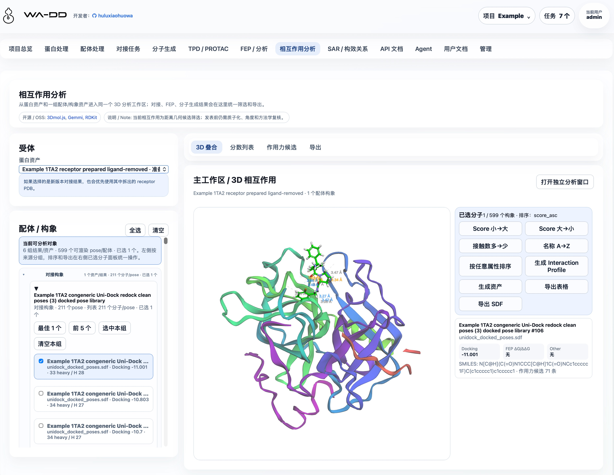
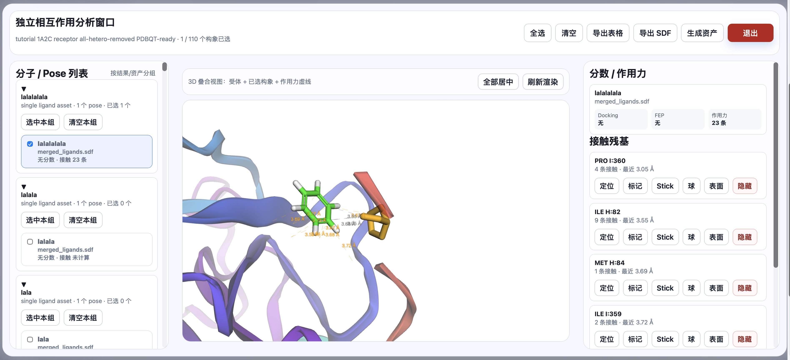
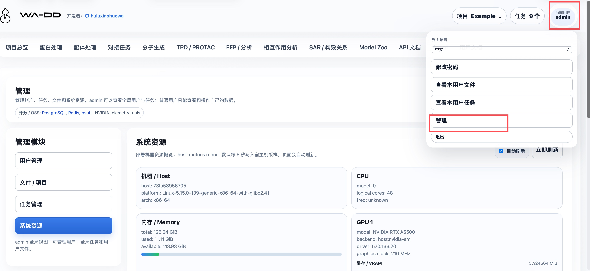

# WA-DD

<p align="center">
  
</p>

> [English documentation](README.EN.md)

> **开发者**：[huluxiaohuowa](https://github.com/huluxiaohuowa) · 本项目仍处于开发中，如需测试请联系 qhulu@outlook.com（仅接受学术科研机构和大专院校的测试申请，暂不接受公司商业化合作）。

## 面向药物研发的一体化分子设计工作台



WA-DD 专为计算机辅助药物设计（CADD）研究人员打造，将靶点蛋白处理、配体准备、分子对接、分子生成、FEP/RBFE 自由能生产计算和相互作用分析整合到统一的浏览器界面中。

从 PDB 结构导入到配体库准备，从 Uni-Dock 对接到 PocketXMol 生成、FEP 规划和三维相互作用检查，所有中间结果都保留为可复用资产——WA-DD 让您专注于药物设计本身，而非工具链的拼凑与切换。



<a id="core-values-zh"></a>

### 核心价值

- **连续工作流**：已覆盖蛋白准备、配体准备、对接、分子生成、FEP/RBFE 生产计算和相互作用分析
- **资产化管理**：蛋白、口袋、配体、对接构象库、FEP 派生 SDF 和报告都沉淀为可复用、可追踪、可 API 调用的资产
- **灵活部署**：支持 x86 NVIDIA 和 Jetson Thor ARM64 平台，兼顾性能与边缘计算
- **开放生态**：对接 Uni-Dock、Vina、OpenFE、OpenMM 等主流 CADD 工具

<a id="feature-status-zh"></a>

### 功能状态

功能按用户能否在当前 WebApp 中完成端到端任务划分；“规划中”模块不应视为生产可用能力。

| 状态 | 模块 | 当前可用范围 |
| --- | --- | --- |
| 已可用 | 项目与资产、蛋白处理、配体处理、对接任务、分子生成、相互作用分析 | 可创建并复用资产、提交任务、查看、筛选、导出或下载输出。 |
| 已可用 | FEP / RBFE 生产计算 | 支持 OpenFE + OpenMM（CUDA）进行真实 ΔG/ΔΔG 自由能计算；可选择 dry-run 规划或完整生产模拟；输出 edge 结果表、带 FEP 字段的 SDF 和轨迹文件。 |
| 已可用 | Model Zoo、TPD / PROTAC、Agent / Pi、管理、系统资源、用户文档、API 文档 | 可集中下载和更新项目模型；TPD 可提交 DeepTernary 结构建模任务；可管理个人 Agent 会话与模型配置；管理员可管理用户和任务；模块指南和 API 契约可直接浏览。 |
| 规划中 | SAR / 构效关系 | 目前仅保留功能定位与指南入口，尚无可提交的业务工作流。 |

#### 已可用

- **项目与资产**：按用户隔离项目、资产、任务和文件；资产支持预览、下载、重命名、删除和复制到其他项目。操作优先使用资产名称、类型和来源，不要求用户记裸 ID。
- **蛋白与配体处理**：支持 PDB ID/本地 PDB、SMILES/SDF/MOL/MOL2/PDB 导入，3D 预览、口袋定义、Ketcher 2D 编辑及蛋白/配体准备。配体资产按原始配体、准备后配体、对接构象、分子生成和 FEP 输出分组，可打开 2D/3D、排序、筛选、合并、导出。
- **对接与相互作用分析**：使用 Uni-Dock GPU（Vina/Vinardo 评分）提交对接任务；每组任务输出一个合并 SDF pose library 和报告。相互作用分析可从对接、生成或 FEP 输出中多选构象，检查几何接触、导出表格/SDF 或生成新资产。
- **分子生成**：PocketXMol 支持口袋 de novo 生成和 fragment growing；结果保存为可复用的 `prepared_ligand` 或 `prepared_ligand_library`。`scaffold hopping` 与 `linker design` 需要原子锚点选择器，当前未开放。
- **FEP / RBFE 生产计算**：基于 OpenFE + OpenMM（CUDA）执行真实相对结合自由能计算。支持 star 拓扑网络、Lomap 原子映射、dry-run 规划预览和完整生产模拟。每个 edge 输出 ΔΔG (kcal/mol)、误差和轨迹文件（DCD），结果汇总为 `fep_result` edge 表和带 FEP 字段的 `fep_output` SDF。支持从对接姿势库或准备好的配体 SDF 直接启动。
- **Model Zoo**：集中管理项目模型，置顶 PocketXMol 和 DeepTernary，并支持自选 ModelScope / HuggingFace 仓库下载。模型路径采用 `/data/export/ms|hf/.../current` 兼容结构，便于后续与 VOS 中的 model-hub 对接。
- **TPD / PROTAC**：DeepTernary 任务以 POI、E3、degrader/MGD 和 PROTAC 辅助 PDB 资产为输入，输出 `ternary_complex` 结构假设。binary ligand/mask PDB 可从蛋白页共晶配体生成 TPD PDB 资产，或在配体页上传 PDB 后选择。
- **Agent / Pi**：每位用户拥有独立会话、上下文和加密模型配置；受控工具仅能访问该用户有权限的项目、资产和任务。
- **管理、用户文档与自动化**：管理员可审核用户和管理全局任务；系统资源页显示宿主机 CPU、内存、磁盘和 GPU；Web 镜像会把 `userguide/*.md` 转换为页面内用户文档；API 文档基于 FastAPI OpenAPI，支持以 `project_id`、`asset_id` 和 `job_id` 串联自动化。




#### 规划中：尚未实现业务工作流

- **SAR / 构效关系**：拟支持活性数据表、R-group 分析、MMPA、构效关系可视化和下一轮设计候选推荐。

<a id="interaction-model-zh"></a>

### 交互结构

全局顶部只承载应用标题、项目上下文、任务中心、用户和退出。项目切换、新建、删除收进右上角项目菜单；任务进度收进任务中心，按步骤时间线显示，不在顶部铺绿色状态条。

每个业务模块按 CADD 操作流分层：

- 左侧：输入、参数、资产选择和提交动作。
- 右侧：主工作区、3D/2D 预览、编辑器、输出检查和下载入口。
- 需要大画布的功能，例如蛋白 3D 操作和 Ketcher 2D 分子编辑，提供专注编辑模式，可弹出为独立全屏窗口，完成后退出回到工作台。

<a id="deployment-zh"></a>

### 持久化路径与跨容器文件约定

所有业务容器必须把同一个宿主机目录挂载到容器内 `/data`：

```text
宿主机：${WA_DD_DATA_HOST_DIR}
容器内：/data
```

生产环境示例：

```bash
WA_DD_DATA_HOST_DIR=/data/ssd/jhu/wa-dd-web/data
```

web、protein-prep worker、ligand-prep worker 和后续模型 worker 都必须使用相同的容器内路径：

```text
/data/users/<user_id>/projects/<project_id>/assets/<asset_id>/...
/data/model-cache/...
```

数据库 `AssetFile.storage_path` 只记录容器内 `/data/...` 路径，不记录宿主机路径。这样 web 上传、worker 读取、worker 输出、web 下载和跨任务复用都使用同一套路径，不会因为不同容器看到不同目录而混乱。

`/modelhub` 是共享模型目录，不用于用户项目输入/输出文件。Model Zoo 服务把同一宿主目录挂载为 `/data`，并维护 `export/ms|hf/<org>/<repo>/snapshots/...` 与 `current` 稳定入口；web 和模型 worker 通过 `/modelhub/export/.../current` 读取。该结构与 VOS 中的 model-hub 对接路径兼容。

系统资源监控使用同一个 `/data` 挂载路径传递宿主机指标：

```text
/data/system-metrics/host.json
```

`wa-dd-host-metrics` runner 默认每 5 秒写入这个文件。Web 容器不需要 NVIDIA runtime；它只读取 JSON。runner 会在宿主机 namespace 中采集 GPU：Jetson/Thor/Tegra 主机优先使用 `tegrastats` 或 Jetson sysfs，不走 `nvidia-smi`；x86 NVIDIA 使用 `nvidia-smi`；ROCm 使用 `rocm-smi`。没有可用 GPU 工具时，页面会明确显示 GPU 不可见，而不是伪造占用数据。

### 默认账户

```text
username: admin
password: admin123456
```

新用户可以在登录页提交注册申请，必须由管理员审核后才能使用。后续接入 VOS 账户时，可通过受 `WA_DD_USER_PROVISION_TOKEN` 保护的接口自动创建用户空间。

### 独立 Docker 部署（当前）

部署包目录是 [deploy/](deploy/)。该目录里的 [compose.yaml](deploy/compose.yaml) 只定义 `amd`（x86_64 CUDA 12.8）和 `thor`（Jetson Thor CUDA 13+）两个 profile。FEP 已作为 profile 内 worker 服务接入。

部署由 [deploy/deploy.sh](deploy/deploy.sh) 负责：它从 SWR 查询匹配当前平台 tag 规则的最新镜像，并更新部署根目录的 `images.env`。显式传入 `--root` 时，脚本完全使用用户指定的目录；未传 `--root` 时，脚本才会从当前正在运行的 `wa-dd` 容器挂载中推断既有部署根目录。`runtime.env` 是持久化运行状态的映射，部署脚本不会覆盖已存在的运行配置。[deploy/images.env.example](deploy/images.env.example) 只描述变量结构；[build_image.sh](build_image.sh) 只构建和推送镜像，不会修改仓库或部署目录中的版本记录。CPU 组件使用单一 Dockerfile；GPU 组件的 AMD CUDA 12.8 与 Thor CUDA 13+ Dockerfile 分开。部署逻辑、Compose 模板、镜像变量模板和默认 Web 环境配置后续都统一维护在 [deploy/](deploy/) 目录。

```bash
cd deploy
# 首次部署前可编辑 env.web：设置密码、端口及其他部署配置
./deploy.sh --profile amd --root /absolute/path/to/wa-dd-runtime
```

Thor 使用 `--profile thor`。部署根目录持有 `images.env` 与既有的 `runtime.env`，后者显式指定数据、数据库、Redis 与 Model Hub 的宿主机路径，因此持久化状态不会写入源码仓库。升级已有部署时，推荐先从当前运行容器的挂载或既有运行目录确认 root；如果确认无误，可以继续显式传入同一个 `--root`，也可以省略 `--root` 让脚本从正在运行的 `wa-dd` 容器中推断。首次部署前可在 `deploy/` 目录运行 `./deploy.sh --check --profile amd|thor` 验证镜像发现和 Compose 渲染。

**全量更新与单组件更新（两者都支持）：**

```bash
# 全量：检测所有组件的新镜像并协调整个 amd 服务组（原有用法，默认 --component all）
cd deploy
./deploy.sh --profile amd --root /absolute/path/to/wa-dd-runtime

# 单组件：只检测 Web 镜像，只替换 Web；不重建 PostgreSQL、Redis 或其他 worker
./deploy.sh --profile amd --root /absolute/path/to/wa-dd-runtime --component web

# 其他可单独替换的组件
./deploy.sh --profile amd --root /absolute/path/to/wa-dd-runtime --component ligand-prep
./deploy.sh --profile thor --root /absolute/path/to/wa-dd-runtime --component molecule-gen
```

可用组件为 `web`、`model-zoo`、`host-metrics`、`protein-prep`、`ligand-prep`、`unidock`、`molecule-gen`、`deepternary`、`pi-agent`、`fep` 和 `all`。单组件模式只更新该组件对应的 `images.env` 条目，并使用 Compose 的 `--no-deps --force-recreate` 替换该服务；全量模式仍检测全部镜像并执行完整服务组更新。

如需发布新镜像，请在明确指定的构建环境运行 `./build_image.sh --profile amd|thor --component web|model-zoo|host-metrics|protein-prep|ligand-prep|unidock|molecule-gen|deepternary|pi-agent|fep|all`。标签由组件是否使用 GPU 自动决定并推送到 `huluxiaohuowa`；`model-zoo` 是 CPU 组件，使用同一个 `Dockerfile.model-zoo`，只按 amd/arm 平台区分标签；Pi worker 也是 CPU 组件，随 `all` 构建；DeepTernary 与 FEP 为 GPU 大镜像，仍需显式指定组件构建。下次 `deploy.sh` 会重新发现并采用匹配的最新 tag。由于当前 Compose 包含 FEP 和 DeepTernary worker，首次部署前 registry 也必须已有对应平台的 FEP/DeepTernary 镜像，否则部署脚本会明确失败；thor DeepTernary 暂无 tag 时，`deploy.sh --check` 会先写入保留的完整镜像名，便于后续在 tc81 构建补齐。Pi 复用 `WA_DD_DATA_HOST_DIR` 下的 `pi/` 目录；首次启动会自动生成并持久化配置加密主密钥，详见 [Agent / Pi](userguide/pi-agent.md)。

### 快速启动

**首次部署：**

```bash
cd deploy
# 首次部署前可编辑 env.web；部署根目录必须是绝对路径
./deploy.sh --profile amd --root /absolute/path/to/wa-dd-runtime
```

**Jetson Thor 部署：**

```bash
cd deploy
./deploy.sh --profile thor --root /absolute/path/to/wa-dd-runtime
```

服务启动后访问 `http://localhost:8800`，使用默认账户登录：

```text
用户名: admin
密码: admin123456
```

<a id="components-and-models-zh"></a>

### 支持的组件

当前 profile 会启动以下核心组件：

| 组件 | 说明 | 依赖 |
| --- | --- | --- |
| Web UI/API | 主界面与 REST API | CPU |
| Model Zoo | 模型下载、更新和 ModelHub 兼容路径管理 | CPU |
| Host metrics | 系统资源监控 | CPU |
| Protein prep | 蛋白准备（加氢、去溶剂化等） | CPU |
| Ligand prep | 配体准备（含 RDKit、OpenBabel、Meeko） | CPU |
| Uni-Dock | GPU 对接引擎（Vina/Vinardo） | NVIDIA GPU |
| Molecule gen | PocketXMol 分子生成 | NVIDIA GPU |
| FEP | OpenFE + OpenMM 自由能计算 | NVIDIA GPU（AMD 或 Thor） |

### 模型缓存

WA-DD 模型文件和 Model Hub 使用同一套持久化目录结构。当前主要模型包括：

- **PocketXMol（分子生成）**：`/modelhub/export/ms/huluxiaohuowa/pocketxmol/current`
- **DeepTernary（TPD / PROTAC）**：`/modelhub/export/ms/huluxiaohuowa/deepternary/current`

宿主机路径是 `${MODEL_HUB_SHARED_MODELS_PATH}/export/ms|hf/<org>/<repo>/current`。如果按本仓库的独立部署 compose 启动，`${MODEL_HUB_SHARED_MODELS_PATH}` 会映射到 web/worker 容器的 `/modelhub`，并映射到 `wa-dd-model-zoo` 容器的 `/data`。

推荐通过网页 `Model Zoo` 下载和更新 PocketXMol、DeepTernary 或自选模型；分子生成和 TPD 页面内的小卡片仍可查看对应模型是否就绪。命令行等价方式：

```bash
pip install modelscope
mkdir -p "${MODEL_HUB_SHARED_MODELS_PATH}/export/ms/huluxiaohuowa/pocketxmol/snapshots/manual"
modelscope download \
  --model huluxiaohuowa/pocketxmol \
  --local_dir "${MODEL_HUB_SHARED_MODELS_PATH}/export/ms/huluxiaohuowa/pocketxmol/snapshots/manual"
ln -sfn snapshots/manual "${MODEL_HUB_SHARED_MODELS_PATH}/export/ms/huluxiaohuowa/pocketxmol/current"
```

预期包含：

- `data/trained_models/pxm/checkpoints/pocketxmol.ckpt`
- `data/trained_models/pxm/train_config/train.yml`

模型更新不会在本地 `current` 已满足必需文件时盲目删除重下；Model Zoo 会把新下载内容放入新的 snapshot，校验必需文件后再切换 `current`。WA-DD 和 Model Hub 使用同一目录规范，因此任一系统下载的 `huluxiaohuowa/pocketxmol` 或 `huluxiaohuowa/deepternary` 都能被另一方读取和更新。

Uni-Dock 对接引擎为传统分子对接程序，不依赖神经网络模型文件。

<a id="api-automation-zh"></a>

### API 自动化

标准 API 契约由 FastAPI 自动生成：

- `/openapi.json`
- `/docs`
- `/redoc`

网页内的 API 文档页面也会读取 `/openapi.json`。自动化工作流按 `project_id`、`asset_id`、`job_id` 串联：

```text
login
  -> project_id
  -> protein asset_id
  -> pocket asset_id
  -> ligand asset_id
  -> prepared_ligand asset_id
  -> docking job
  -> job_id
  -> output_asset_ids
  -> file download
```

<a id="user-guides-zh"></a>

### 使用指南

模块级使用指南在 [userguide](userguide)：

- [Example 1TA2 完整范例](userguide/example-1ta2-workflow.md)
- [项目与资产](userguide/project-and-assets.md)
- [蛋白处理](userguide/protein-preparation.md)
- [1A2C 蛋白准备示例](userguide/1A2C-protein-preparation.md)
- [配体处理](userguide/ligand-preparation.md)
- [配体准备功能框架](userguide/ligand-preparation-research-and-framework.md)
- [对接任务](userguide/docking-tasks.md)
- [分子生成](userguide/molecule-generation.md)
- [Model Zoo](userguide/model-zoo.md)
- [FEP 与分析](userguide/fep-analysis.md)
- [相互作用分析](userguide/interaction-analysis.md)
- [TPD / PROTAC](userguide/tpd-protac.md)
- [TPD / PROTAC 5T35 案例](userguide/tpd-protac-5t35-case.md)
- [SAR / 构效关系](userguide/sar.md)
- [管理](userguide/admin.md)
- [Agent / Pi](userguide/pi-agent.md)
- [API 自动化](userguide/api-automation.md)

<a id="vos-packaging-zh"></a>

### VOS 打包

VOS 包模板位于 `ictrek.app/`，当前独立 WebApp 开发不依赖 VOS：

```bash
cd ictrek.app
./scripts/package.sh
```

<a id="license-zh"></a>

### 来源与许可

WA-DD 当前以资产管理、蛋白/配体准备、Uni-Dock 对接、PocketXMol 分子生成、FEP/RBFE 生产计算和相互作用分析为核心。

项目源代码采用 [Business Source License 1.1](LICENSE)：
- **非商业用途**：可用于学术研究和教育目的，但不得分发或商业使用
- **商业用途**：需联系 Licensor 获取商业授权
- **变更条款**：2029-07-31 后自动变更为 Apache License 2.0

第三方组件（如 deepternary/DockQ、mmrotate 等）仍分别适用其自身许可证。
