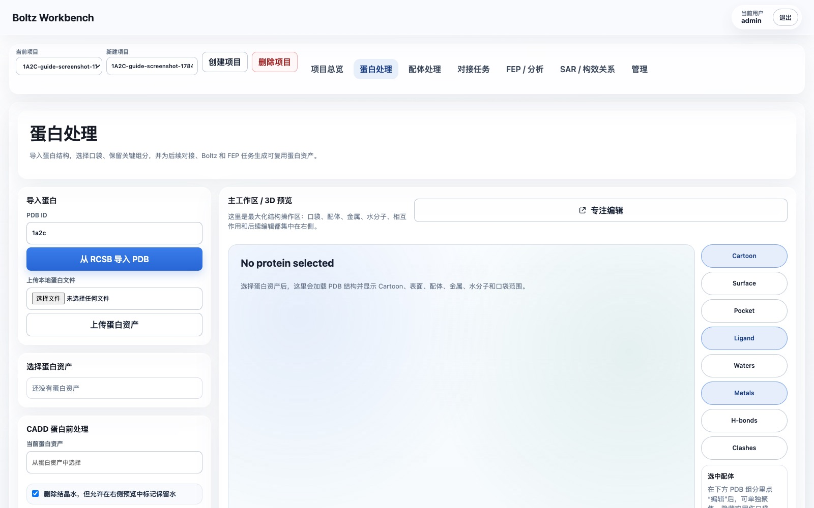
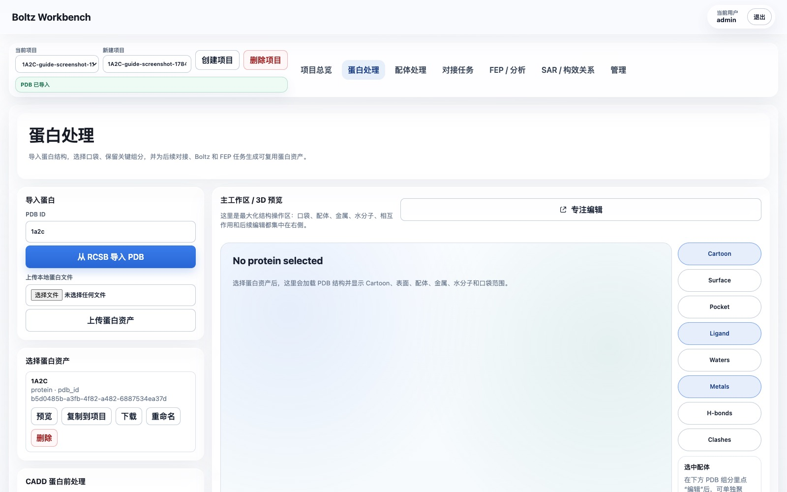
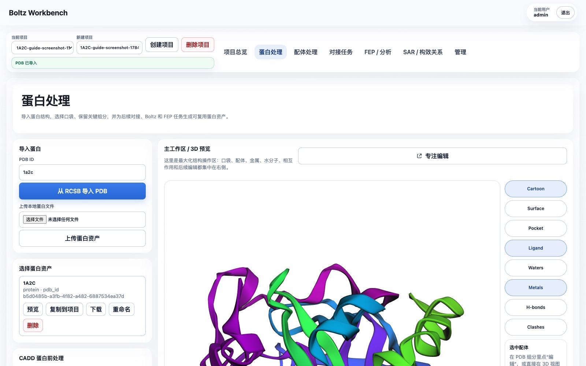
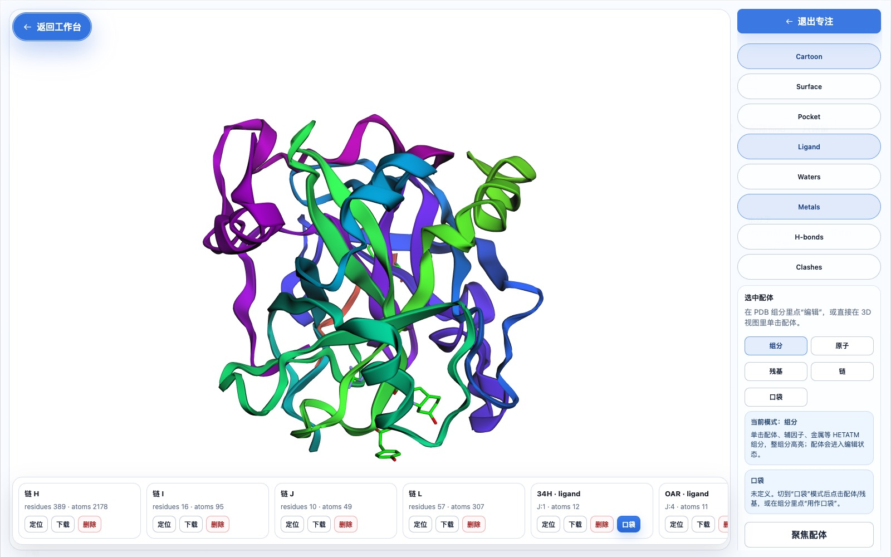
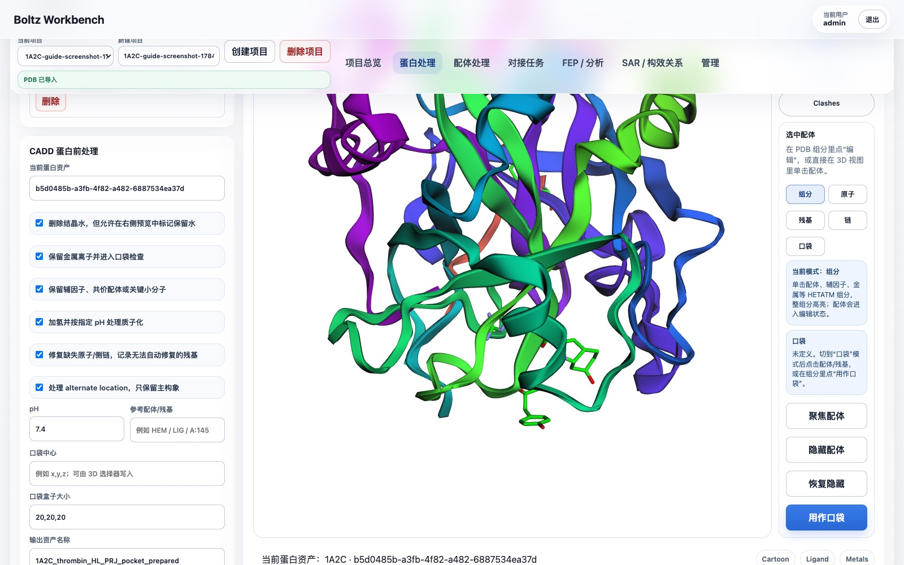
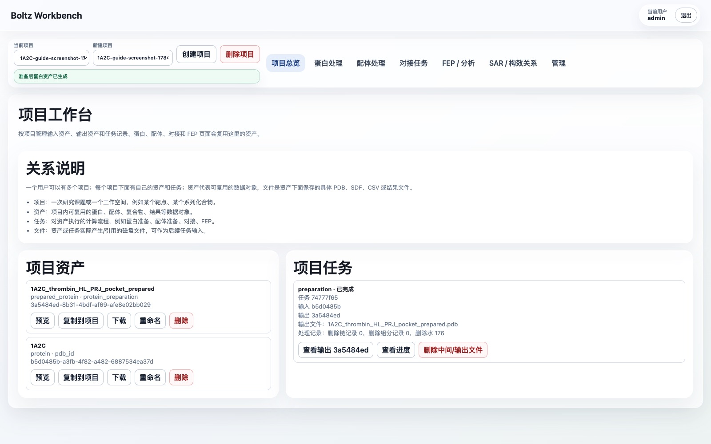

> [中文文档](1A2C-protein-preparation.md)

# 1A2C Protein Preparation Web Guide

This guide uses PDB `1A2C` as an example. It explains how to choose the reference ligand, define a docking pocket, run protein preparation in WA-DD, and reuse the prepared receptor and pocket in downstream docking workflows.

## English quick path

1. Log in as `admin / admin123456`.
2. Create a project such as `tutorial-1A2C-thrombin`.
3. Open `Protein Preparation`, import PDB ID `1a2c`, and preview the imported protein asset.
4. In the PDB component list, use `PRJ J:3` as the pocket reference. It sits in the middle of the Aeruginosin 298-A inhibitor chain.
5. Set the pocket center to approximately `18.54, -14.79, 20.56` and start with a `20, 20, 20 Å` box. Increase to `22, 22, 22 Å` if you want to cover the full inhibitor chain more conservatively.
6. Keep thrombin chains `H/L`; remove the original inhibitor chain `J` before preparing the receptor. Remove hirudin chain `I` if the task is ordinary small-molecule docking against thrombin.
7. Keep `NA H:626` unless your downstream method requires all ions removed. Remove crystallographic waters by default.
8. Run protein preparation and use the generated `prepared_protein` asset plus the `pocket` asset in the docking page.

## 1. Which ligand to choose for this structure

`1A2C` is the complex of thrombin with the inhibitor Aeruginosin 298-A. In the PDB file this inhibitor is not a single three-letter ligand, but chain `J`:

```text
chain J: 34H J:1 + LEU J:2 + PRJ J:3 + OAR J:4
```

The PDB component list in the web UI will show the HETATM components separately:

| Component | Type | Recommended as docking pocket |
| --- | --- | --- |
| `34H J:1` | Aeruginosin fragment | Can help confirm pocket boundaries |
| `PRJ J:3` | Aeruginosin middle fragment | Recommended as the pocket center reference in the web UI |
| `OAR J:4` | Aeruginosin terminal guanidinium fragment | Can help confirm pocket boundaries |
| `TYS I:363` | Sulfonated tyrosine on hirudin chain I | Not recommended as a small-molecule docking pocket |
| `NA H:626` | Sodium ion | Keep; do not use as a small-molecule pocket center |
| `HOH/WAT` | Crystallographic water | Delete by default unless key waters need to be retained |

Recommended approach:

- Biological reference ligand: use the entire `chain J`, i.e. Aeruginosin 298-A.
- Single-component reference for "use as pocket" in the web UI: select `PRJ J:3`.
- Recommended starting pocket center: `18.54, -14.79, 20.56`.
- Recommended starting pocket box: `20, 20, 20 Å`.

Reason: `PRJ J:3` is located in the middle of the chain J inhibitor. Using it as the center and adjusting the box to about `20 Å` covers the entire binding region of `34H/LEU/PRJ/OAR`. Do not use `TYS I:363` to define the small-molecule docking pocket; it belongs to the hirudin fragment and is not the small-molecule ligand this example intends to replace or reproduce.

## 2. Import 1A2C in the web UI

1. Open WA-DD.
2. Log in:
   - Username: `admin`
   - Password: `admin123456`
3. Go to `Project Overview`.
4. Create a new project, for example:
   - `tutorial-1A2C-thrombin`
5. Open the `Protein Preparation` page.
6. In the `Import PDB from RCSB` input, enter:
   - `1a2c`
7. Click `Import PDB from RCSB`.
8. In the left `Select Protein Asset` panel, click the newly imported `1A2C`, then click `Preview`.

The page before import looks like this:



After import is complete, the `1A2C` protein asset appears on the left:



The 3D workspace on the right should display the protein structure, with chains, ligands, waters, metals, and other objects visible.



## 3. Select the reference ligand and define the pocket

1. On the right side of the `Protein Preparation` page, click `Focus Edit`.
2. In the Focus Edit window on the right, choose a mode:
   - It is recommended to start with `Components` mode.
3. In the bottom horizontal object bar, find:
   - `PRJ · ligand · J:3`
4. Click the `PRJ J:3` object card, or click the corresponding ligand fragment in the 3D view.
5. Click `Use as Pocket`.

In the Focus Edit window, the bottom horizontal object bar lists protein chains, ligands, metals, waters, and other PDB objects:


6. Turn on the `Pocket` display switch and confirm that a blue pocket box appears in the 3D view.
7. In the pocket parameters on the right, adjust the box to:
   - `SX = 20`
   - `SY = 20`
   - `SZ = 20`
8. If you need more conservative coverage of the entire chain J, use:
   - `SX = 22`
   - `SY = 22`
   - `SZ = 22`
9. While adjusting, check whether the blue box covers the region of `34H/LEU/PRJ/OAR`.
10. Click `Create Pocket Asset`.

After selecting `PRJ J:3`, use it as the pocket reference:



Once created, this pocket asset appears in the project assets and is automatically filled into the pocket input of subsequent docking tasks.

## 4. What to delete and what to keep during protein preparation

Recommended parameters for this example:

| Item | Recommendation |
| --- | --- |
| Water molecules | Delete by default |
| Metal ion `NA H:626` | Keep |
| Cofactors / key HETATM | Keep unless you clearly know they are not needed |
| Reference inhibitor chain `J` | If you intend to reproduce the ligand with docking, remove it from the receptor |
| Hirudin chain `I` | Decide based on your research goal; if only doing thrombin small-molecule pocket docking, it is recommended to delete it |
| Thrombin chains `H/L` | Keep |

Recommended receptor preparation strategy:

- Keep thrombin `H` and `L` chains.
- Delete chain `J`, because it is the original co-crystallized inhibitor and should not remain in the receptor to be docked.
- If the goal is ordinary small-molecule docking, also delete the `I` chain hirudin fragment, to prevent it from occupying an exosite and biasing the pocket environment.
- Keep the `NA` metal ion unless the downstream method explicitly requires all ions to be removed.
- Delete water molecules as the default starting point; if key waters are later found to participate in important interactions, retain them individually.

Web UI steps:

1. In the object bar at the bottom of the Focus Edit window, find `chain J`.
2. Click `Delete` to add the original inhibitor chain J to the deletion list.
3. If this task only studies the thrombin small-molecule pocket, also find `chain I` and click `Delete`.
4. Exit Focus Edit and return to `Protein Preparation`.
5. In the `CADD Protein Pre-Processing` area, confirm:
   - Remove structural waters: checked.
   - Keep metal ions: checked.
   - Keep cofactors, covalent ligands, or key small molecules: choose based on your research goal; in this example, if chain J has already been removed, you can leave it checked.
   - pH: `7.4`.
6. Suggested output name:
   - `1A2C thrombin prepared for docking`

Protein preparation parameter confirmation page:



## 5. Run the protein preparation task

1. In `Current Protein Asset`, confirm that the original `1A2C` asset is selected.
2. Confirm that the pocket parameters have been filled in, with the box at `20, 20, 20 Å` or your manually adjusted values.
3. Click `Prepare Protein`.
4. Go to `Project Overview` or the task list on the current page to view the task.

The task should display:

- `queued`
- `running`
- `completed`

When complete, a new `prepared_protein` asset is generated.

After the task completes, you can see the task card and output asset in the project overview:



## 6. View, download, and reuse the output

After preparation is complete:

1. In the task card, click `View Output`.
2. On the output asset page, confirm:
   - Type: `prepared_protein`
   - File: the prepared `.pdb`
   - Metadata: includes deleted waters, deleted chains, pocket parameters, and processing statistics.
3. Click `Download` to download the prepared PDB.
4. In the subsequent `Docking Tasks` page, select this `prepared_protein` as the protein input.
5. If another project also needs to use it, click `Copy to Project` on the asset card, enter the target project ID, and rename the copied asset.

## 7. How to handle failed tasks

If a task fails:

1. In the task card, click `View Progress` to read the error message first.
2. If the task has already produced partial output, click `Delete Intermediate/Output Files`.
3. After modifying the parameters, click `Continue/Rerun`.
4. After rerunning, a new output asset is generated, and the original task record is preserved for tracking.

## 8. Current implementation boundaries

The web UI currently supports trackable PDB file-level preparation:

- Delete specified chains.
- Delete specified HETATM components.
- Delete water molecules.
- Generate a downloadable, reusable `prepared_protein` asset that can be copied to other projects.
- Record task status, progress events, output files, and cleanup statistics.

The following chemistry preparation steps are not yet actually performed:

- Add hydrogens.
- pH-related protonation.
- Missing atom / missing residue repair.
- Conformation selection for alternate locations.

These steps are recorded in the task metadata's `unsupported_operations` field, and will be executed only after PDBFixer/OpenMM, PropKa/PDB2PQR, Reduce, or similar workers are integrated in the future.
