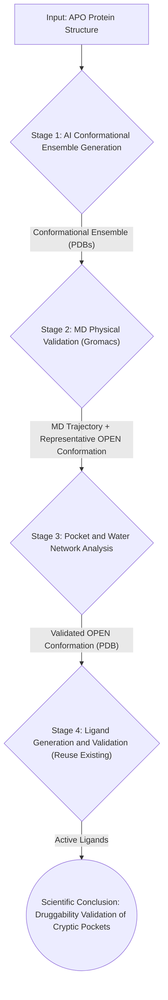

> [中文文档](案例：隐式口袋发现工作流.md)

# Case: Cryptic Pocket Discovery Workflow

## 1. Case Concept and Scientific Problem

### 1.1 Background and Challenge

In drug discovery, the traditional Structure-Based Drug Design (SBDD) workflow typically relies on a static protein structure (often in the apo state or complexed with a known ligand). However, many important drug targets, such as **KRAS G12C**, **SHP2**, and **BTK**, possess a unique class of binding sites known as **cryptic pockets**.

Characteristics of cryptic pockets include:
- They are **absent or not fully exposed** in the static protein structure (especially the apo state).
- Their formation results from **ligand-induced fit** or represents a rare conformational state accessible through protein dynamics.
- Traditional molecular docking algorithms, which assume a rigid protein, **systematically miss** these important druggable sites.

### 1.2 Scientific Problem

This case aims to address the following core scientific question:

> **How to build a computational and verifiable closed-loop workflow to predict, validate, and exploit cryptic protein pockets?**

Specifically, we explore:
1. **Conformational Ensemble Generation**: Can AI models (based on ColabFold, a community-optimized version of AlphaFold2) generate ensembles of protein conformations that represent "openable" states, serving as candidates for cryptic pockets?
2. **Physical Validation**: Can molecular dynamics (MD) simulations, particularly enhanced sampling techniques, physically verify whether these candidate conformations can genuinely open pockets?
3. **Ligand-Induced Closed Loop**: Once a pocket is physically validated, can we generate and optimize ligands on this "open" conformation and quantify their binding advantage using methods like FEP?

### 1.3 Research Value

- **Scientific Value**: Addresses the core AI for Science question of whether AI-predicted conformations have physical realism.
- **Engineering Value**: Provides an automated pipeline that transforms cryptic pocket discovery from "expert intuition and manual trial" to a "reproducible, quantifiable computational process."
- **Application Value**: Offers a new strategy for first-in-class drug design targeting KRAS, MYC, and other challenging targets.

---

## 2. Workflow Design and Task Decomposition

To realize this concept, we designed a closed-loop workflow with four core stages. The WA-DD platform will fully support this pipeline through new Worker components and existing ones.

### 2.1 Workflow Data Flow



### 2.2 Task Decomposition and New Components

| Stage | Task Description | WA-DD Component | Status |
| :--- | :--- | :--- | :--- |
| **1. AI Conformational Ensemble** | Generate multiple candidate protein conformations using ColabFold (community-optimized AlphaFold2) via MSA subsampling. | **New**: `wa-dd-conformer-gen` (Conformer Generation Worker) | 🔄 In Development |
| **2. MD Physical Validation** | Run enhanced sampling MD simulations on candidate conformations using Gromacs to verify pocket opening. | **New**: `wa-dd-md-engine` (MD Simulation Worker) | 🚀 Planned |
| **3. Pocket & Water Analysis** | Extract pocket opening events from MD trajectories and analyze water thermodynamics. | **New**: `wa-dd-pocket-analyzer` (Pocket Analysis Worker) | 🚀 Planned |
| **4. Ligand Generation & Validation** | Generate ligands on validated OPEN conformation and perform docking and FEP validation. | **Reuse**: `wa-dd-molecule-gen`, `wa-dd-unidock`, `wa-dd-fep` | ✅ Ready |

---

## 3. Validation Process (Single-Server Progressive Plan)

We will use **KRAS G12C** as a model target to validate this workflow. KRAS G12C has a classic cryptic pocket in its Switch II region, which opens upon binding with covalent inhibitors (like ARS-1620).

Given the current resource of a single server (tc232/server6), we adopt a **"pyramid-style progressive validation"** strategy, ensuring each step can be completed within a short timeframe and produces deterministic evidence.

### 3.1 Four-Layer Progressive Validation Plan

| Layer | Goal | Computational Task | Single-Server Time | Validation Output |
| :--- | :--- | :--- | :--- | :--- |
| **L0: Baseline Validation** | Can FEP distinguish Open vs APO conformations? | Calculate ΔΔG of ARS-1620 analog on KRAS G12C known OPEN (6GJ8) and APO (4OBE) structures | 1-2 days | FEP ΔΔG result table (showing OPEN ΔG significantly优于 APO) |
| **L1: AI Prediction** | Can AI predict the OPEN conformation? | ColabFold MSA subsampling, generate 10 candidate conformations | Half a day | Conformational ensemble + RMSD comparison with 6GJ8 |
| **L2: Physical Validation** | Is AI-predicted conformation physically stable? | Run 5ns aMD on AI top conformation + baseline, compare RMSD drift | 1-2 days | MD trajectory + RMSD evolution curves |
| **L3: Closed-Loop Discovery** | Can AI-discovered conformation induce ligand binding? | PocketXMol generates 10 molecules on AI conformation, Uni-Dock docking, Top 3 FEP | 3-5 days | ΔΔG < 0 for new molecules (validating druggability) |

### 3.2 Detailed Steps for Each Layer

#### L0: Baseline Validation (Day 1-2)
- **Goal**: Prove that WA-DD's FEP pipeline can physically distinguish OPEN vs APO conformations.
- **Input**: KRAS G12C APO (PDB: 4OBE), KRAS G12C OPEN (PDB: 6GJ8), ARS-1620 analog ligand.
- **Steps**:
    1. Process 4OBE and 6GJ8 with `wa-dd-protein-prep`.
    2. Prepare ARS-1620 analog with `wa-dd-ligand-prep`.
    3. Calculate binding ΔG on both conformations with `wa-dd-fep`.
- **Pass Criteria**: OPEN conformation ΔG is better than APO by -1.0 kcal/mol or more.

#### L1: AI Prediction (Day 3-4)
- **Goal**: Generate candidate conformations representing different states of the Switch II region.
- **Input**: KRAS G12C APO (PDB: 4OBE), ColabFold MSA public server.
- **Steps**:
    1. Run ColabFold MSA subsampling (10-50% ratio) on 4OBE with `wa-dd-conformer-gen`, generating 10 conformations.
    2. Calculate RMSD between each conformation and the Switch II region of 6GJ8.
    3. Screen candidate conformations with RMSD < 3.0Å (as input for L2).
- **Pass Criteria**: Find at least 1 conformation with RMSD < 3.0Å to 6GJ8.

#### L2: Physical Validation (Day 5-8)
- **Goal**: Validate the physical stability of AI-predicted conformations.
- **Input**: AI conformations screened in L1 + 6GJ8 baseline conformation.
- **Steps**:
    1. Run 5ns aMD simulations on 3 conformations each with `wa-dd-md-engine` (Gromacs).
    2. Analyze RMSD evolution and pocket volume changes with `wa-dd-pocket-analyzer`.
    3. Compare RMSD drift between AI conformations and 6GJ8.
- **Pass Criteria**: AI conformation RMSD drift < 2.0Å (comparable to 6GJ8).

#### L3: Closed-Loop Discovery (Day 9-14)
- **Goal**: Validate that AI-discovered conformations can be used for ligand design.
- **Input**: AI conformation validated in L2.
- **Steps**:
    1. De novo generate 10 molecules on AI conformation with `wa-dd-molecule-gen` (PocketXMol).
    2. Dock and screen Top 3 with `wa-dd-unidock`.
    3. Calculate ΔΔG of Top 3 with `wa-dd-fep`.
- **Pass Criteria**: At least 1 new molecule has ΔΔG < 0 (stronger binding than baseline ligand).

### 3.3 Expected Scientific Discovery Signals

1. **AI Prediction Accuracy Validation**: Evaluate what proportion of AI-generated conformations can stably exist in MD simulations and show pocket opening.
2. **Contribution of Conformational Entropy**: Quantify the contribution of conformational changes to binding free energy by comparing FEP results across different conformations.
3. **Water Molecule Role**: Analyze the ingress/egress patterns of water molecules during pocket opening in MD trajectories to identify potential "unhappy waters."

---

## 4. Development Progress

### 4.1 Completed
- **Scientific Problem Definition**: Clarified the scientific value and technical path of cryptic pocket discovery.
- **Workflow Design**: Completed the full data flow design from AI conformation generation to FEP validation, as well as the single-server progressive validation plan.
- **Existing Component Integration**: Confirmed that existing components like `protein-prep`, `molecule-gen`, `unidock`, and `fep` can be directly reused.

### 4.2 In Progress
- **`wa-dd-conformer-gen` Worker Design and Development**: Core integration of ColabFold (community-optimized AlphaFold2 v2.3.2) for MSA subsampling and conformation generation. ColabFold uses the open-source Apache 2.0 license and supports CUDA 13 (Thor) via `jax[cuda13]` and `openmm[cuda13]`.

### 4.3 Planned
- **`wa-dd-md-engine` Worker Design and Development**: Integrate Gromacs, focusing on aMD parameter optimization and GPU acceleration.
- **`wa-dd-pocket-analyzer` Worker Design and Development**: Integrate `fpocket` and `MDAnalysis` for trajectory analysis.
- **API & Frontend Integration**: Design API interfaces for new workers and add corresponding task submission and result display pages in the web UI.

### 4.4 Milestones
| Time | Milestone |
| :--- | :--- |
| **Phase 1 (Week 1)** | Complete `wa-dd-conformer-gen` MVP, run through L1 AI conformation generation. |
| **Phase 2 (Week 2)** | Complete `wa-dd-md-engine` MVP, run through L0 baseline FEP + L2 physical validation. |
| **Phase 3 (Week 3)** | Complete `wa-dd-pocket-analyzer`, run through L3 closed-loop discovery. |
| **Phase 4 (Week 4)** | Integrate all components, complete the full four-layer validation workflow. |

---

## 5. ColabFold Model Weights and Deployment

### 5.1 Model Weights Download

ColabFold uses the same model weights as AlphaFold2. The weight files are maintained by DeepMind and hosted on Google Cloud Storage.

| Resource | Download URL | Size | Description |
| :--- | :--- | :--- | :--- |
| **AlphaFold2 v2.3.2 parameters (recommended)** | `https://storage.googleapis.com/alphafold/alphafold_params_2022-12-06.tar` | ~3.4GB | Contains 5 models (model_1 ~ model_5), each ~1.7GB |
| **model_1 + model_2 only (minimal install)** | Same as above, keep only model_1 and model_2 after extraction | ~3.4GB | Only 2 models needed for MSA subsampling |

**Download commands**:
```bash
# Download the full parameter package
wget https://storage.googleapis.com/alphafold/alphafold_params_2022-12-06.tar

# Extract (includes model_1~model_5 and alphafold_multimer_v3, etc.)
tar xf alphafold_params_2022-12-06.tar

# Minimal install: keep only model_1 and model_2
mkdir -p /data/models/colabfold_params
cp alphafold_params_2022-12-06/model_1.npz /data/models/colabfold_params/
cp alphafold_params_2022-12-06/model_2.npz /data/models/colabfold_params/
```

### 5.2 MSA Acquisition Methods

ColabFold supports two MSA generation methods. We use the public server approach to avoid the ~940GB local database:

| Method | Space | Description |
| :--- | :--- | :--- |
| **Public MSA server (recommended)** | 0GB | Remote MSA retrieval via `colabfold.mmseqs.com` public server |
| **Local MMseqs2 database** | ~940GB | Requires downloading UniRef30 + BFD + ColabFold DB, only for large-scale parallel |

### 5.3 Thor (CUDA 13) Docker Build

The official ColabFold Docker image is based on CUDA 12. Thor (CUDA 13) requires a custom build. Key configuration:

```dockerfile
# Base image (consistent with FEP/Unidock Thor versions)
ARG COLABFOLD_THOR_BASE_IMAGE=nvcr.io/nvidia/cuda:13.0.2-runtime-ubuntu24.04

# JAX and OpenMM with CUDA 13 support
# ColabFold officially supports jax[cuda13] and openmm[cuda13]
RUN pip install 'jax[cuda13]>=0.4.0' 'openmm[cuda13]>=8.2.0'
RUN pip install 'colabfold[alphafold,openmm]>=1.6.2'
```

**Disk usage**: Image ~15GB + model weights ~3.4GB = **~18.4GB**

### 5.4 Minimal Verification Command

```bash
# KRAS G12C sequence
echo ">KRAS_G12C
MTEYKLVVVGAGGVGKSALTIQLIQNHFVDEYDPTIEDSYRKQVVIDGETCLLDILDTAGQEEYSAMRDQ
YMRTGEGFLCVFAINNTKSFEDIHQYREQIKRVKDSDDVPMVLVGNKCDLAARTVESRQAQDLARSYGIP
YIETSAKTRQGVEDAFYTLVREIRQH" > /tmp/kras_g12c.fasta

# ColabFold inference (MSA via public server, model weights mounted from /data/models/colabfold_params)
colabfold_batch /tmp/kras_g12c.fasta /tmp/kras_output \
  --model-type alphafold2_ptm \
  --num-models 2 \
  --amber \
  --num-recycle 3
```
