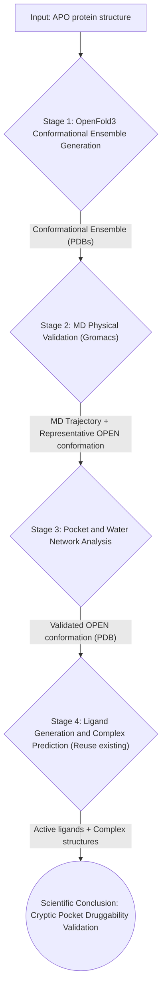

> [中文文档](案例：隐式口袋发现工作流.md)

# Case: Cryptic Pocket Discovery Workflow

## 1. Case Concept and Scientific Questions

### 1.1 Background and Challenges

In drug discovery, traditional Structure-Based Drug Design (SBDD) workflows typically rely on a static protein structure (usually apo state or a complex with a known ligand). However, many important drug targets such as **KRAS G12C**, **SHP2**, and **BTK** possess a special binding site — the **Cryptic Pocket**.

Cryptic pockets are characterized by:
- Being **absent or fully exposed** in static protein structures (especially apo state).
- Pocket formation resulting from **ligand-induced fit** or rare conformational states in protein dynamics.
- Traditional docking algorithms assuming a rigid protein, therefore **systematically missing** these important druggable sites.

### 1.2 Scientific Questions

This case aims to address the core scientific question:

> **How to build a computational, verifiable closed-loop workflow to predict, validate, and exploit cryptic pockets in proteins?**

Specifically, we explore:
1. **Conformational Ensemble Generation**: Can the OpenFold3 AI model (an open-source reproduction of AlphaFold3) generate an ensemble of "openable" protein conformations through template perturbation and ligand induction strategies, serving as candidate sources for cryptic pockets?
2. **Physical Validation**: Can molecular dynamics (MD) simulations, particularly enhanced sampling techniques, physically validate whether these candidate conformations can truly open pockets?
3. **Ligand-Induced Closed Loop**: Once a pocket is validated in physical simulations, can ligand generation and complex prediction be performed on this "open" conformation, with binding advantages quantified by methods such as FEP?

### 1.3 Research Value

- **Scientific Value**: Addresses the core question in AI for Science of whether AI-predicted conformations have physical authenticity.
- **Engineering Value**: Provides an automated toolchain that transforms cryptic pocket discovery from "reliance on expert intuition and manual experimentation" to "repeatable, quantifiable computational workflow".
- **Application Value**: Provides new strategies for first-in-class drug design targeting KRAS, MYC, and other targets.

---

## 2. Workflow Design and Task Decomposition

To realize the above concept, we designed a closed-loop workflow consisting of four core stages. The current WA-DD platform supports this workflow through the existing OpenFold3, GROMACS, PocketXMol, FEP, and standard asset-management stack. Pocket analysis is exposed as part of the GROMACS `pocket_discovery` protocol and can emit standard reusable `pocket` assets.

### 2.1 Workflow Data Flow

### 2.2 Task Decomposition and Component Status

| Stage | Task Description | WA-DD Component | Status |
| :--- | :--- | :--- | :--- |
| **1. OpenFold3 Conformational Ensemble Generation** | Generate multiple candidate protein conformations using the OpenFold3 model through template perturbation and ligand induction strategies. | `wa-dd-openfold3` | ✅ Integrated |
| **2. MD Physical Validation** | Perform enhanced sampling MD simulations on candidate conformations using GROMACS to validate pocket opening. | `wa-dd-gromacs` (`pocket_discovery` / aMD / analysis) | ✅ Integrated |
| **3. Pocket and Water Network Analysis** | Extract candidate pocket events, pocket-volume curves, and candidate pocket structures from MD outputs, then register reusable standard `pocket` assets. | Built-in pocket analyzer in `wa-dd-gromacs` | ✅ MVP integrated; deeper fpocket/MDAnalysis scoring remains planned |
| **4. Ligand Generation and Complex Prediction** | Generate ligands on validated OPEN conformations, predict complex structures via OpenFold3, and validate with FEP. | `wa-dd-molecule-gen`, `wa-dd-openfold3`, `wa-dd-fep` | ✅ Integrated |

### 2.3 OpenFold3 Conformational Ensemble Generation Strategies

OpenFold3 does not have built-in MSA subsampling, but generates conformational diversity through two complementary strategies:

| Strategy | Principle | Implementation |
| :--- | :--- | :--- |
| **Template Perturbation** | OpenFold3 supports template input; different templates induce different conformations | Provide 5 templates for KRAS G12C: APO (4OBE), GTP state (5VQ2), GDP state (4TQ9), Switch II OPEN (6GJ8), randomly perturbed APO |
| **Ligand Induction** | OpenFold3 can directly input ligands to predict complexes; different ligands induce different conformations | Input KRAS + known active ligands (ARS-1620, MRTX849) + fragment library, predict ~10 conformations |

Combined, these two strategies can generate approximately 15-20 candidate conformations.

---

## 3. Validation Process (Single-Server Progressive Approach)

We will use **KRAS G12C** as the model target to validate this workflow. The Switch II region of KRAS G12C contains a classic cryptic pocket that opens when bound to covalent inhibitors (such as ARS-1620).

Given the current available resources being a single server (tc232/server6), we adopt a **"pyramid-style progressive validation"** strategy, ensuring each step can be completed in the short term and produce deterministic evidence.

### 3.1 Four-Level Progressive Validation Plan

| Level | Goal | Computational Task | Single-Server Duration | Validation Output |
| :--- | :--- | :--- | :--- | :--- |
| **L0: Baseline Validation** | Can FEP distinguish Open vs APO conformations? | Calculate ΔΔG of ARS-1620 analogs using KRAS G12C known OPEN (6GJ8) and APO (4OBE) structures | 1-2 days | FEP ΔΔG result table (showing OPEN conformation ΔG significantly better than APO) |
| **L1: AI Prediction** | Can OpenFold3 predict the OPEN conformation? | OpenFold3 template perturbation + ligand induction, generate ~15 candidate conformations | Half a day | Conformational ensemble + RMSD comparison with 6GJ8 |
| **L2: Physical Validation** | Are AI-predicted conformations physically stable? | Run 5ns aMD on AI optimal conformation + baseline conformation, compare RMSD drift | 1-2 days | MD trajectory + RMSD evolution curve |
| **L3: Closed-Loop Discovery** | Can AI-discovered conformations induce ligand binding? | On AI-validated conformations, PocketXMol generates 10 molecules, OpenFold3 predicts complex structures, Top 3 selected for FEP | 3-5 days | ΔΔG < 0 for new molecules (validating druggability) |

### 3.2 Detailed Steps for Each Level

#### L0: Baseline Validation (Day 1-2)
- **Goal**: Prove that WA-DD's FEP pipeline can physically distinguish OPEN from APO conformations.
- **Input**: KRAS G12C APO (PDB: 4OBE), KRAS G12C OPEN (PDB: 6GJ8), ARS-1620 analog ligands.
- **Steps**:
    1. Process 4OBE and 6GJ8 with `wa-dd-protein-prep`.
    2. Prepare ARS-1620 analogs with `wa-dd-ligand-prep`.
    3. Calculate binding ΔG of ligands in both conformations with `wa-dd-fep`.
- **Pass Criteria**: OPEN conformation ΔG is -1.0 kcal/mol or more superior to APO conformation.

#### L1: AI Prediction (Day 3-4)
- **Goal**: Generate candidate conformations representing different states of the Switch II region.
- **Input**: KRAS G12C APO (PDB: 4OBE), using the OpenFold3 structure-prediction capability already integrated into the platform.
- **Steps**:
    1. Run OpenFold3 template perturbation (5 templates) on 4OBE with `wa-dd-openfold3`, generating 5 conformations.
    2. Run OpenFold3 ligand induction (5 ligands) on 4OBE with `wa-dd-openfold3`, generating 5 conformations.
    3. Calculate RMSD between each conformation and the Switch II region of 6GJ8.
    4. Screen candidate conformations with RMSD < 3.0Å (as input for L2).
- **Pass Criteria**: Find at least 1 conformation with RMSD < 3.0Å from 6GJ8.

#### L2: Physical Validation (Day 5-8)
- **Goal**: Validate the physical stability of AI-predicted conformations.
- **Input**: AI conformations screened from L1 + 6GJ8 baseline conformation.
- **Steps**:
    1. Run 5ns simulations on 3 conformations each with the `pocket_discovery` / aMD protocol in `wa-dd-gromacs`.
    2. Use the built-in GROMACS pocket analyzer to output `pocket_analyzer_report.json`, `pocket_events.csv`, `pocket_volume.csv`, and a standard `pocket` asset.
    3. Compare RMSD drift between AI conformations and 6GJ8.
- **Pass Criteria**: AI conformation RMSD drift < 2.0Å (comparable to 6GJ8).

#### L3: Closed-Loop Discovery (Day 9-14)
- **Goal**: Validate that AI-discovered conformations can be used for ligand design.
- **Input**: AI conformations validated from L2.
- **Steps**:
    1. De novo generate 10 molecules on AI conformations with `wa-dd-molecule-gen` (PocketXMol).
    2. Predict complex structures of "protein + new ligand" with OpenFold3 (replacing original Uni-Dock docking).
    3. Calculate ΔΔG of Top 3 with `wa-dd-fep`.
- **Pass Criteria**: At least 1 new molecule has ΔΔG < 0 (stronger binding than baseline ligand).

### 3.3 Expected Scientific Discovery Signals

1. **AI Prediction Capability Validation**: What proportion of OpenFold3 conformations generated through template perturbation and ligand induction can stably exist in MD simulations, and can pocket opening be observed.
2. **Dynamic Entropy Contribution**: Quantify the contribution of conformational changes to binding free energy by comparing FEP results across different conformations.
3. **Water Molecule Role**: Analyze water molecule entry/exit patterns during pocket opening in MD trajectories, identifying potential "unhappy water".
4. **OpenFold3 Complex Prediction Accuracy**: Compare the consistency between OpenFold3-predicted complex structures and FEP physical validation results.

---

## 4. Development Progress

### 4.1 Completed
- **Scientific Question Definition**: Clarified the scientific value and technical path of cryptic pocket discovery.
- **Workflow Design**: Completed the full data flow design from OpenFold3 conformation generation to FEP validation, as well as the single-server progressive validation plan.
- **Existing Component Integration**: `openfold3`, `gromacs`, `molecule-gen`, `fep`, and related components now share one asset chain.
- **Pocket Analyzer MVP**: GROMACS `pocket_discovery` can register `md_result`, candidate `pocket` assets, and a complete downloadable result package.

### 4.2 In Progress
- **OpenFold3 Conformation-Generation Validation**: Validate template perturbation, ligand-induced conformation generation, result screening, and UI chaining through the existing `wa-dd-openfold3` component.

### 4.3 Planned
- **Pocket Analyzer Depth**: Add fpocket, MDAnalysis, water-network analysis, and multi-frame pocket-event scoring without changing the standard `pocket` asset contract.
- **Case Evidence**: Fill the KRAS G12C L0-L3 example with real outputs, screenshots, and threshold evidence.

### 4.4 Milestones
| Timeline | Milestone |
| :--- | :--- |
| **Phase 1 (Week 1)** | Run L1 conformation generation and candidate screening with `wa-dd-openfold3`. |
| **Phase 2 (Week 2)** | Run L0 baseline FEP and L2 physical validation with `wa-dd-gromacs`. |
| **Phase 3 (Week 3)** | Use the GROMACS pocket analyzer to emit standard `pocket` assets and complete L3 closed-loop discovery. |
| **Phase 4 (Week 4)** | Add fpocket/MDAnalysis scoring, water-network analysis, and complete case evidence. |

---

## 5. Platform UI Operations and Asset Flow

This case targets an already deployed WA-DD instance. Regular users do not need to install OpenFold3 manually, download model weights, write Dockerfiles, or run commands inside containers; those are platform-operations concerns. The L0-L3 workflow should be completed through the Web UI as much as possible, with every step registered as project assets.

### 5.1 UI Entry Points

| Work | Page | Main Inputs | Main Outputs |
| :--- | :--- | :--- | :--- |
| Structure preparation | Protein Processing | PDB ID or uploaded PDB/CIF | `protein` / `prepared_protein` assets |
| Ligand preparation | Ligand Processing | SDF, SMILES, table, or drawn molecule | `ligand` / `prepared_ligand` assets |
| Conformation generation | Structure Prediction | Protein asset, template/ligand-induced parameters | OpenFold3 structure-result assets |
| MD and pocket analysis | GROMACS / MD | Protein/complex/topology/trajectory assets, `pocket_discovery` protocol | `md_result`, `pocket_analyzer_report.json`, `pocket_events.csv`, `pocket_volume.csv`, standard `pocket` assets |
| Molecule generation | Molecule Generation | Standard `pocket` asset and generation constraints | Candidate-molecule SDF assets |
| FEP validation | FEP / Analysis | Congeneric ligands, complexes, or docking/generation outputs | FEP result tables and downloadable result assets |

### 5.2 Standard Asset Chaining

- GROMACS `pocket_discovery` writes pocket-analysis outputs into the same task result and creates a standard `pocket` asset when a representative structure is available.
- Standard `pocket` assets can be selected directly in the Docking and Molecule Generation pages; users do not need to manually copy center coordinates or file paths.
- The task-output button in the upper-right task panel lists registered output assets; "download all outputs" packages all result files for that task.
- Individual result files remain openable or downloadable from asset details, including `json`, `csv`, `xvg`, `pdb`, `gro`, and `log` outputs.

### 5.3 Human Review Still Required

The platform handles the data flow and compute scheduling, but the cryptic-pocket case still requires scientific judgment:

- Choose APO, OPEN, ligand-induced, or template-perturbed conformations as controls.
- Decide whether RMSD, pocket volume, candidate residues, and FEP ΔΔG support the conclusion that a pocket is druggable.
- Manually review the current MVP pocket analyzer's geometry-defined candidate pockets; deeper fpocket, MDAnalysis, water-network, and multi-frame event scoring remain planned enhancements.
