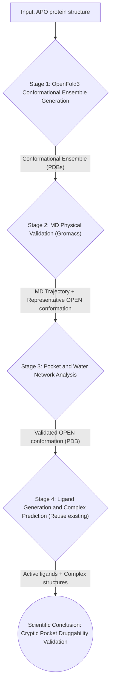

> [中文文档](案例：隐式口袋发现工作流.md)

# Case: Cryptic Pocket Discovery Workflow

## 1. Case Concept and Scientific Questions

### 1.1 Background and Challenges

In drug discovery, traditional Structure-Based Drug Design (SBDD) workflows typically rely on a static protein structure (usually apo state or a complex with a known ligand). However, many important drug targets such as **KRAS G12C**, **SHP2**, and **BTK** possess a special binding site — the **Cryptic Pocket**.

Cryptic pockets are characterized by:
- Being **absent or fully exposed** in static protein structures (especially apo state).
- Pocket formation resulting from **ligand-induced fit** or rare conformational states in protein dynamics.
- Traditional docking algorithms assuming a rigid protein, therefore **systematically missing** these important druggable sites.

### 1.2 Scientific Questions

This case aims to address the core scientific question:

> **How to build a computational, verifiable closed-loop workflow to predict, validate, and exploit cryptic pockets in proteins?**

Specifically, we explore:
1. **Conformational Ensemble Generation**: Can the OpenFold3 AI model (an open-source reproduction of AlphaFold3) generate an ensemble of "openable" protein conformations through template perturbation and ligand induction strategies, serving as candidate sources for cryptic pockets?
2. **Physical Validation**: Can molecular dynamics (MD) simulations, particularly enhanced sampling techniques, physically validate whether these candidate conformations can truly open pockets?
3. **Ligand-Induced Closed Loop**: Once a pocket is validated in physical simulations, can ligand generation and complex prediction be performed on this "open" conformation, with binding advantages quantified by methods such as FEP?

### 1.3 Research Value

- **Scientific Value**: Addresses the core question in AI for Science of whether AI-predicted conformations have physical authenticity.
- **Engineering Value**: Provides an automated toolchain that transforms cryptic pocket discovery from "reliance on expert intuition and manual experimentation" to "repeatable, quantifiable computational workflow".
- **Application Value**: Provides new strategies for first-in-class drug design targeting KRAS, MYC, and other targets.

---

## 2. Workflow Design and Task Decomposition

To realize the above concept, we designed a closed-loop workflow consisting of four core stages. The WA-DD platform will support this workflow through new Worker components and reuse of existing components.

### 2.1 Workflow Data Flow



### 2.2 Task Decomposition and New Components

| Stage | Task Description | WA-DD Component | Status |
| :--- | :--- | :--- | :--- |
| **1. OpenFold3 Conformational Ensemble Generation** | Generate multiple candidate protein conformations using the OpenFold3 model through template perturbation and ligand induction strategies. | **New**: `wa-dd-conformer-gen` (Conformer Generation Worker) | 🔄 In Development |
| **2. MD Physical Validation** | Perform enhanced sampling MD simulations on candidate conformations using Gromacs to validate pocket opening. | **New**: `wa-dd-md-engine` (MD Simulation Worker) | 🚀 Planned |
| **3. Pocket and Water Network Analysis** | Extract pocket opening/closing events from MD trajectories and analyze the thermodynamic contribution of water molecules. | **New**: `wa-dd-pocket-analyzer` (Pocket Analysis Worker) | 🚀 Planned |
| **4. Ligand Generation and Complex Prediction** | Generate ligands on validated OPEN conformations, predict complex structures via OpenFold3, and validate with FEP. | **Reuse**: `wa-dd-molecule-gen`, `wa-dd-fep` + OpenFold3 complex prediction | ✅ Ready / New |

### 2.3 OpenFold3 Conformational Ensemble Generation Strategies

OpenFold3 does not have built-in MSA subsampling, but generates conformational diversity through two complementary strategies:

| Strategy | Principle | Implementation |
| :--- | :--- | :--- |
| **Template Perturbation** | OpenFold3 supports template input; different templates induce different conformations | Provide 5 templates for KRAS G12C: APO (4OBE), GTP state (5VQ2), GDP state (4TQ9), Switch II OPEN (6GJ8), randomly perturbed APO |
| **Ligand Induction** | OpenFold3 can directly input ligands to predict complexes; different ligands induce different conformations | Input KRAS + known active ligands (ARS-1620, MRTX849) + fragment library, predict ~10 conformations |

Combined, these two strategies can generate approximately 15-20 candidate conformations.

---

## 3. Validation Process (Single-Server Progressive Approach)

We will use **KRAS G12C** as the model target to validate this workflow. The Switch II region of KRAS G12C contains a classic cryptic pocket that opens when bound to covalent inhibitors (such as ARS-1620).

Given the current available resources being a single server (tc232/server6), we adopt a **"pyramid-style progressive validation"** strategy, ensuring each step can be completed in the short term and produce deterministic evidence.

### 3.1 Four-Level Progressive Validation Plan

| Level | Goal | Computational Task | Single-Server Duration | Validation Output |
| :--- | :--- | :--- | :--- | :--- |
| **L0: Baseline Validation** | Can FEP distinguish Open vs APO conformations? | Calculate ΔΔG of ARS-1620 analogs using KRAS G12C known OPEN (6GJ8) and APO (4OBE) structures | 1-2 days | FEP ΔΔG result table (showing OPEN conformation ΔG significantly better than APO) |
| **L1: AI Prediction** | Can OpenFold3 predict the OPEN conformation? | OpenFold3 template perturbation + ligand induction, generate ~15 candidate conformations | Half a day | Conformational ensemble + RMSD comparison with 6GJ8 |
| **L2: Physical Validation** | Are AI-predicted conformations physically stable? | Run 5ns aMD on AI optimal conformation + baseline conformation, compare RMSD drift | 1-2 days | MD trajectory + RMSD evolution curve |
| **L3: Closed-Loop Discovery** | Can AI-discovered conformations induce ligand binding? | On AI-validated conformations, PocketXMol generates 10 molecules, OpenFold3 predicts complex structures, Top 3 selected for FEP | 3-5 days | ΔΔG < 0 for new molecules (validating druggability) |

### 3.2 Detailed Steps for Each Level

#### L0: Baseline Validation (Day 1-2)
- **Goal**: Prove that WA-DD's FEP pipeline can physically distinguish OPEN from APO conformations.
- **Input**: KRAS G12C APO (PDB: 4OBE), KRAS G12C OPEN (PDB: 6GJ8), ARS-1620 analog ligands.
- **Steps**:
    1. Process 4OBE and 6GJ8 with `wa-dd-protein-prep`.
    2. Prepare ARS-1620 analogs with `wa-dd-ligand-prep`.
    3. Calculate binding ΔG of ligands in both conformations with `wa-dd-fep`.
- **Pass Criteria**: OPEN conformation ΔG is -1.0 kcal/mol or more superior to APO conformation.

#### L1: AI Prediction (Day 3-4)
- **Goal**: Generate candidate conformations representing different states of the Switch II region.
- **Input**: KRAS G12C APO (PDB: 4OBE), OpenFold3 model weights.
- **Steps**:
    1. Run OpenFold3 template perturbation (5 templates) on 4OBE with `wa-dd-conformer-gen`, generating 5 conformations.
    2. Run OpenFold3 ligand induction (5 ligands) on 4OBE with `wa-dd-conformer-gen`, generating 5 conformations.
    3. Calculate RMSD between each conformation and the Switch II region of 6GJ8.
    4. Screen candidate conformations with RMSD < 3.0Å (as input for L2).
- **Pass Criteria**: Find at least 1 conformation with RMSD < 3.0Å from 6GJ8.

#### L2: Physical Validation (Day 5-8)
- **Goal**: Validate the physical stability of AI-predicted conformations.
- **Input**: AI conformations screened from L1 + 6GJ8 baseline conformation.
- **Steps**:
    1. Run 5ns simulations on 3 conformations each with `wa-dd-md-engine` (Gromacs aMD).
    2. Analyze RMSD evolution and pocket volume changes with `wa-dd-pocket-analyzer`.
    3. Compare RMSD drift between AI conformations and 6GJ8.
- **Pass Criteria**: AI conformation RMSD drift < 2.0Å (comparable to 6GJ8).

#### L3: Closed-Loop Discovery (Day 9-14)
- **Goal**: Validate that AI-discovered conformations can be used for ligand design.
- **Input**: AI conformations validated from L2.
- **Steps**:
    1. De novo generate 10 molecules on AI conformations with `wa-dd-molecule-gen` (PocketXMol).
    2. Predict complex structures of "protein + new ligand" with OpenFold3 (replacing original Uni-Dock docking).
    3. Calculate ΔΔG of Top 3 with `wa-dd-fep`.
- **Pass Criteria**: At least 1 new molecule has ΔΔG < 0 (stronger binding than baseline ligand).

### 3.3 Expected Scientific Discovery Signals

1. **AI Prediction Capability Validation**: What proportion of OpenFold3 conformations generated through template perturbation and ligand induction can stably exist in MD simulations, and can pocket opening be observed.
2. **Dynamic Entropy Contribution**: Quantify the contribution of conformational changes to binding free energy by comparing FEP results across different conformations.
3. **Water Molecule Role**: Analyze water molecule entry/exit patterns during pocket opening in MD trajectories, identifying potential "unhappy water".
4. **OpenFold3 Complex Prediction Accuracy**: Compare the consistency between OpenFold3-predicted complex structures and FEP physical validation results.

---

## 4. Development Progress

### 4.1 Completed
- **Scientific Question Definition**: Clarified the scientific value and technical path of cryptic pocket discovery.
- **Workflow Design**: Completed the full data flow design from OpenFold3 conformation generation to FEP validation, as well as the single-server progressive validation plan.
- **Existing Component Integration**: Confirmed that `protein-prep`, `molecule-gen`, `fep` and other existing components can be directly reused.

### 4.2 In Progress
- **`wa-dd-conformer-gen` Worker Design and Development**: Core integration of OpenFold3 (open-source reproduction of AlphaFold3) for template perturbation and ligand induction conformation generation. OpenFold3 is based on the Apache 2.0 license, supports CUDA 13 (Thor), and natively supports protein-ligand complex structure prediction.

### 4.3 Planned
- **`wa-dd-md-engine` Worker Design and Development**: Integrate Gromacs, focusing on aMD parameter optimization and GPU acceleration.
- **`wa-dd-pocket-analyzer` Worker Design and Development**: Integrate `fpocket` and `MDAnalysis` for trajectory analysis.
- **API and Frontend Integration**: Design API interfaces for new Workers, and add corresponding task submission and result display pages on the Web interface.

### 4.4 Milestones
| Timeline | Milestone |
| :--- | :--- |
| **Phase 1 (Week 1)** | Complete `wa-dd-conformer-gen` MVP, run through L1 OpenFold3 conformation generation. |
| **Phase 2 (Week 2)** | Complete `wa-dd-md-engine` MVP, run through L0 baseline FEP + L2 physical validation. |
| **Phase 3 (Week 3)** | Complete `wa-dd-pocket-analyzer`, run through L3 closed-loop discovery. |
| **Phase 4 (Week 4)** | Integrate all components, complete the full four-layer validation workflow. |

---

## 5. OpenFold3 Model Weights and Deployment

### 5.1 Model Weights Download

OpenFold3 is an open-source reproduction of AlphaFold3, developed by the AlQuraishi Lab at Columbia University and the OpenFold Consortium, licensed under Apache 2.0 (commercial use allowed).

| Resource | Download Method | Size | Description |
| :--- | :--- | :--- | :--- |
| **OpenFold3 Model Parameters** | Auto-download via `setup_openfold` command | ~1-2GB | Contains OpenFold3-preview2 model weights |
| **HuggingFace Manual Download** | `https://huggingface.co/OpenFold/OpenFold3` | ~1-2GB | Manually download weight files |

**Installation and Download**:
```bash
# Install OpenFold3
pip install openfold3

# Download model weights (auto)
setup_openfold

# Or manual download
wget https://huggingface.co/OpenFold/OpenFold3/resolve/main/of3p2_ema.pt
mkdir -p /data/models/openfold3
cp of3p2_ema.pt /data/models/openfold3/
```

### 5.2 MSA Acquisition Methods

OpenFold3 supports MSA acquisition through the ColabFold public server, requiring no local database:

| Method | Space | Description |
| :--- | :--- | :--- |
| **ColabFold Public Server (Recommended)** | 0GB | Remote MSA retrieval via `colabfold.mmseqs.com` |
| **Local MMseqs2 Database** | ~46GB (UniRef30) | Only for large-scale parallel processing |

### 5.3 Thor (CUDA 13) Docker Build

OpenFold3 is based on PyTorch, requiring CUDA 13 compatibility verification. Key configuration:

```dockerfile
# Base image (consistent with FEP/Unidock Thor versions)
ARG OPENFOLD3_THOR_BASE_IMAGE=nvcr.io/nvidia/cuda:13.0.2-runtime-ubuntu24.04

# PyTorch + CUDA 13 support
RUN pip install 'torch>=2.4.0' --index-url https://download.pytorch.org/whl/cu130

# OpenFold3
RUN pip install 'openfold3>=0.1.0'
RUN setup_openfold
```

**Disk Usage**: Image ~10GB + model weights ~1-2GB = **~12GB**

### 5.4 Minimal Verification Commands

```bash
# KRAS G12C sequence
echo ">KRAS_G12C
MTEYKLVVVGAGGVGKSALTIQLIQNHFVDEYDPTIEDSYRKQVVIDGETCLLDILDTAGQEEYSAMRDQ
YMRTGEGFLCVFAINNTKSFEDIHQYREQIKRVKDSDDVPMVLVGNKCDLAARTVESRQAQDLARSYGIP
YIETSAKTRQGVEDAFYTLVREIRQH" > /tmp/kras_g12c.fasta

# Method 1: Protein monomer prediction
run_openfold predict --fasta_path=/tmp/kras_g12c.fasta

# Method 2: Protein+ligand complex prediction (JSON input)
cat > /tmp/kras_ligand.json << EOF
{
  "name": "KRAS_G12C_ARS1620",
  "sequences": [
    {"protein": "MTEYKLVVVGAGGVGKSALTIQLIQNHFVDEYDPTIEDSYRKQVVIDGETCLLDILDTAGQEEYSAMRDQYMRTGEGFLCVFAINNTKSFEDIHQYREQIKRVKDSDDVPMVLVGNKCDLAARTVESRQAQDLARSYGIPYIETSAKTRQGVEDAFYTLVREIRQH"},
    {"smiles": "CC#CC(=O)NC1=CC=C(C=C1)NC(=O)N2CCN(CC2)C(=O)O"}
  ]
}
EOF
run_openfold predict --query_json=/tmp/kras_ligand.json

# Method 3: Template perturbation (specify template PDB)
cat > /tmp/kras_template.json << EOF
{
  "name": "KRAS_G12C_template_4OBE",
  "sequences": [
    {"protein": "MTEYKLVVVGAGGVGKSALTIQLIQNHFVDEYDPTIEDSYRKQVVIDGETCLLDILDTAGQEEYSAMRDQYMRTGEGFLCVFAINNTKSFEDIHQYREQIKRVKDSDDVPMVLVGNKCDLAARTVESRQAQDLARSYGIPYIETSAKTRQGVEDAFYTLVREIRQH"}
  ],
  "templates": [
    {"pdb": "4OBE", "chain_id": "A"}
  ]
}
EOF
run_openfold predict --query_json=/tmp/kras_template.json
```
