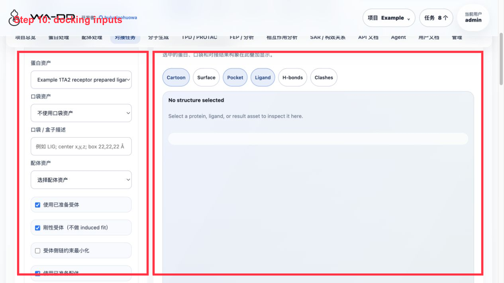
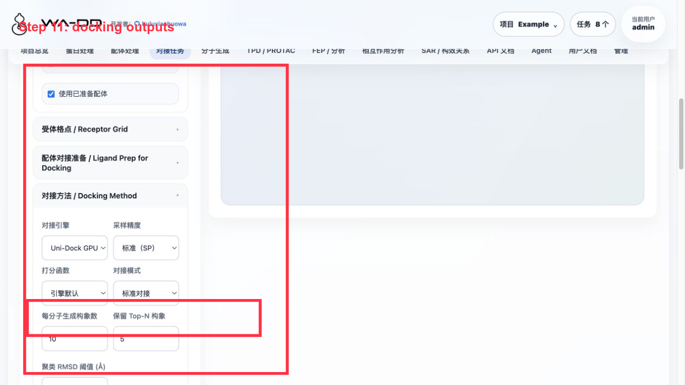

# 对接任务 / Docking Tasks

## 作用 / Role

对接任务组合蛋白、配体和口袋，用于预测结合构象、筛选候选和生成 FEP 起点。当前默认对接引擎为 Uni-Dock GPU，支持 Vina/Vinardo 评分函数。

Docking tasks combine receptor, ligand, and pocket assets to predict binding poses, screen candidates, and seed FEP. The default docking engine is Uni-Dock GPU with Vina/Vinardo scoring.

## 输入 / Inputs

- `prepared_protein` asset
- `ligand` 或 `prepared_ligand` asset
- `pocket` asset
- Uni-Dock 为传统对接引擎，无需神经网络模型文件

Uni-Dock is a traditional docking engine and does not require neural network model files.

## 输出 / Outputs

- `JobOut`
- `result` asset：包含 Uni-Dock 报告、pose 表、worker log 和任务摘要。
- 1 个 `prepared_ligand_library` / `docking_pose_library`：把本次任务全部成功 pose 合并到同一个 SDF；每条 SDF 记录保留分子名、SMILES、对接打分和 pose 序号，可单选、多选、排序、导出或进入相互作用分析/FEP。

- `result` asset: Uni-Dock report, pose table, worker log, and task summary.
- 1 `prepared_ligand_library` / `docking_pose_library`: all successful poses from the task are merged into one SDF. Each SDF record keeps molecule name, SMILES, docking score, and pose index, and can be selected, sorted, exported, or reused by interaction analysis/FEP.

## 操作流程 / Workflow

1. 在"蛋白处理"页导入或准备蛋白，并用共晶配体或手动盒子保存 `pocket` asset。
2. 在"配体处理"页导入 SDF/SMILES 或用 Ketcher 绘制分子。根据目标用途选择导出配置：
   - Uni-Dock/Vina：自动加氢、生成 3D 构象、计算 Gasteiger 电荷并准备 PDBQT。
   - FEP/MD：保留 3D 构象和后续力场参数交接记录。
3. 在"对接任务"页从下拉列表选择蛋白、口袋和配体。页面会调用 `/api/v1/docking/compatibility` 检查当前组合是否可运行。
4. 选择对接方法（默认 Uni-Dock GPU）和相关参数。
5. 点击"提交对接任务"。系统会创建 `docking` 类型任务并交由 Uni-Dock worker 执行。
6. 在任务中心查看逐步进度；完成后到输出资产下载结构、报告或把 result asset 传给后续分析/FEP。

1. Import or prepare the receptor in Protein Processing, then save a `pocket` asset from a co-crystal ligand or a manual box.
2. Import SDF/SMILES or draw molecules in Ligand Processing. Select the export profile by target use:
   - Uni-Dock/Vina: add hydrogens, generate 3D conformers, assign Gasteiger charges, and prepare PDBQT.
   - FEP/MD: keep 3D conformers and force-field handoff metadata.
3. In Docking Tasks, select receptor, pocket, and ligand from dropdowns. The page calls `/api/v1/docking/compatibility`.
4. Choose the docking method (default: Uni-Dock GPU) and related parameters.
5. Submit the docking task. The system creates a `docking` job and dispatches it to the Uni-Dock worker.
6. Track progress in the Task Center. After completion, download structures/reports or reuse the result asset in analysis/FEP.

## API / Automation

```http
GET /api/v1/docking/compatibility
POST /api/v1/jobs
GET /api/v1/jobs?project_id=<project_id>
GET /api/v1/jobs/{job_id}/events
GET /api/v1/models/pocketxmol
```

自动化时优先调用兼容性接口。只有 `compatible=true` 时才提交对接任务。任务完成后读取 `output_asset_ids`，再通过资产文件下载接口获取结构与报告。

For automation, call the compatibility endpoint first. Submit a docking task only when `compatible=true`. After completion, read `output_asset_ids` and download structures/reports from the asset file endpoints.

## Server6 Example：1TA2 同系物库与 de novo 生成物对接

本例在 server6 的 `Example` 项目完成，使用 1TA2 thrombin 的 176 配体口袋。





操作要点：

1. 蛋白选择 `Example 1TA2 receptor prepared ligand-removed`。
2. 口袋选择 `Example 1TA2 176 binding pocket`。
3. 配体库可以选择：
   - `Example 1TA2 congeneric 72 analog library prepared for docking`
   - `Example 1TA2 PocketXMol de novo generated ligands`
4. 对接方法选择 Uni-Dock；本例使用 `pose_per_ligand=3`、`keep_top_poses=1`、`cpu_threads=4`、GPU 设备 `cuda:0`。
5. 任务完成后使用：
   - `查看报表 · N poses`：打开 pose 表，按 docking score 查看排名。
   - `分析构象库 · N poses`：把本次任务的合并 SDF 自动载入相互作用分析页面。

本次验证输出：

- 同系物库：66 个输入配体，194 个 pose，失败/跳过 0 个；pose library 资产为 `Example 1TA2 congeneric Uni-Dock screening result docked pose library`。
- de novo 生成物：23 个输入配体，69 个 pose，失败/跳过 0 个；pose library 资产为 `Example 1TA2 PocketXMol de novo Uni-Dock result docked pose library`。

结果解读：

- docking score 越负通常表示 Vina 评分越好，但它不是实验结合自由能。
- 一组任务只输出一个合并 SDF，不再把每个 pose 拆成一堆资产；要比较好坏，应在 pose 表或相互作用分析里按 score 排序、单选/多选查看。
- 如果 `查看报表` 没反应或报错，优先检查任务是否已产生 `unidock_pose_table.csv` 和 `unidock_docked_poses.sdf`；这两个文件是报表和 3D 分析的来源。
