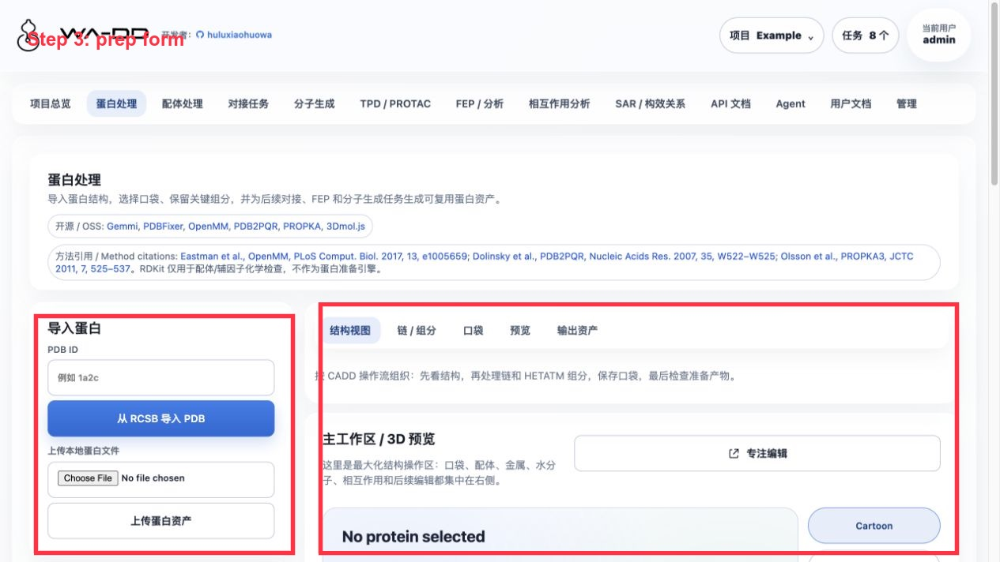
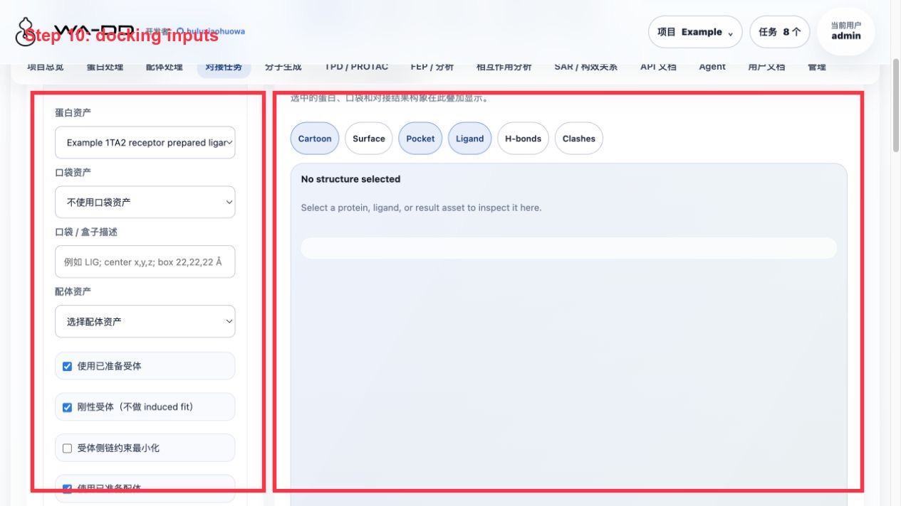
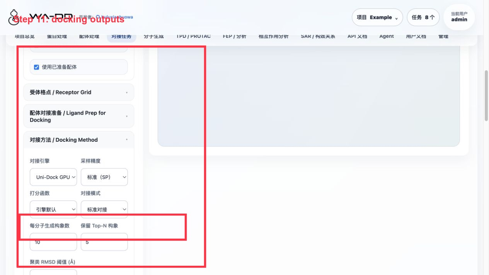
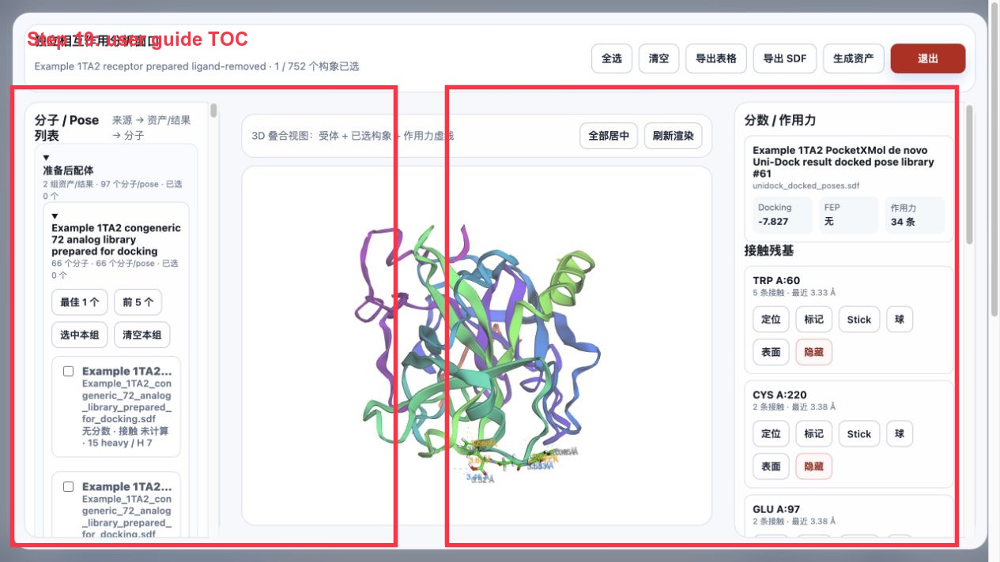

> [中文文档](example-1ta2-workflow.md)

# Example 1TA2 Full Walkthrough

This walkthrough is completed on the server6 deployment page, accessible at `http://123.207.15.89:45103`. The goal is to let new users start from a PDB co-crystal structure and complete protein preparation, ligand preparation, docking, molecule generation, a second round of docking, FEP planning, and interaction analysis.

The target of this example is the thrombin complex `1TA2`, with the co-crystallized reference ligand `176 A:401`.

## 1. Check the Example project

After entering the page, log in with the administrator account and select `Example` from the project menu in the upper right corner. The red boxes in each step screenshot indicate the locations the user should focus on or click.

You should see the following key assets:

- `Example 1TA2 thrombin complex`
- `Example 1TA2 reference ligand 176`
- `Example 1TA2 176 binding pocket`
- `Example 1TA2 receptor prepared ligand-removed`
- `Example 1TA2 congeneric 72 analog library prepared for docking`
- `Example 1TA2 PocketXMol de novo generated ligands`
- Two Uni-Dock docked pose libraries
- Two FEP results and two FEP outputs

## 2. Download the protein from PDB and extract the reference ligand/pocket

Go to `Protein Processing` and download `1TA2` from PDB. Find `176 A:401` in the component list.

Operations:

1. Extract `176 A:401` as a ligand asset: `Example 1TA2 reference ligand 176`.
2. Extract a pocket asset at the `176 A:401` position: `Example 1TA2 176 binding pocket`.
3. Run protein preparation; the output is `Example 1TA2 receptor prepared ligand-removed`.

During protein preparation, the reference ligand must be removed; otherwise the pocket is still occupied by the co-crystal ligand during subsequent docking.

## 3. Prepare the congeneric ligand library

Go to `Ligand Processing`, select the congeneric library, and generate the prepared ligand asset.

Congeneric library in this example:

- Raw library: `Example 1TA2 ligand 176 congeneric 72 analog library`
- Prepared library: `Example 1TA2 congeneric 72 analog library prepared for docking`

Recommended preparation parameters:

- Explicit hydrogen addition
- Generate 3D conformers
- pH 7.4
- MMFF/UFF optimization
- Compute chemical properties and write them into SDF properties

## 4. Run Uni-Dock docking on the congeneric library

Go to `Docking Tasks` and select the prepared protein, the prepared congeneric library, and the 176 pocket.

Parameters for this example:

- engine: Uni-Dock
- scoring: Vina
- `pose_per_ligand=3`
- `keep_top_poses=1`
- `cpu_threads=4`
- GPU: `cuda:0`

Validation results for this run:

- Input ligands: 66
- Output poses: 194
- Failed/skipped: 0
- Output pose library: `Example 1TA2 congeneric Uni-Dock screening result docked pose library`

Click `View Report · 194 poses` to see the score table; click `Analyze Pose Library · 194 poses` to enter interaction analysis.

## 5. Run PocketXMol de novo generation in the same pocket

Go to `Molecule Generation` and select the same prepared protein and the same pocket.

Parameters for this example:

- Mode: pocket-based de novo generation
- Number to generate: 24
- batch size: 8
- mean atoms: 28
- min atoms: 10
- sampling steps: 100
- pocket radius: 12 Å
- GPU: `cuda:0`
- `prepare_for_docking=true`

Validation results for this run:

- 24 requested, 23 succeeded.
- Output asset: `Example 1TA2 PocketXMol de novo generated ligands`
- Output SDF: `generated_ligands_h.sdf`
- The asset has explicit hydrogens; the page shows the `heavy / H` count for each molecule.

## 6. Dock the de novo generated ligands

Return to `Docking Tasks`, with the same prepared protein, the same pocket, and `Example 1TA2 PocketXMol de novo generated ligands` as inputs.

Validation results for this run:

- Input ligands: 23
- Output poses: 69
- Failed/skipped: 0
- Output pose library: `Example 1TA2 PocketXMol de novo Uni-Dock result docked pose library`

## 7. Run an FEP/RBFE dry-run on both docking result sets

Go to `FEP / Analysis` and create an RBFE task for each of the two docked pose libraries.

This example is a dry-run, used to check the ligand map and result presentation, and does not represent real ΔΔG.

Output:

- Congeneric library: 193 planned edges, derived SDF `Example 1TA2 congeneric docking-pose RBFE plan clean annotated SDF`, 194 records.
- de novo library: 68 planned edges, derived SDF `Example 1TA2 de novo docking-pose RBFE plan clean annotated SDF`, 69 records.

Click `View FEP · N edges` to see the edge table; click `Analyze FEP SDF · N molecules` to send the SDF with FEP fields into interaction analysis.

## 8. Interaction analysis and result interpretation

Go to `Interaction Analysis` and select `Example 1TA2 receptor prepared ligand-removed` as the receptor. On the left, expand FEP output, docking poses, molecule generation, and prepared ligands by source.

Operations:

1. Expand a source group.
2. Click `Best 1`, `Top 5`, or check specific molecules one by one.
3. View the receptor, ligand, and interaction force dashed lines in the 3D area.
4. View docking score, FEP fields, number of interaction forces, and contacting residues on the right.
5. Use the export button to save the table, SDF, or generate a new asset from the selected molecules.

Independent window:

Note: Before clicking `Open Independent Analysis Window`, you must select at least one molecule/pose; otherwise the page will prompt you to select a conformation first.

Result interpretation:

- A more negative docking score is generally better, but it cannot be directly equated to experimental free energy.
- Edges from an FEP dry-run are only planning results; a formal FEP run produces real ΔΔG, uncertainty, and trajectories.
- The interaction dashed lines are currently distance-based geometric candidates, suitable for fast screening and locating residues; before publication, they should still be verified with a formal profiler or experimental structure.

## 9. 2D/3D asset viewing

The Ligand Processing page can directly open any ligand SDF, docking pose library, or fep_output.

Usage suggestions:

- The 2D view is suitable for sorting, filtering, paging, and exporting by properties.
- The 3D view is suitable for confirming whether a conformation is reasonable, whether explicit hydrogens are present, and whether multiple conformations overlap in reasonable positions.
- On the asset card, prioritize the asset name, source category, and molecule count; there is no need to memorize raw IDs.

## 10. User documentation page

The `User Documentation` item in the menu will display the HTML converted from `userguide/*.md` at build time.

Each time the web image is built, the documentation and images are re-converted; after updating the documentation, the web image must be rebuilt and deployed before the online page can show the new content.
