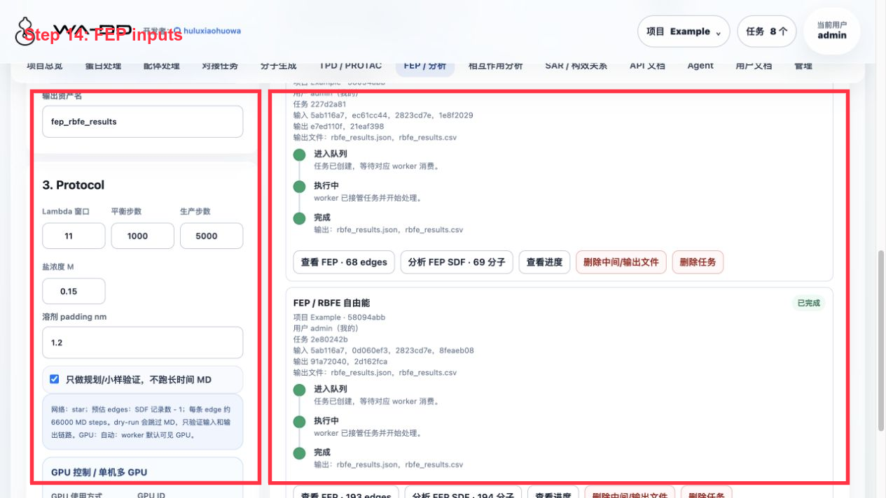

# FEP 与分析 / FEP and Analysis

## 作用 / Role

FEP/分析模块用于后续自由能计算、轨迹检查、误差分析和报告输出。

FEP/analysis is reserved for free-energy calculations, trajectory inspection, uncertainty analysis, and reports.

## 输入 / Inputs

- prepared complex or docking result
- ligand series
- simulation settings

## 输出 / Outputs

- ΔG / ΔΔG tables
- trajectories
- analysis reports
- `fep_result` asset：保存 RBFE 网络、edge 表、状态、误差和原始结果文件。
- `fep_output` asset：FEP 完成后额外生成的派生 SDF；保留输入分子构象，同时把 FEP 结果字段写入 SDF properties，便于在配体处理和相互作用分析中加载、排序、导出。

## API / Automation

当前为规划入口；后续 worker 会通过 `POST /api/v1/jobs` 创建任务，并用 `output_asset_ids` 返回结果资产。

## Server6 Example：两组 docked pose library 的 RBFE dry-run

本例在 server6 的 `Example` 项目完成，对两组对接结果分别创建 FEP/RBFE 规划结果。

输入资产：

- 蛋白：`Example 1TA2 receptor prepared ligand-removed`
- 口袋：`Example 1TA2 176 binding pocket`
- 同系物对接 pose library：`Example 1TA2 congeneric Uni-Dock screening result docked pose library`
- de novo 对接 pose library：`Example 1TA2 PocketXMol de novo Uni-Dock result docked pose library`

本次验证输出：

- 同系物库：`Example 1TA2 congeneric docking-pose RBFE plan clean`
  - `fep_result`：193 条 planned edge
  - `fep_output`：`Example 1TA2 congeneric docking-pose RBFE plan clean annotated SDF`，194 条 SDF 记录
- de novo 库：`Example 1TA2 de novo docking-pose RBFE plan clean`
  - `fep_result`：68 条 planned edge
  - `fep_output`：`Example 1TA2 de novo docking-pose RBFE plan clean annotated SDF`，69 条 SDF 记录

结果怎么看：

1. 点击 `查看 FEP · N edges` 查看网络/edge 表。dry-run 结果显示 `planned`，用于确认 ligand map，不代表真实 ΔΔG。
2. 点击 `分析 FEP SDF · N 分子` 会把派生 SDF 载入相互作用分析，结构、docking score 和 FEP 字段可一起查看。
3. 在配体处理页面中，`fep_output` 分类可作为普通 SDF 资产加载 2D/3D、排序和导出。

当前限制：

- FEP worker 现在要求 `reference_ligand` 是输入 SDF 内的真实记录名。单独提取的参考配体资产不能直接作为跨资产 reference 传入；如果需要严格使用独立参考资产，需要在 FEP 接口增加 `reference_ligand_asset_id` 并由 worker 合并/映射。
- dry-run 不运行 OpenMM 生产模拟，因此不会产生真实 ΔG/ΔΔG 数值或轨迹。正式生产任务会更耗时，并使用 GPU。
