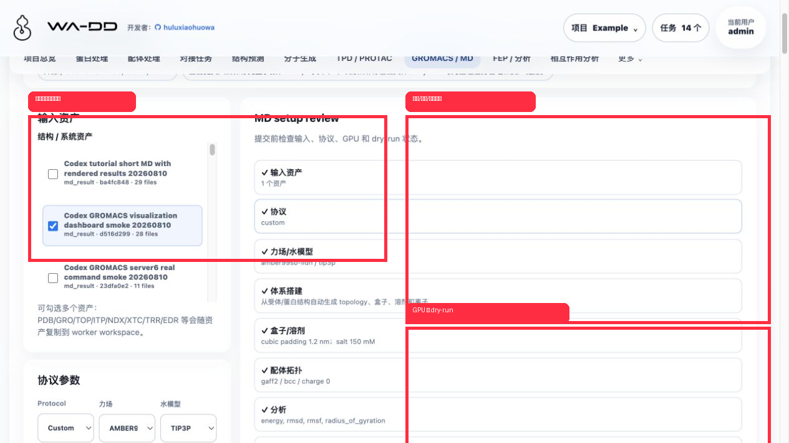
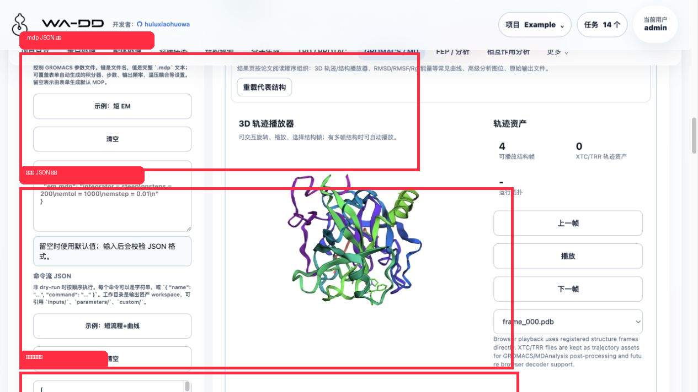
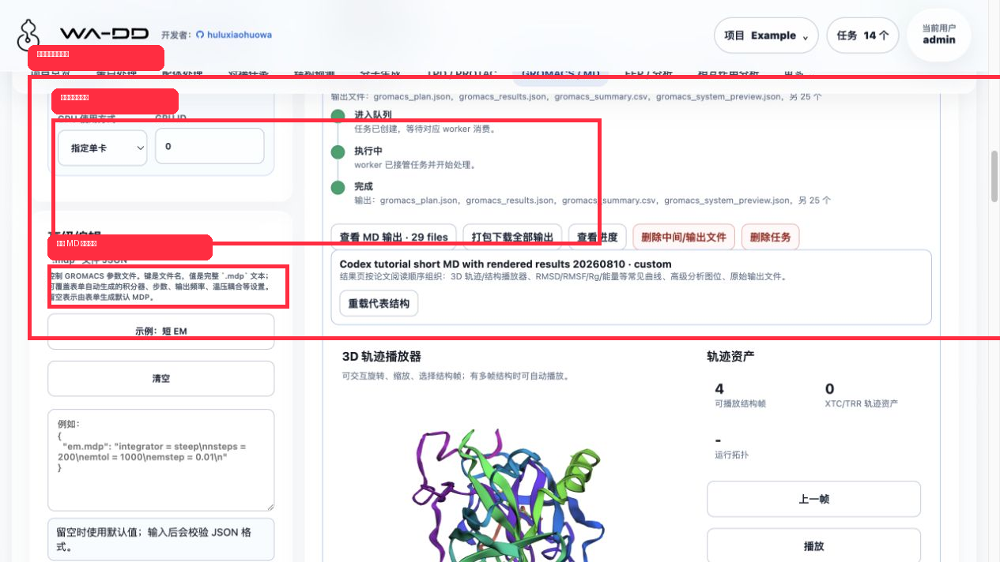
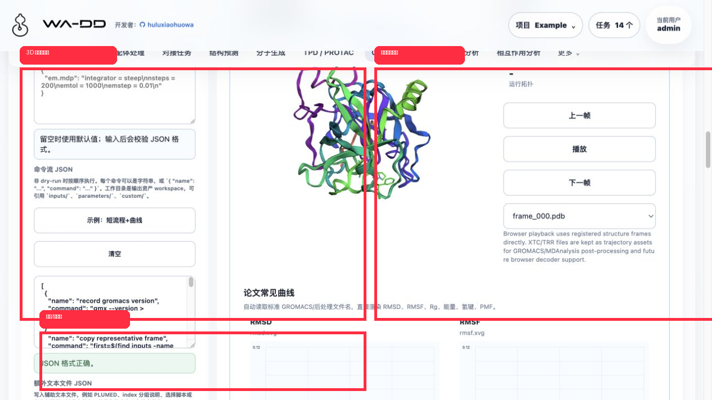
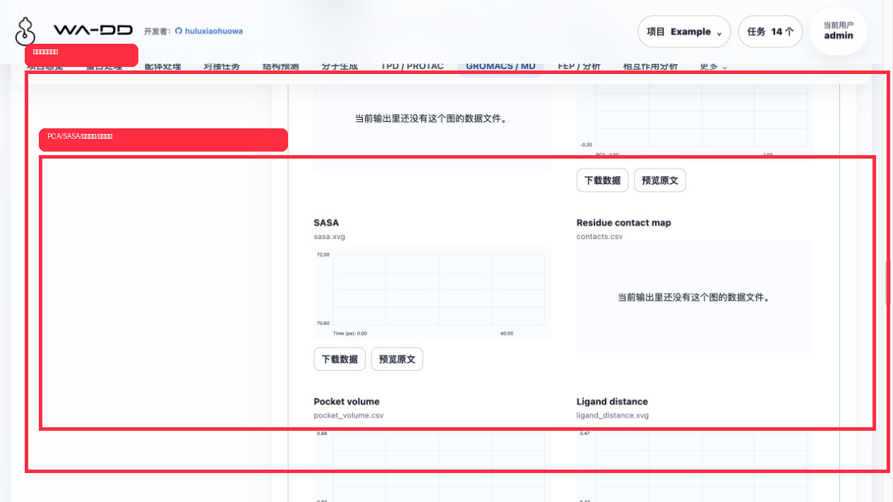

> [中文文档](gromacs-md.md)

# GROMACS / MD

## Role

The GROMACS / MD page submits CUDA-accelerated molecular dynamics jobs and stores the full input parameters, command stream, logs, trajectory structures, and paper-style analysis figures as WA-DD task assets. It supports energy minimization, NVT, NPT, production MD, aMD, Metadynamics, Umbrella, binding-stability analysis, cryptic-pocket discovery, trajectory post-processing, and custom command streams.

## Quick Tutorial: Short MD Result Rendering Loop

The example below was completed on server6 in the `Example` project. The task ID was `677e3a02`, and the output asset was `ba4fc848`. This short flow validates UI interaction, worker execution, output registration, and result rendering. It generates representative structures and common curves, but it is not a replacement for production scientific MD.

1. Open `GROMACS / MD`.
2. In `Structure / system assets`, check one or more input assets. Each asset has its own checkbox, so users do not need system multi-select shortcuts.
3. Set `Protocol` to `Custom commands`.
4. Clear `dry-run` so the worker actually executes the command stream.
5. Set GPU mode to automatic or single GPU. For a single GPU, enter `0`, `1`, or `0,1` in `GPU ID`.

The advanced editor accepts three JSON fields:

- `.mdp` files JSON: keys are filenames, values are complete `.mdp` text. This controls integrator, steps, output frequency, temperature/pressure coupling, and other GROMACS parameters.
- Command JSON: commands run one by one when dry-run is off. Each item can be a string or `{ "name": "...", "command": "..." }`.
- Extra text files JSON: writes helper files under `custom/`, such as PLUMED files, index notes, selection scripts, or custom configs.

Click `Example: short flow + curves` to insert a ready-to-run command stream. Invalid input shows a validation message below the field; valid input shows `JSON 格式正确。`

After submission, the task card shows `queued / running / completed` events. Once completed, click `View MD output` in the current task card. The result expands directly under that task, not at the bottom of the page.

This validation task produced 29 files, including `gromacs_plan.json`, `gromacs_results.json`, `gromacs_summary.csv`, `gromacs_system_preview.json`, representative structure frames, and `.xvg/.csv` analysis curves.

The result page follows a paper-reading order:

- 3D trajectory player: loads `.pdb/.gro/.cif` representative structures and supports rotation, zoom, frame switching, and playback.
- Common paper figures: automatically detects and renders `rmsd.xvg`, `rmsf.xvg`, `gyrate.xvg`, `energy.xvg`, `hbond.xvg`, and related files.
- Each curve offers raw data download and source preview.

The advanced analysis section automatically detects PCA/FEL, SASA, pocket volume, ligand distance, contact maps, and cluster maps. This example rendered `pca.xvg`, `sasa.xvg`, `pocket_volume.csv`, and `ligand_distance.xvg`.

## GPU Observation

During this short command-stream task, the server6 GROMACS worker container was `wa-dd-wa-dd-gromacs-worker-amd-1`, using `wa-dd-gromacs:amd_cu128_20260810`. `nvidia-smi` sampling showed GPU 0/1 visible, while utilization stayed at 0% and memory remained at the baseline, about `496 MiB / 18 MiB`.

That is expected for this tutorial job: it validates UI and rendering, calls `gmx --version`, and writes short curves/representative structures. It does not run a long `gmx mdrun -nb gpu -pme gpu -bonded gpu -update gpu` workload. A production MD or benchmark run should show clear CUDA load in worker logs and GPU sampling.

## Starting From Ligand / Receptor Assets

- Receptor-only MD: select a `.pdb/.gro` asset from protein preparation or upload. The default auto-preparation option generates topology, box, solvent, and ions.
- Parameterized complex MD: select the complex structure and matching `.top/.itp/.prm` assets. WA-DD then builds the `grompp/mdrun` path directly.
- Unparameterized ligand: selecting `.sdf/.mol2` ligand assets keeps automatic ligand topology enabled by default. The worker uses OpenBabel/ACPYPE to generate `.itp/.gro` and registers them into the same MD output asset.
- Trajectory analysis: select `.xtc/.trr`, preferably with the matching `.tpr` and `.edr`; the page previews RMSD/RMSF/energy analysis commands.

## Outputs

- Trajectory: `.xtc`, `.trr`
- Energy: `.edr`
- Analysis: `.xvg`, `.csv`, `.json`, `.xpm`
- Structure: `.gro`, `.pdb`, `.cif`
- Checkpoint: `.cpt`
- Parameters: `.mdp`, `.top`, `.itp`, `.ndx`, `.tpr`
- Logs: `.log`, `.txt`

`.xvg`, `.csv`, `.json`, and log files can be previewed in the page. `.xvg/.csv` files render lightweight curves. When representative `.gro/.pdb/.cif` structures exist, the output detail opens an interactive 3D preview.
