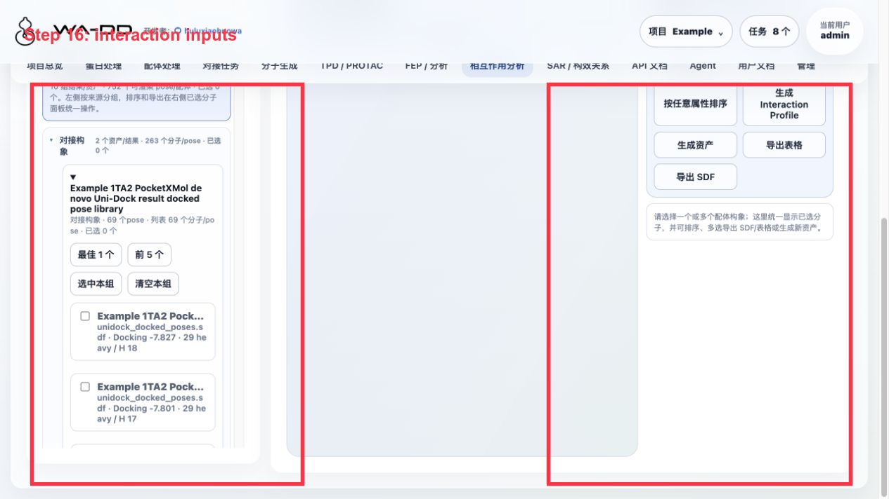
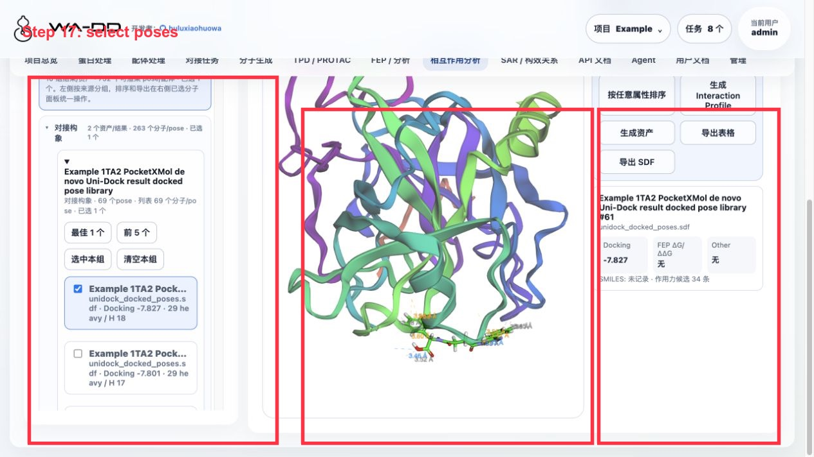
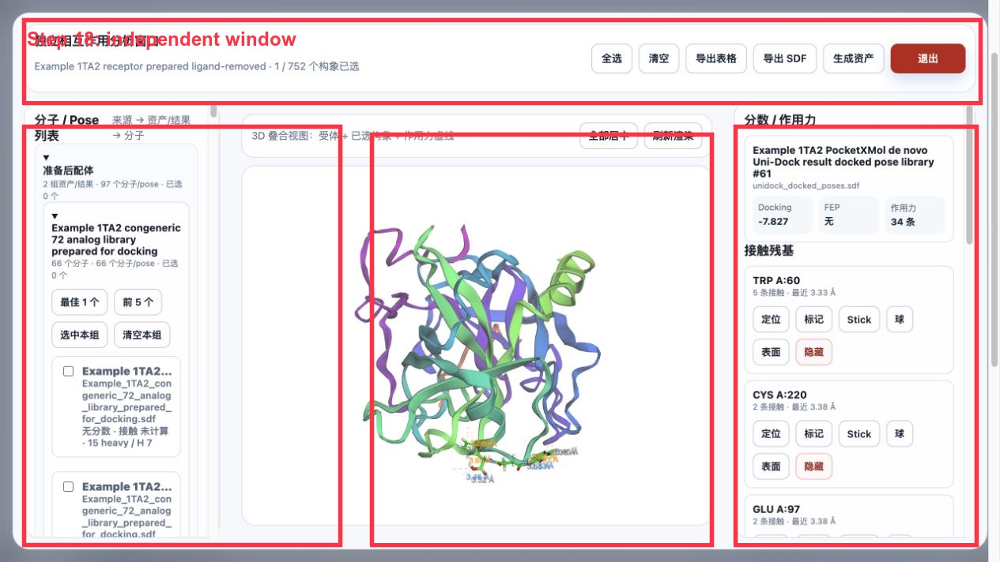
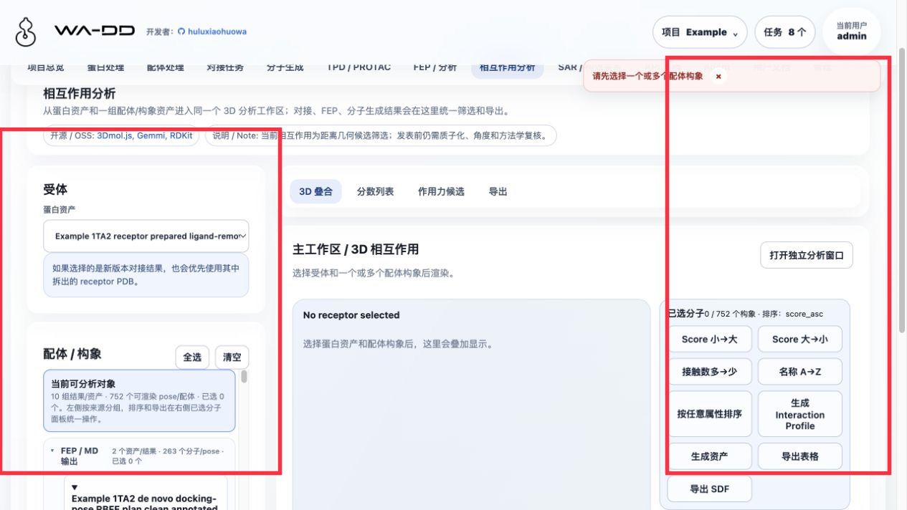

> [English documentation](interaction-analysis.EN.md)

# 相互作用分析

相互作用分析将受体、已选配体构象和几何接触结果放在同一个独立窗口中，便于从对接或分子生成结果快速检查结合模式。

## 输入

- 受体上下文：选择对应的 `prepared_protein` 或 `pocket` 资产。
- 配体构象：选择上传的 3D SDF、`prepared_ligand`，或对接/生成结果中的构象。

使用含显式氢的 3D SDF 时，系统按已存储结构进行渲染和分析；若输入没有显式氢，请先确认是否适合当前氢键敏感分析。

## 操作

1. 打开相互作用分析并选择受体和配体来源。
2. 在左侧按结果/资产分组展开分子或 Pose，勾选需要比较的构象。
3. 在中间 3D 视图检查受体、配体和作用力虚线；可使用“全部居中”和“刷新渲染”调整视图。
4. 在右侧查看每个接触残基的接触数与最近距离；可定位、标记、切换 Stick/球/表面显示或隐藏该残基。
5. 按需导出表格或选中构象 SDF，并将已选构象生成可复用资产供后续对接、SAR 或 FEP 使用。

## Server6 Example：用 1TA2 对接和 FEP 输出做分析

本例在 server6 的 `Example` 项目完成。页面把不同来源统一按组显示：FEP/MD 输出、对接构象、分子生成、准备后配体、原始导入/编辑。

操作步骤：

1. 进入“相互作用分析”。
2. 受体选择 `Example 1TA2 receptor prepared ligand-removed`。
3. 在“配体 / 构象”区展开来源分组，例如：
   - `FEP / MD 输出`
   - `对接构象`
   - `分子生成`
4. 点击某个资产组里的 `最佳 1 个` 或 `前 5 个`，也可以逐个勾选具体分子/pose。
5. 中间 3D 区显示受体 + 已选构象 + 作用力虚线；右侧显示分数、作用力数量和接触残基。
6. 用右侧按钮导出：
   - `导出表格`：分子名、SMILES、docking score、FEP 字段、作用力统计。
   - `导出 SDF`：选中分子的构象和 SDF properties。
   - `生成资产`：把已选分子保存为新的 SDF 资产。

独立窗口：

1. 必须先至少选中一个分子/pose。
2. 点击 `打开独立分析窗口`。
3. 独立窗口中保留全选、清空、导出表格、导出 SDF、生成资产和退出按钮。

结果解读：

- `Docking` 是 Uni-Dock/Vina 对接分数，越负通常越好，但不是实验结合自由能。
- `FEP` 字段来自 `fep_output` SDF。dry-run 只显示 planned edge，不代表真实 ΔΔG。
- `作用力` 当前是基于距离的几何候选筛选；发表前应使用更完整的工具（如 PLIP/RDKit profiler 或实验结构复核）确认质子化、角度、供受体关系和相互作用类型。
- 右侧残基卡片可定位、标记、切换 Stick/球/表面或隐藏，用于判断虚线对应哪个残基。

## 输出

- 残基接触与几何距离表，可导出为表格。
- 选中构象的合并 SDF，可导出或保存为新的资产。
- 对接任务产出的相互作用数据可随 `result` 资产中的 `wa_dd_interactions.json` 一并获取。

## 注意

- 多个构象的选择、导出和后续使用均以任务级 SDF 资产为单位，保留每条记录的名称和元数据。
- 该模块用于检查几何接触候选（如氢键、疏水接触和卤素键候选），不应将其直接视为实验结合证据。
