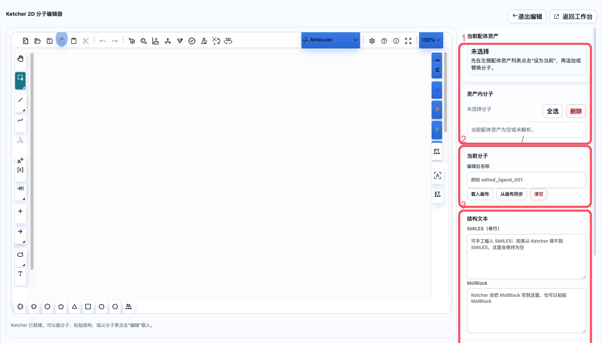
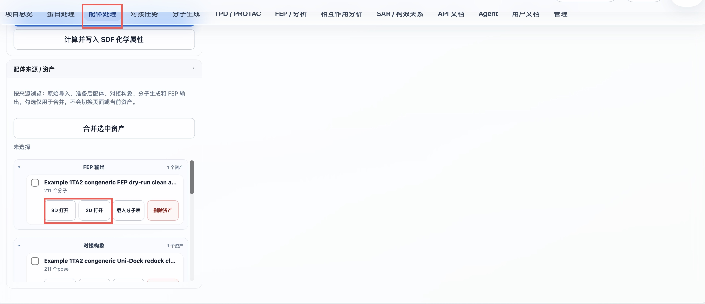
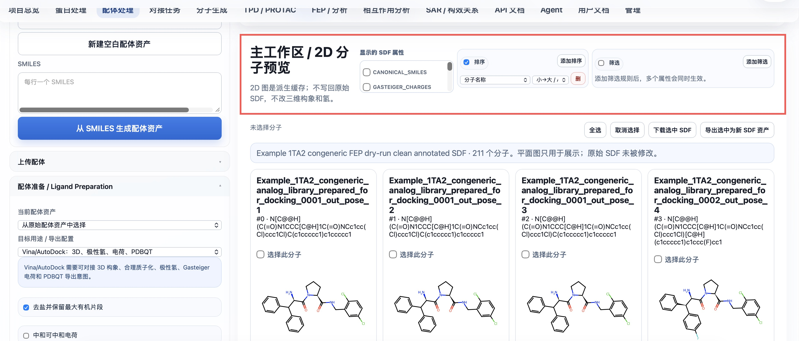
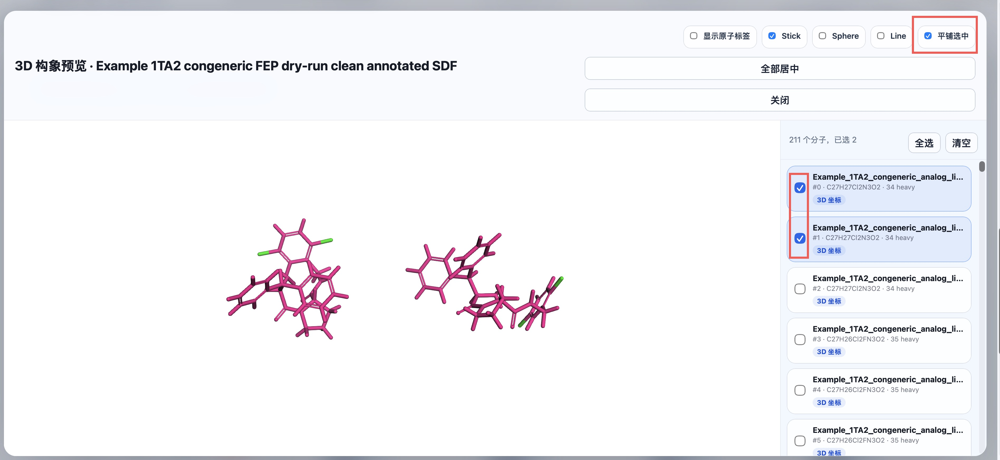
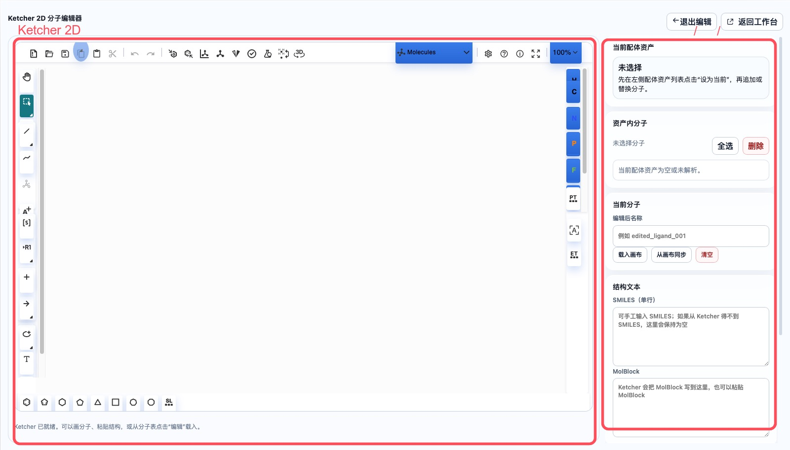
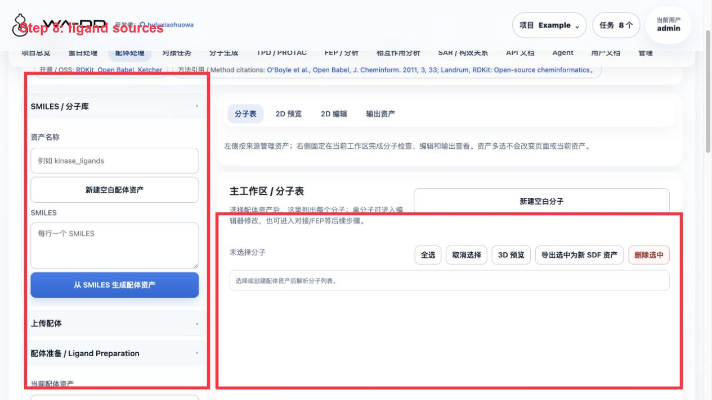
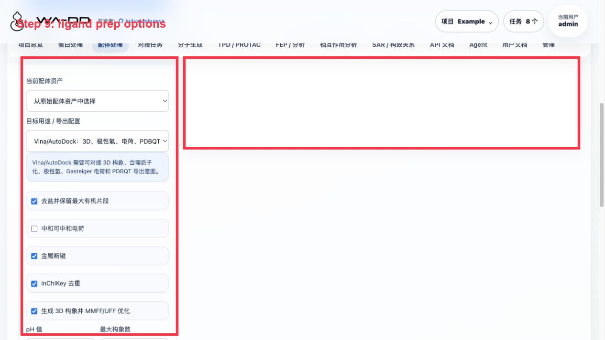
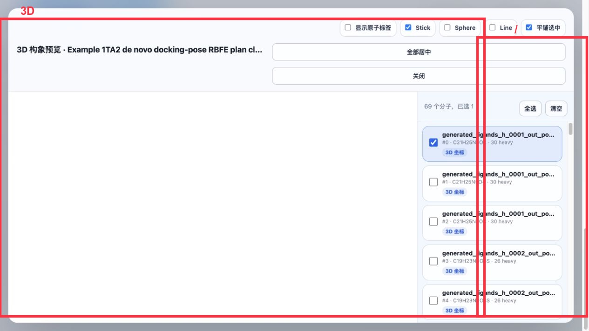

# 配体处理使用指南

本指南继续使用固定项目 `tutorial-1A2C-thrombin`。目标是从 1A2C 共晶结构中提取配体片段，合并成配体库，完成配体准备，并生成可供 Uni-Dock 对接、SAR、分子生成和后续 FEP 使用的配体资产。

## 本模块完成什么

- 从 SMILES、SDF、MOL/MOL2/PDB 或空白库创建 ligand asset。
- 在配体资产内查看分子列表，并对单个或多个分子执行选择、复制、删除、编辑。
- 使用 Ketcher 2D 编辑器画新分子或修改已有分子。
- 将分子追加到当前配体资产、替换当前分子位置，或另存为新的配体资产。
- 调用 `wa-dd-ligand-prep-worker` 生成 `prepared_ligand` 资产。
- 为 Uni-Dock/Vina、FEP/MD 等下游工作流准备兼容的配体输入。

## 1. 从 1A2C 共晶结构提取配体库

在 `蛋白处理` 的链/组分或专注编辑窗口中，可以把共晶配体对象提取到当前项目的配体资产。对 `1A2C`，建议提取：

```text
34H J:1
PRJ J:3
OAR J:4
TYS I:363（如需要记录 hirudin 相关修饰片段）
```

推荐配体库资产名称：

```text
1A2C co-crystal ligand library
```

这一步的输出是 `ligand` 资产。该资产后续可以继续追加、编辑、准备或复制到其他项目。

## 2. 在配体处理页面选择当前配体资产

进入 `配体处理` 页面。在左侧 `配体资产` 列表中选择：

```text
1A2C co-crystal ligand library
```

右侧主工作区会显示当前配体资产、资产内分子列表、当前分子编辑区和结构文本区。先确认 `当前配体资产` 显示的是要追加或替换的资产，避免把分子写到错误库里。



资产来源会按原始配体、准备后配体、对接构象、分子生成和 FEP 输出分组。对每个 SDF 资产可直接选择 `3D 打开` 或 `2D 打开`；勾选多个资产后可合并为一个新的 SDF 资产。



2D 主工作区支持选择显示的 SDF 属性、按属性排序或筛选，并可下载所选记录或导出为新的 SDF 资产。这些展示和筛选操作不修改原始 SDF。



## 3. 编辑已有分子

在 `资产内分子` 列表中选择一个分子，例如 `PRJ J:3` 或 `OAR J:4`。

常用操作：

- `用于对接`：将这个分子设为当前对接任务的配体。
- `编辑`：把该分子加载到 Ketcher。
- `复制`：在同一 ligand asset 中新增一个相同分子，再载入 Ketcher 修改。
- 勾选一个或多个分子后点击 `删除`：批量删除不需要的分子。

复制后再编辑是推荐做法：原始共晶分子保留，副本用于修改。

### 3D 构象预览

点击资产卡片的 `3D 打开` 可查看 SDF 内的构象。右侧列表可多选要同时显示的分子；`平铺选中` 将选中的构象分开排布，便于比较，而不会改变存储的坐标或氢原子。



## 4. 使用 Ketcher 画新分子或修改分子

打开 `2D 编辑` 选项卡或点击 `弹出专注编辑`。Ketcher 左侧和底部是绘图工具，中间是分子画布，右侧是结构文本和保存策略。

保存策略：

- `追加到当前配体资产`：把当前画布中的分子作为新分子追加到当前 ligand asset，成功后画布应清空，方便继续画下一个分子。
- `替换当前分子位置`：用当前画布分子覆盖分子列表中当前选中的 index。
- `另存为新配体资产`：生成一个新的 ligand asset，不修改原始配体库。

如果 Ketcher 不能直接生成 SMILES，系统会使用 MolBlock；后端会用 RDKit/Open Babel 解析并标准化。



## 5. 运行配体准备

在左侧 `配体准备` 中选择：

```text
1A2C co-crystal ligand library
```

在 `目标用途 / 导出配置` 中按下游任务选择：

- `Uni-Dock/Vina`：自动启用 3D 构象、显式氢、Gasteiger 电荷、可旋转键和 PDBQT 兼容导出。
- `FEP/MD`：自动启用 3D 构象和显式氢，保留力场参数化交接 metadata。

推荐输出名称：

```text
1A2C co-crystal ligands prepared
```

点击 `生成准备后配体资产`。生产部署使用 `wa-dd-ligand-prep-worker`，这是 CPU worker，不需要 GPU 或 PyTorch。它包含 RDKit、Open Babel、Meeko、Dimorphite-DL 和 gemmi。

当前准备流程包括：

- 盐拆分。
- 按目标用途选择是否中和、加氢、分配电荷。
- 按目标用途选择是否生成 3D 构象。
- MMFF/UFF 优化。
- 互变异构体记录。
- 立体异构体记录。
- Vina/AutoDock 路线会额外尝试生成 PDBQT；如果底层工具失败，任务会保留 SDF 并在 metadata 中记录原因。

完成后输出 `prepared_ligand` 资产：

```text
1A2C co-crystal ligands prepared
```

## 6. 用于对接任务

准备好的 `prepared_ligand` 资产可以直接在对接任务页面使用。在"对接任务"页面：

- 蛋白资产：选择对应的 `prepared_protein`
- 配体资产：选择刚生成的 `prepared_ligand` 或 `prepared_ligand_library`
- 口袋资产：选择对应的 `pocket`
- 对接方法：默认 Uni-Dock GPU

点击"提交对接任务"即可开始对接计算。


## 7. API 自动化衔接

配体处理的关键 API：

```http
POST /api/v1/assets/ligands/empty
POST /api/v1/assets/ligands/smiles
POST /api/v1/assets/upload
POST /api/v1/assets/ligands/{asset_id}/molecules
PUT  /api/v1/assets/ligands/{asset_id}/molecules/{index}
POST /api/v1/assets/ligands/merge
POST /api/v1/preparations/ligand
POST /api/v1/jobs
```

自动化顺序：

```text
ligand asset_id
  -> prepared_ligand asset_id
  -> prepared_protein asset_id + pocket asset_id
  -> docking job_id
  -> downstream result assets
```

## 8. Server6 Example：同系物库、FEP 输出和 2D/3D 查看

本例在 server6 的 `Example` 项目完成，配体处理页面用于检查原始同系物库、准备后库、对接 pose library、分子生成库和 FEP 输出 SDF。





操作步骤：

1. 进入“配体处理”。
2. 左侧“配体来源 / 资产”按来源展开：
   - `原始导入 / 编辑`
   - `准备后配体`
   - `对接构象`
   - `分子生成`
   - `FEP / MD 输出`
3. 选择 `Example 1TA2 ligand 176 congeneric 72 analog library`，点击“生成准备后配体资产”。
4. 推荐准备参数：显式加氢、生成 3D 构象、pH 7.4、MMFF/UFF 优化、计算化学属性。
5. 准备完成后得到 `Example 1TA2 congeneric 72 analog library prepared for docking`。
6. 对接和 FEP 完成后，回到配体处理页面可继续打开：
   - `docking_pose_library`：查看每个对接 pose 的 3D 构象和 docking score。
   - `fep_output`：查看带 FEP 字段的派生 SDF。



2D/3D 结果怎么用：

- `2D 打开`：按页查看二维结构；属性来自 SDF properties，可用于排序、筛选、下载选中 SDF 或导出新资产。
- `3D 打开`：查看 SDF 内构象。右侧列表支持单选/多选，适合比较构象是否叠到合理口袋位置。
- `载入分子表`：将 SDF 内每条记录加载到主工作区，便于按属性选择和编辑。

结果解读：

- 对接分数来自 `WA_DD_DOCKING_SCORE` 等 SDF property。
- FEP dry-run 输出的 `fep_output` 会保留结构并标注 planned edge 信息；真实 ΔΔG 需要正式生产 FEP 任务。
- 页面显示的 `heavy / H` 可快速确认是否含显式氢。分子生成启用 `prepare_for_docking` 后，本例生成资产已带氢。

---

# Ligand Preparation Guide

This guide continues with the fixed project `tutorial-1A2C-thrombin`. The goal is to extract ligands from the 1A2C co-crystal structure, merge them into a ligand library, run ligand preparation, and produce reusable ligand assets for Uni-Dock docking, SAR, molecule generation, and downstream FEP workflows.

## What this module does

- Creates ligand assets from SMILES, SDF, MOL/MOL2/PDB uploads, or an empty library.
- Displays molecules inside a ligand asset and supports single/multi-molecule selection, copy, delete, and edit actions.
- Uses Ketcher 2D for drawing new molecules or modifying existing molecules.
- Appends molecules to the current ligand asset, replaces the current molecule index, or saves a new ligand asset.
- Runs `wa-dd-ligand-prep-worker` to generate `prepared_ligand` assets.
- Prepares compatible ligand inputs for Uni-Dock/Vina, FEP/MD, and other downstream workflows.

## 1. Extract a ligand library from the 1A2C co-crystal structure

From the protein component list or focused 3D editor, extract co-crystal ligand components into a ligand asset. For `1A2C`, use:

```text
34H J:1
PRJ J:3
OAR J:4
TYS I:363 (optional, for recording the hirudin-related modified fragment)
```

Recommended ligand asset name:

```text
1A2C co-crystal ligand library
```

The output is a `ligand` asset that can be extended, edited, prepared, or copied to another project.

## 2. Select the current ligand asset

Open `Ligand Preparation`. In the left-side ligand asset list, select:

```text
1A2C co-crystal ligand library
```

The right workspace shows the current ligand asset, molecules inside the asset, the current molecule editor, and structure text. Always confirm the current ligand asset before appending or replacing molecules.


Asset sources are grouped as raw ligands, prepared ligands, docking poses, molecule-generation output, and FEP output. Each SDF asset can be opened directly in `3D` or `2D`; selected assets can be merged into one new SDF asset.


The 2D workspace can choose displayed SDF properties, sort or filter by them, download selected records, and export them as a new SDF asset. Display and filtering do not modify the stored SDF.


## 3. Edit an existing molecule

Choose a molecule in the `Molecules in asset` list, such as `PRJ J:3` or `OAR J:4`.

Common actions:

- `Use for docking`: set this molecule as the current docking ligand.
- `Edit`: load the molecule into Ketcher.
- `Copy`: append an identical molecule to the same ligand asset and load the copy into Ketcher.
- Select one or more molecules and click `Delete`: remove unnecessary molecules in batch.

Copy-before-edit is the recommended workflow because it preserves the original co-crystal molecule.

### 3D conformer preview

Select `Open 3D` on an asset card to inspect conformers in its SDF. The right-side list supports selecting several molecules for simultaneous display; `Tile selected` separates those conformers for comparison without changing stored coordinates or hydrogens.


## 4. Draw or modify molecules with Ketcher

Open the `2D Edit` tab or the focused editor. Ketcher tools are on the left and bottom; the canvas is in the center; structure text and save actions are on the right.

Save strategies:

- `Append to current ligand asset`: append the current drawing as a new molecule. After success, the canvas should clear so the next molecule can be drawn immediately.
- `Replace current molecule position`: overwrite the selected molecule index with the current drawing.
- `Save as new ligand asset`: create a new ligand asset without changing the original library.

If Ketcher cannot provide SMILES directly, the system keeps the MolBlock and lets RDKit/Open Babel parse and standardize it on the backend.


## 5. Run ligand preparation

In `Ligand Preparation`, select:

```text
1A2C co-crystal ligand library
```

In `Target use / export profile`, choose the downstream route:

- `Uni-Dock/Vina`: enable 3D conformers, explicit hydrogens, Gasteiger charges, torsion preparation, and PDBQT compatibility output.
- `FEP/MD`: enable 3D conformers and explicit hydrogens, and keep force-field handoff metadata.

Recommended output name:

```text
1A2C co-crystal ligands prepared
```

Click `Generate prepared ligand asset`. Production deployments use `wa-dd-ligand-prep-worker`, a CPU worker that does not require GPU or PyTorch. It bundles RDKit, Open Babel, Meeko, Dimorphite-DL, and gemmi.

The preparation workflow covers:

- Salt stripping.
- Target-specific neutralization, hydrogen handling, and charge assignment.
- Target-specific 3D conformer generation.
- MMFF/UFF optimization.
- Tautomer recording.
- Vina/AutoDock mode additionally attempts PDBQT export; if the underlying tool fails, the SDF is kept and the reason is recorded in metadata.
- Stereoisomer recording.

The output is a `prepared_ligand` asset:

```text
1A2C co-crystal ligands prepared
```

## 6. Use in docking tasks

Prepared `prepared_ligand` assets can be used directly on the Docking Tasks page. On the "Docking Tasks" page:

- Protein asset: select the corresponding `prepared_protein`
- Ligand asset: select the newly generated `prepared_ligand` or `prepared_ligand_library`
- Pocket asset: select the corresponding `pocket`
- Docking method: default Uni-Dock GPU

Click "Submit docking job" to start the docking calculation.


## 7. API automation chaining

Key ligand APIs:

```http
POST /api/v1/assets/ligands/empty
POST /api/v1/assets/ligands/smiles
POST /api/v1/assets/upload
POST /api/v1/assets/ligands/{asset_id}/molecules
PUT  /api/v1/assets/ligands/{asset_id}/molecules/{index}
POST /api/v1/assets/ligands/merge
POST /api/v1/preparations/ligand
POST /api/v1/jobs
```

Automation chain:

```text
ligand asset_id
  -> prepared_ligand asset_id
  -> prepared_protein asset_id + pocket asset_id
  -> docking job_id
  -> downstream result assets
```
