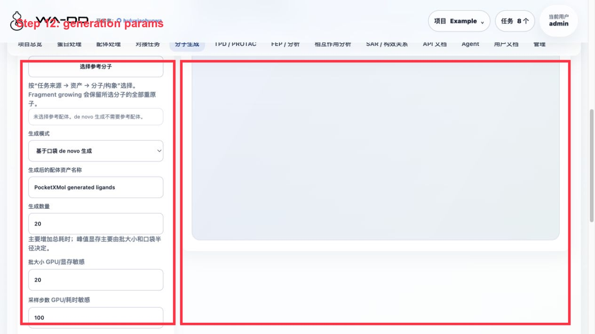
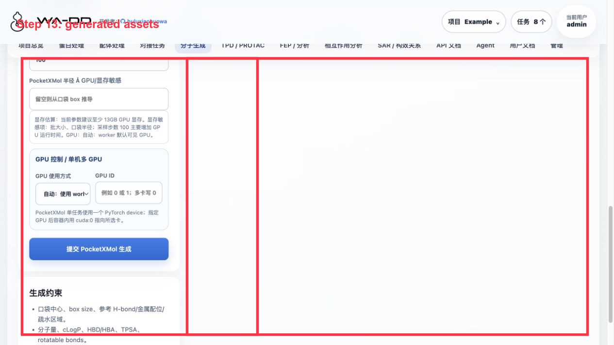

> [English documentation](molecule-generation.EN.md)

# 分子生成

## 作用

分子生成页面使用 PocketXMol，根据已保存的口袋资产生成三维配体构象。生成结果会保存为可复用资产，可继续用于相互作用分析、对接和 FEP。

当前已接入并可用的是 `基于口袋 de novo 生成` 和 `Fragment growing`。

`Scaffold hopping`、`Linker design` 需要用户在分子里选择保留骨架、片段分组和连接锚点；页面尚未提供原子/锚点选择器，所以暂不开放提交。

## 前置条件

开始前需要在同一个项目里准备好：

- 蛋白资产：`protein`、`prepared_protein` 或 `complex`。
- 口袋资产：`pocket`，必须包含 `center`、`box_size` 和 `pocket_structure`。
- PocketXMol 模型：路径固定为 `/modelhub/export/ms/huluxiaohuowa/pocketxmol/current`，不要手动改到其他目录，否则 ModelHub 无法识别和更新。页面上的模型管理按钮会使用 ModelScope CLI 下载、更新或删除这个受管目录。

口袋资产应同时满足三类用途：

- Vina/AutoDock/Uni-Dock：使用 `center` 和 `box_size` 作为 docking box。
- PocketXMol：使用 `center` 和 `generation_radius` 作为生成区域。
- 可视化：使用 `pocket_structure` PDB 展示口袋附近残基。

## 页面字段怎么填

### 蛋白资产

选择当前项目中的蛋白或准备后蛋白。建议使用蛋白准备步骤输出的 `prepared_protein`，这样后续对接和 FEP 可以复用同一套受体资产。

### 口袋资产

选择蛋白准备页面或蛋白组件页面创建的 `pocket` 资产。口袋资产会提供：

- docking box：`center` + `box_size`
- PocketXMol 半径：`generation_radius`
- 口袋可视化：`pocket_structure`

如果没有可选口袋，需要先回到蛋白页面创建口袋资产。

### 参考配体 / fragment

从当前项目的 ligand / prepared_ligand / prepared_ligand_library 资产中选择，不需要手填 ID。

使用规则：

- `基于口袋 de novo 生成`：可不选参考配体。
- `Fragment growing`：必须选择一个参考配体或 fragment 资产。

选择参考配体资产后，页面会加载该资产内的具体分子/构象，并在 `参考分子 / 构象` 下拉框中列出 `#index`、名称和 SMILES。预览框会显示当前选中的分子编号、名称、重原子数和 SMILES。

Fragment growing 当前采用“整个所选分子作为 fragment”的语义：worker 会读取所选资产中的指定分子/构象，保留它的全部重原子，再生成扩展部分。用户不需要知道原子序号，也不需要理解 SMILES 中的原子编号。

如果只想增长某个局部片段，应先在配体页面把该片段画成或上传成单独 ligand asset，再回到这里选择这个 fragment 资产。

### 模型管理

分子生成页面的模型管理卡会显示：

- 模型是否就绪；
- ModelHub 兼容路径；
- 已占用大小；
- 最新 snapshot；
- `modelscope` CLI 是否可用；
- 必要的 `pocketxmol.ckpt` 和 `train.yml` 是否存在。

按钮含义：

- `下载模型`：当前模型不完整时，用 `modelscope download --model huluxiaohuowa/pocketxmol --local_dir <snapshot>` 下载，校验完整后切换 `current`。
- `更新模型`：强制重新下载到新的 snapshot，校验完整后切换 `current`。
- `删除模型文件`：删除 `/modelhub/export/ms/huluxiaohuowa/pocketxmol` 这个受管模型目录。不会删除 `/modelhub` 根目录或其他模型。

下载、更新和删除是全局模型操作，需要管理员权限。

### 生成模式

可提交模式：

- `基于口袋 de novo 生成`：只使用蛋白和口袋，从口袋区域生成新分子。
- `Fragment growing`：使用参考 fragment/配体作为保留部分，在口袋环境中扩展新结构。

暂未开放模式：

- `Scaffold hopping`：需要选择要保留/替换的骨架部分。
- `Linker design`：需要选择两个或多个片段分组和连接锚点。

### 生成后的配体资产名称

建议写清楚靶点、口袋和参数，例如：

`tutorial_1A2C_22A_PocketXMol_20`

生成完成后会创建：

- 1 个 `prepared_ligand_library`：包含整批加氢后的 SDF、原始 SDF、口袋 PDB、报告和相互作用预览表。
- 多个 `prepared_ligand`：每个生成构象一个独立资产，可直接用于对接、FEP 和相互作用分析。

### 生成数量

控制总共要生成多少个候选分子。主要影响总耗时，对峰值显存影响较小。

### 批大小

GPU/显存敏感。批大小越大，单轮同时生成的分子越多，速度可能更快，但显存占用也更高。

建议：

- 8-12：更稳，适合先试跑。
- 20：默认批量，适合 16GB 以上 GPU。
- 50+：只建议在显存充足并确认口袋较小时使用。

### 采样步数

GPU/耗时敏感。步数越高，单个分子的生成时间越长。峰值显存变化通常小于批大小和口袋半径。

建议：

- 20：smoke test 或验证流程。
- 100：默认正式生成。
- 200+：更慢，适合需要更充分采样时使用。

### PocketXMol 半径 Å

GPU/显存敏感。留空时使用口袋资产中的 `generation_radius`，或从 `box_size` 推导。

半径越大，模型看到的口袋区域越大，计算量和显存占用越高。一般不建议盲目放大；如果要覆盖更大的结合区域，应先确认口袋定义是否合理。

## 输出资产怎么使用

生成完成后，在分子生成页面打开结果，可以看到：

- 口袋附近残基
- 生成的三维配体构象
- 几何距离相互作用预览
- 生成的 library 资产和 SDF 内每个分子记录

后续使用方式：

- 相互作用分析：选择对应 `pocket` 或 `prepared_protein` 作为受体上下文，再选择生成出的 `prepared_ligand_library`，然后单选或多选其中的分子记录。
- 对接：在 docking 页面选择生成出的 `prepared_ligand` 或 `prepared_ligand_library` 作为配体资产。
- FEP：优先选择已经对接后的 `docking_pose_library`；也可以选择准备后的 ligand library 作为候选输入。

如果只是想查看口袋与生成构象是否匹配，优先在相互作用分析中选择生成时使用的 `pocket` 资产；如果要看全蛋白背景，则选择对应 `prepared_protein`。

## 已验证的 tutorial 例子

在 `tutorial` 项目中，已用 1A2C 口袋完成一次小批量生成：

- 项目：`tutorial`
- 输入蛋白：`tutorial 1A2C receptor all-hetero-removed PDBQT-ready`
- 输入口袋：`tutorial 1A2C 22A ligand-site pocket`
- 任务：`tutorial PocketXMol smoke 3 ligands 20260728 retry3`
- 输出：1 个 `prepared_ligand_library`，其中包含 3 条 SDF 分子记录
- 生成构象已加氢，资产 metadata 标记 `prepared_for: docking, wa-dd, fep_md`

## Server6 Example：1TA2 口袋 de novo 生成

本例在 server6 的 `Example` 项目完成，输入为准备后 1TA2 thrombin 和 176 配体所在口袋。

操作步骤：

1. 进入“分子生成”。
2. 蛋白选择 `Example 1TA2 receptor prepared ligand-removed`。
3. 口袋选择 `Example 1TA2 176 binding pocket`。
4. 模式选择 `基于口袋 de novo 生成`。
5. 本例参数：生成数量 24，batch size 8，mean atoms 28，min atoms 10，sampling steps 100，PocketXMol 半径 12 Å，GPU `cuda:0`。
6. 保持 `prepare_for_docking=true`，提交后等待任务完成。

本次验证输出：

- 请求 24 个分子，成功 23 个。
- 输出资产：`Example 1TA2 PocketXMol de novo generated ligands`。
- 输出文件：`generated_ligands_h.sdf`。
- 生成 SDF 已显式加氢；页面会显示每个分子的 `heavy / H` 数量。

结果解读：

- PocketXMol 生成的是三维构象；启用 `prepare_for_docking` 后，worker 会在后处理阶段保存加氢 SDF。
- 分子生成本身没有 docking score；要比较分子优劣，需要把生成资产继续提交 Uni-Dock，得到 docking score 后再在配体处理或相互作用分析里排序。
- 如果生成资产在配体处理能看到但在相互作用分析看不到，先刷新页面并确认该资产类别是 ligand / prepared ligand / prepared ligand library。

## 常见问题

### 为什么 scaffold hopping / linker design 不能选？

这两个模式不是单靠“选一个配体资产”就能安全定义的任务。它们需要用户在 2D/3D 分子视图中点选：

- 哪些原子/片段要固定；
- 哪些原子/片段要替换或连接；
- linker 的连接锚点。

在原子/锚点选择器完成前，页面不开放这两个模式，避免生成任务语义不清。

### 为什么生成结果能在分子生成页看到，但相互作用分析里看不到？

需要确认两点：

1. 任务已完成并且输出资产已经刷新到当前项目资产列表。
2. 相互作用分析中选择了合适的受体上下文：生成结果建议选择对应 `pocket`，再选择生成出的 `prepared_ligand` 构象。

### 生成出的分子能直接对接吗？

可以。生成 worker 会把结果保存为加氢后的 SDF，并创建 `prepared_ligand_library` 资产。对接页面可以直接选择这个资产，worker 会在内部拆分每条 SDF 记录进行对接，输出仍是一个合并的 pose library SDF。

如果某个下游工具要求 PDBQT，则由对接/配体准备流程在提交时转换或校验，不需要用户手动改文件。
