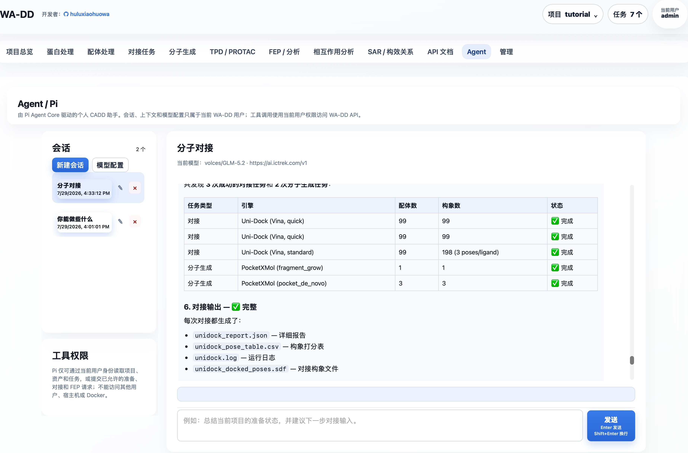

> [English documentation](pi-agent.EN.md)

# Agent 工作台（Pi / Prime）

Agent 页面支持 Pi Agent Core 与 Prime Agent 两种个人 CADD 运行时。每个 WA-DD 用户只能看到自己的会话、上下文和模型配置；两个运行时共享同一份加密模型配置。



页面左侧可新建、重命名或删除个人会话，并打开模型配置；右侧对话会结合当前项目中的蛋白、配体、口袋和任务结果，按需询问必要输入后调用允许的工具。工具权限与当前用户一致，不能访问其他用户的项目或资产。

首次打开页面会要求填写当前账户的 OpenAI 兼容模型地址、模型名和 API Key。每个用户的 API Key 各自加密保存，页面不会回显它。

Pi 与 Prime 只提供受控的 `wa_dd_api` 工具：在当前用户权限内读取项目、资产和任务，并提交允许的准备、对接或 FEP API 请求。Prime 的内置 IPython / shell 工具已禁用，Prime worker 也没有宿主机目录、Docker socket 或其他用户 token 的访问权。

Pi 复用既有的 `WA_DD_DATA_HOST_DIR` 挂载；加密配置和会话上下文镜像固定保存到容器内 `/data/pi`，即宿主机的 `${WA_DD_DATA_HOST_DIR}/pi`。PostgreSQL 仍是权限校验和查询的权威记录。

首次启动会在该持久目录生成只读的部署加密主密钥。通常无需设置环境变量；如需由密钥管理系统托管，可选地设置 `WA_DD_PI_CONFIG_ENCRYPTION_KEY` 覆盖自动密钥。它不是用户的模型 API Key。

构建 Pi worker：

```bash
./build_image.sh --profile amd --component pi-agent
```
