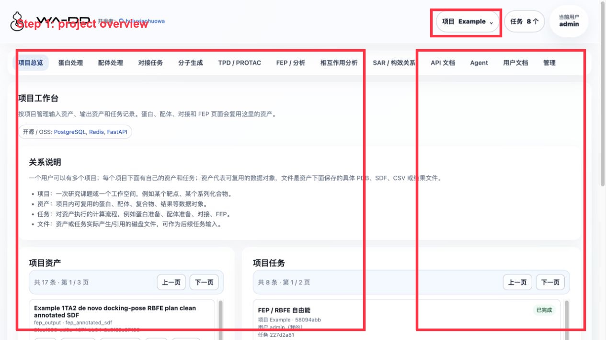

> [中文文档](project-and-assets.md)

# Projects and Assets

## Role

Projects separate research contexts for one user; assets are reusable inputs, outputs, and intermediate files.

## Inputs

- project name
- protein, ligand, pocket, docking results, and other assets

## Outputs

- `project_id`
- `asset_id`
- downloadable files

## API / Automation

```http
POST /api/v1/projects
GET /api/v1/projects
GET /api/v1/assets?project_id=<project_id>
PATCH /api/v1/assets/{asset_id}
POST /api/v1/assets/{asset_id}/copy
DELETE /api/v1/assets/{asset_id}
```

When copying an asset to another project, the web UI selects the target project by project name; the API uses the target `project_id`.

## Server6 Example: How the Project Overview Inspects the Complete Workflow

This example uses the server6 deployment page `http://123.207.15.89:45103`, with the project name `Example`.



Inspection order:

1. Select `Example` from the project menu in the upper-right corner.
2. In "Project Assets", confirm that the key assets exist:
   - Original protein: `Example 1TA2 thrombin complex`
   - Reference ligand: `Example 1TA2 reference ligand 176`
   - Pocket: `Example 1TA2 176 binding pocket`
   - Prepared protein: `Example 1TA2 receptor prepared ligand-removed`
   - Prepared congeneric library: `Example 1TA2 congeneric 72 analog library prepared for docking`
   - PocketXMol generated library: `Example 1TA2 PocketXMol de novo generated ligands`
   - Two sets of Uni-Dock pose library
   - Two sets of FEP `fep_result` and two sets of `fep_output`
3. In "Project Tasks", confirm that all tasks are "Completed". This example includes protein preparation, ligand preparation, molecule generation, two docking runs, and two FEP runs.
4. When there are too many assets and tasks, use pagination to view them; you do not need to remember raw IDs. In practice, prioritize asset name, type, and source.

Result interpretation:

- `fep_output` is a loadable SDF asset derived from FEP.
- `docking_pose_library` is the merged conformation SDF asset of a docking task.
- If a task fails and produces failure assets, delete the failed task and the intermediate/output files to avoid polluting the Example project.
