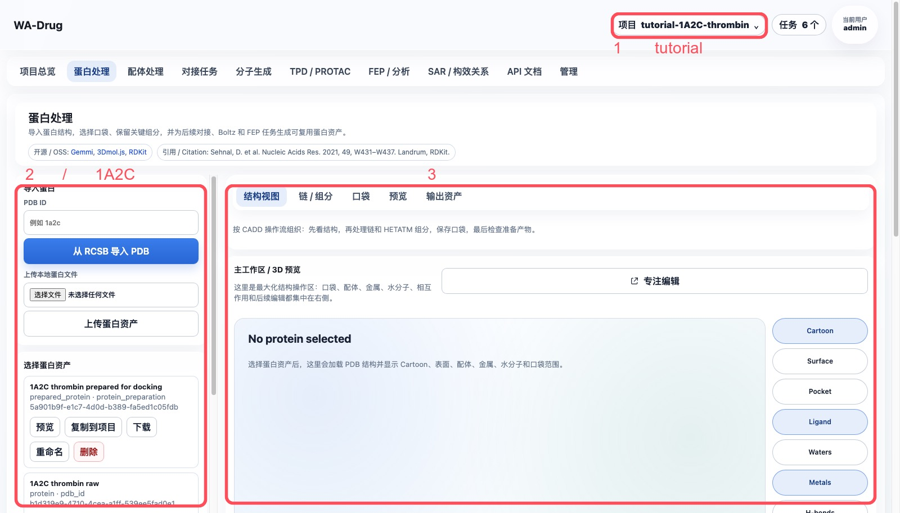
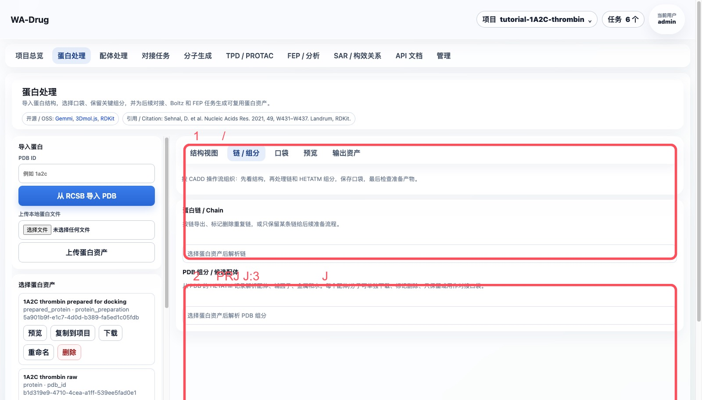
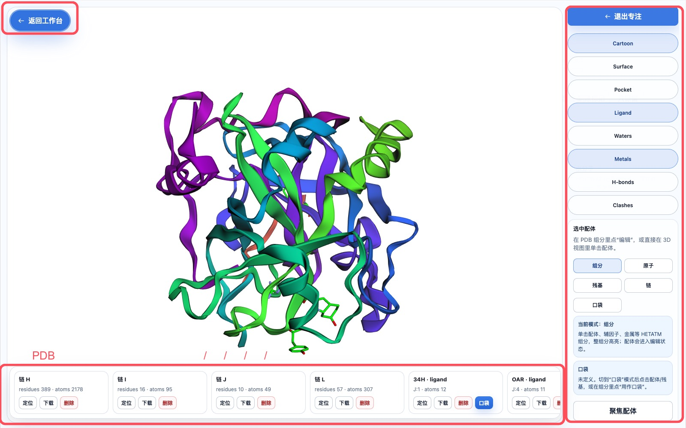
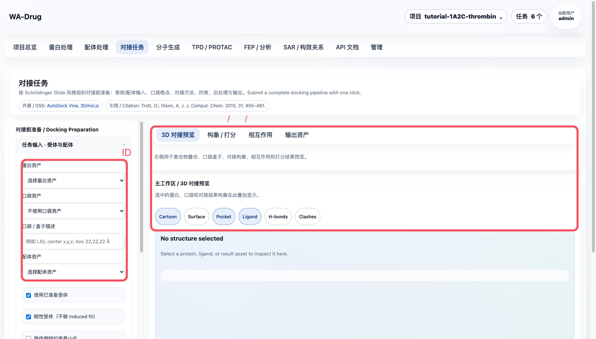
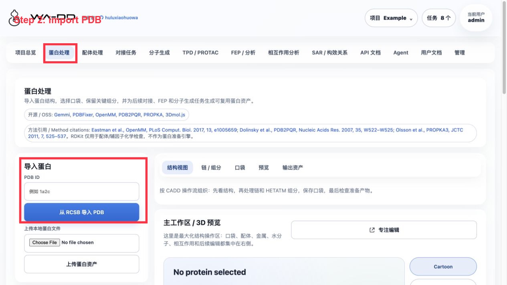
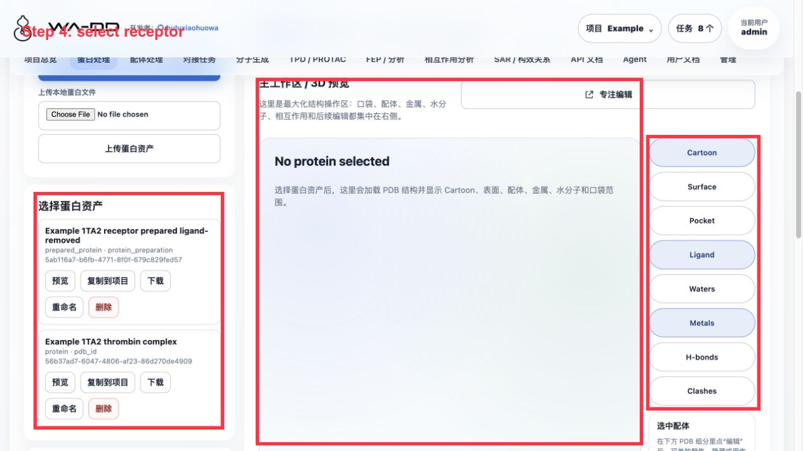
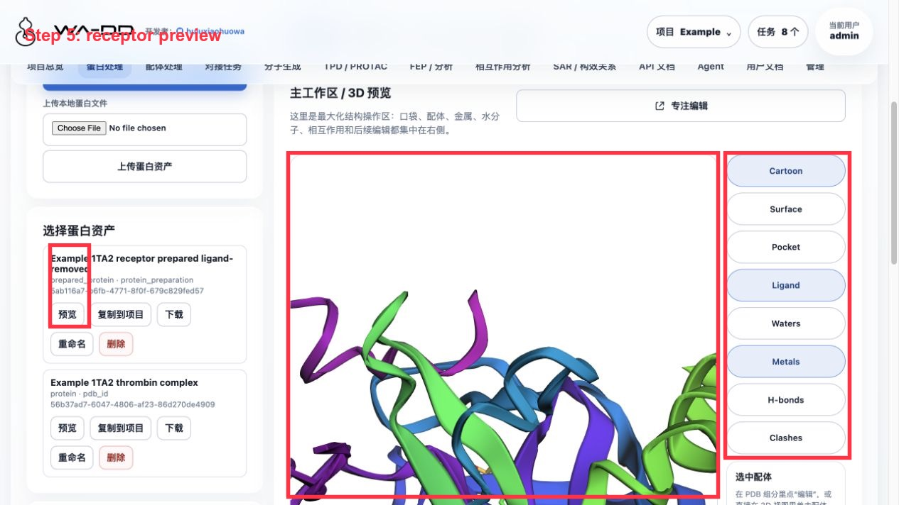
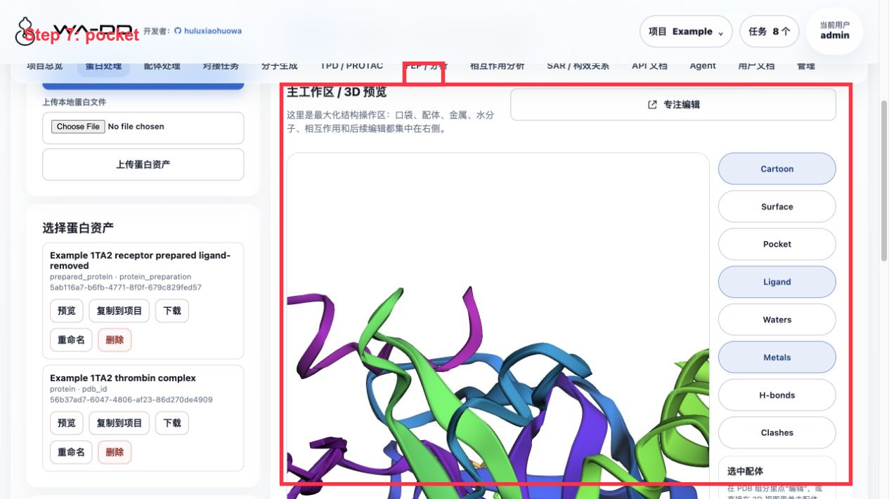

> [中文文档](protein-preparation.md)

# Protein Preparation Guide

This guide uses a fixed project, `tutorial-1A2C-thrombin`, and the example structure is RCSB PDB `1A2C`. The goal is to complete a reproducible CADD protein preparation workflow: import the co-crystal structure, inspect chains and HETATM components, select a reference ligand, define a pocket, generate a prepared protein asset, and pass the output to subsequent docking, FEP, and molecule generation workflows.

Case source: RCSB PDB `1A2C`, DOI: `10.2210/pdb1A2C/pdb`. The web module itself only displays open-source code and algorithm references; the tutorial case source is only documented in this guide.

## What this module does

- Import a PDB ID or local PDB/mmCIF file.
- Inspect protein chains, co-crystal ligands, metals, waters, and other HETATM components in the 3D view.
- Define a pocket asset from a co-crystal ligand or manual coordinates.
- Remove unwanted chains, ligands, waters, or duplicate chains.
- Generate a `prepared_protein` asset for reuse by docking, FEP, and molecule generation modules.

## 1. Open the fixed tutorial project

After logging in with `admin / admin123456`, select or create the following in the top-right project menu:

```text
tutorial-1A2C-thrombin
```

Enter the `Protein Preparation` page. The left side contains import and preparation parameters; the right side is the 3D main workspace.



## 2. Import 1A2C and select the protein asset

If the project does not yet have a raw structure, enter the following in the `PDB ID` field on the left:

```text
1a2c
```

Click `Import PDB from RCSB`. After successful import, select `1A2C thrombin raw` and click `Preview`.

Recommended asset names:

| Stage | Recommended name | Type |
| --- | --- | --- |
| Raw structure | `1A2C thrombin raw` | `protein` |
| Pocket | `PRJ J:3 active-site pocket` | `pocket` |
| Prepared receptor | `1A2C thrombin prepared for docking` | `prepared_protein` |

## 3. Inspect chains, ligands, and HETATM components

Click `Chains / Components` in the right-side main workspace. The key objects in this example are:

| Object | Meaning | Recommended handling |
| --- | --- | --- |
| Chains `H` / `L` | thrombin receptor chains | Keep |
| Chain `J` | Aeruginosin 298-A inhibitor chain | Define pocket, then remove from receptor |
| `PRJ J:3` | middle fragment of the inhibitor | Recommended as pocket center |
| `34H J:1`, `OAR J:4` | terminal fragments of the inhibitor | Can help confirm pocket coverage; can be extracted to ligand library |
| `TYS I:363` | modified residue in the hirudin fragment | Not used as the small-molecule pocket center in this example |
| `NA H:626` | metal ion | Keep by default |
| `HOH/WAT` | crystallographic waters | Remove by default; keep key waters separately |



## 4. Define the pocket using PRJ J:3

Click `Pop out as focused edit window`, and find `PRJ · ligand · J:3` in the bottom horizontal PDB component strip.

Operation sequence:

1. Click `Locate` on the `PRJ J:3` card to confirm it is in the active site.
2. Click `Pocket` or `Use as pocket`.
3. Enable the `Pocket` display on the right.
4. Set the box to:

```text
center = 18.54, -14.79, 20.56
box    = 20, 20, 20 Å
```

For a more conservative box covering the entire Aeruginosin 298-A chain, use `22, 22, 22 Å` instead. When adjusting the center and size, you should see the blue box cover the co-crystal ligand region in real time.



## 5. Prepare the receptor

Return to the `Protein Preparation` page, and in `CADD protein preprocessing`, select the raw protein asset `1A2C thrombin raw`.

Recommended parameters:

- Remove crystallographic waters: on.
- Keep metal ions: on.
- Keep cofactors/covalent ligands: enable as needed by the task; this example will remove the original inhibitor chain `J`.
- pH: `7.4`.
- Chains to remove: `J`; if only studying the thrombin small-molecule pocket, you can also remove `I`.
- Reference ligand/residue: `PRJ J:3`.
- Output name: `1A2C thrombin prepared for docking`.

Click `Generate prepared protein asset`. A `protein_preparation` task will appear in the task center, with status showing as queued, running, completed, or failed at each step.

## 6. How outputs feed into subsequent steps

Upon completion, you will have two core assets:

- `prepared_protein`: `1A2C thrombin prepared for docking`
- `pocket`: `PRJ J:3 active-site pocket`

These assets are selected by name from dropdown lists in the `Docking tasks` page; no need to manually enter IDs.



## 7. Handling failed tasks

If a task fails:

1. Open `Tasks` in the top-right corner.
2. Click `View progress` on the failed task to confirm the failed step and error.
3. If intermediate files have been generated, click `Clean output`.
4. Fix the input and resubmit; the old task record is retained for traceability.

## 8. Server6 Example: 1TA2 176 ligand pocket

This example was completed in the `Example` project on server6. The target is the thrombin complex `1TA2`, with the co-crystal small molecule `176 A:401` selected as the reference ligand and pocket center.










Operation steps:

1. Enter "Protein Preparation".
2. Download `1TA2` from PDB, name it `Example 1TA2 thrombin complex`.
3. Locate `176 A:401` in the component list.
4. Extract `176 A:401` as a reference ligand asset: `Example 1TA2 reference ligand 176`.
5. Extract a pocket asset centered on `176 A:401`: `Example 1TA2 176 binding pocket`.
6. Run protein preparation with output name `Example 1TA2 receptor prepared ligand-removed`.

Preparation parameters for this example:

- Remove crystallographic waters: on.
- Keep metals: on.
- Keep cofactors: off.
- Add hydrogens: on.
- Repair missing atoms: on.
- pH: 7.4.
- Remove reference ligand `176 A:401` from the receptor to prevent the pocket from being occupied by the original ligand during subsequent docking.

Result inspection:

- The prepared protein asset should be `prepared_protein` and no longer contain `176 A:401`.
- The reference ligand is retained as a separate ligand asset and can be reused in ligand processing, interaction analysis, or subsequent FEP design.
- The pocket asset stores the center, box size, and pocket PDB; subsequent docking and molecule generation both reuse this single pocket definition.
