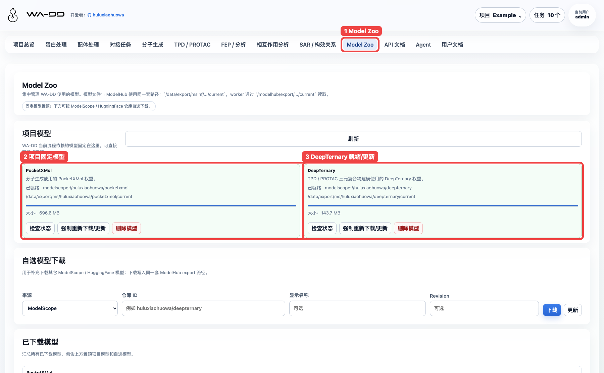
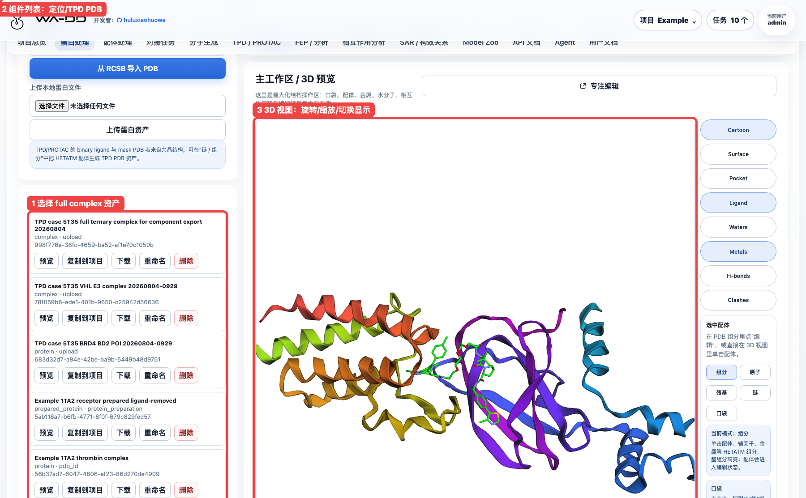
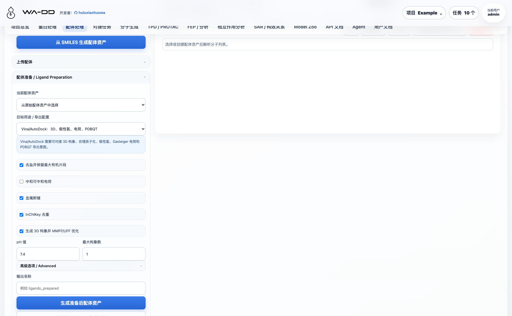
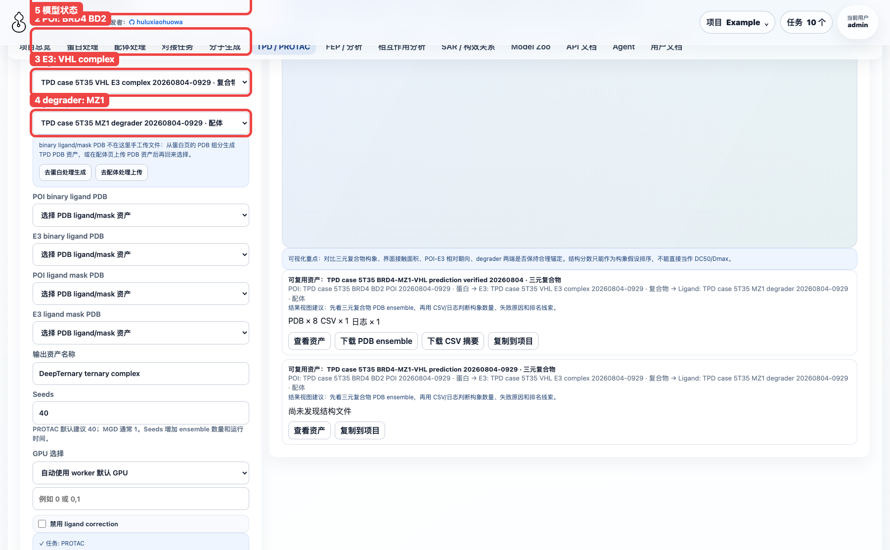
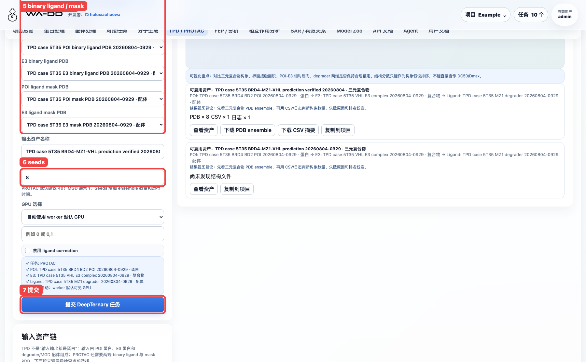
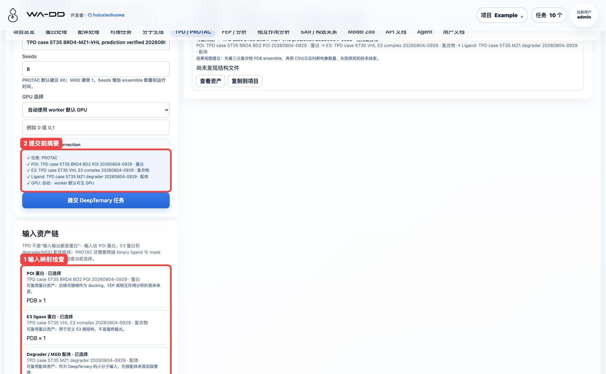
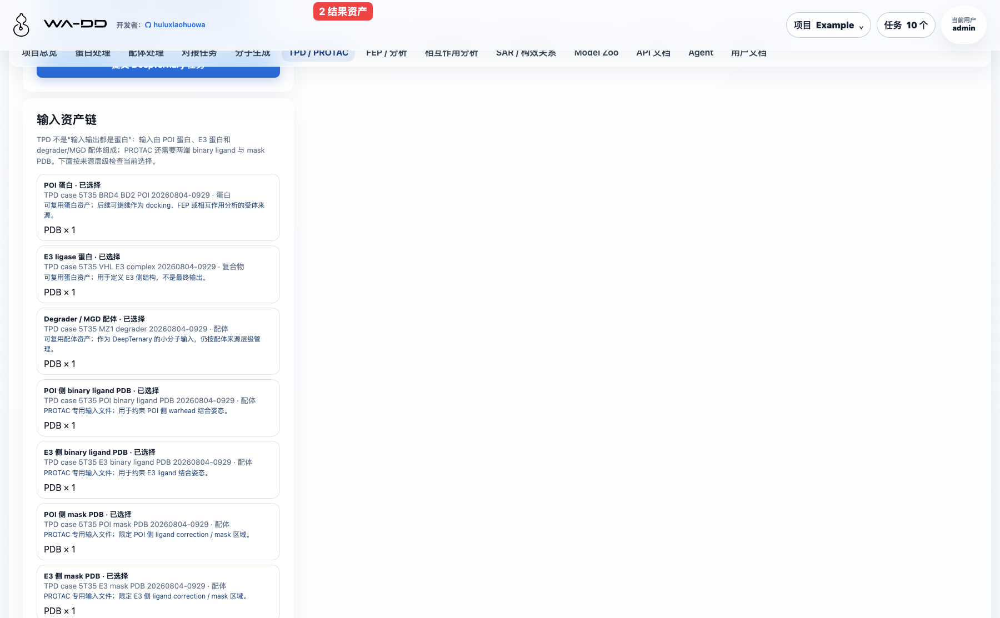
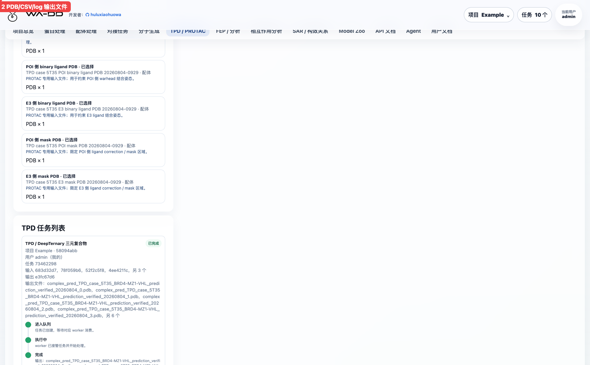

> [English documentation](tpd-protac-5t35-case.EN.md)

# TPD / PROTAC 5T35 案例：BRD4-MZ1-VHL 三元复合物

本案例演示如何在 Example 项目中，用 DeepTernary 对公开 PROTAC 体系 PDB 5T35 做一次完整三元复合物建模。5T35 是 MZ1 同时结合 BRD4 BD2 与 VHL:EloB:EloC 的晶体结构，分辨率 2.70 Å；它是 PROTAC 三元复合物建模的合适教学体系。

参考来源：

- RCSB PDB：`5T35`，The PROTAC MZ1 in complex with the second bromodomain of Brd4 and pVHL:ElonginC:ElonginB，DOI `10.2210/pdb5T35/pdb`。
- Gadd et al., Nature Chemical Biology 2017：Structural basis of PROTAC cooperative recognition for selective protein degradation，DOI `10.1038/nchembio.2329`。
- DeepTernary 官方示例输入：`output/protac22/5T35_H_E_759/`。

## 1. 准备模型

进入顶部导航的 **Model Zoo**，确认 DeepTernary 卡片显示“已就绪”。如果未就绪，点击“下载模型”；如果已经就绪，普通用户点击“检查状态”只会刷新状态，不会强制重新下载。

## 2. 准备 5T35 输入资产

推荐按官方示例拆分文件导入 7 个资产。这样最清楚，也避免用户在 full complex 里手工判断组件时选错。

| 资产 | 文件 | 类型 | TPD 页面用途 |
| --- | --- | --- | --- |
| BRD4 BD2 POI | `unbound_protein1.pdb` | protein | POI protein |
| VHL E3 complex | `unbound_protein2.pdb` | complex | E3 protein |
| MZ1 degrader | `ligand.pdb` | ligand | degrader ligand |
| POI binary ligand | `unbound_lig1.pdb` | ligand | POI binary ligand PDB |
| E3 binary ligand | `unbound_lig2.pdb` | ligand | E3 binary ligand PDB |
| POI mask | `unbound_lig1.pdb` | ligand | POI ligand mask PDB |
| E3 mask | `unbound_lig2.pdb` | ligand | E3 ligand mask PDB |

说明：

- binary ligand 是二元结构中的 anchor/warhead 小分子 PDB。
- mask PDB 用于告诉 DeepTernary 如何把 PROTAC 两端与对应 anchor 对齐；本案例中 mask 与 binary ligand 使用同一个 PDB 文件。
- 如果从 full complex 出发，可先在“蛋白处理”页上传 `complex.pdb`，预览后用组件选择工具定位配体、生成 TPD PDB 资产；但教学案例推荐直接使用上表拆分文件。

配体资产会按来源分组展示。TPD 使用的 MZ1、binary ligand 和 mask 都应该能在“配体处理”页看到，后续可复制、下载或继续给下游流程使用。

## 3. 选择 TPD 主输入

打开顶部导航 **TPD / PROTAC**，先填写主输入：

1. 任务类型：选择 `PROTAC`。
2. POI：选择 `TPD case 5T35 BRD4 BD2 POI ...`。
3. E3：选择 `TPD case 5T35 VHL E3 complex ...`。
4. Degrader：选择 `TPD case 5T35 MZ1 degrader ...`。
5. 模型状态：确认 DeepTernary 已就绪。

## 4. 选择 PROTAC 辅助输入并设置参数

继续填写 PROTAC 额外输入：

1. POI binary ligand PDB：选择 `TPD case 5T35 POI binary ligand PDB ...`。
2. E3 binary ligand PDB：选择 `TPD case 5T35 E3 binary ligand PDB ...`。
3. POI ligand mask PDB：选择 `TPD case 5T35 POI mask PDB ...`。
4. E3 ligand mask PDB：选择 `TPD case 5T35 E3 mask PDB ...`。
5. 输出资产名称：建议写清楚体系和日期，例如 `TPD case 5T35 BRD4-MZ1-VHL prediction verified 20260804`。
6. Seeds：本案例使用 `8`。默认生产建议 `40`；seed 越多，输出 ensemble 越多，运行时间也越长。
7. GPU：保持“自动使用 worker 默认 GPU”。
8. 禁用 ligand correction：保持不勾选。只有当你确认输入 ligand 坐标已完全适合 DeepTernary 且不希望修正时才勾选。
9. 点击“提交 DeepTernary 任务”。

提交前检查“输入资产链”。这里应能看到 POI → E3 → Ligand，以及 PROTAC 的四个辅助 PDB 都已经选择。

## 5. 查看任务状态

提交后，任务会进入 TPD 页面中的“任务 / 结果”区域，也会出现在右上角任务中心。完成后状态应为 `completed`。

本案例已验证完成，任务输出：

- 8 个 `complex_pred_*.pdb`。
- 1 个 `summary_*.csv`。
- 1 个 `deepternary_stdout.log`。

## 6. 查看结果和判断候选

结果资产是 `ternary_complex`，不是单个蛋白或单个配体。推荐查看顺序：

1. 先看结果资产链，确认 POI、E3 和 ligand 都是本次 5T35 输入。
2. 下载 PDB ensemble，在三维工具中查看 BRD4、VHL 和 MZ1 的相对姿态。
3. 下载 CSV 摘要，按 `pred_p2_rmsd` 和 `clash_ratio` 初筛候选。
4. 需要解释界面相互作用时，把 PDB ensemble 或选定 PDB 作为复合物资产继续进入“相互作用分析”。

本次 8 seeds 的 summary 中，seed 7 排名靠前：`pred_p2_rmsd ≈ 1.438`，`clash_ratio ≈ 0.035`。这些指标只用于结构候选排序，不能解释为 DC50、Dmax 或降解活性。

## 7. 交互体验检查

本案例建议用户优先走“拆分资产上传 → TPD 页面选择”的路径，原因是：

- POI、E3、degrader、binary ligand、mask 的来源层级清楚。
- TPD 页面会把输入链和结果链放在同一页面，便于复查。
- 输出是可复用 `ternary_complex` 资产，后续可进入相互作用分析。

如果从 full complex 手动拆组件，需要在蛋白处理页完成定位、聚焦和 TPD PDB 转存。这个路径适合作为补充，但要求用户知道哪一个 HETATM 组件对应 POI warhead 或 E3 ligand；不建议在新手案例中作为主流程。
