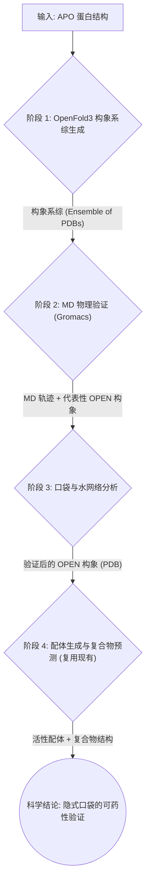

> [English documentation](Case_Cryptic_Pocket_Discovery.EN.md)

# 案例：隐式口袋发现工作流 (Cryptic Pocket Discovery Workflow)

## 1. 案例构想与科学问题

### 1.1 背景与挑战

在药物发现中，传统的结构优化工作流（Structure-Based Drug Design, SBDD）通常基于一个静态的蛋白结构（通常是 apo 态或与已知配体结合的复合物）来进行。然而，许多重要的药物靶点，如 **KRAS G12C**、**SHP2** 和 **BTK**，存在一种特殊的结合位点——**隐式口袋（Cryptic Pocket）**。

隐式口袋的特点是：
- 在蛋白的静态结构中（特别是 apo 态）**不存在或完全暴露**。
- 口袋的形成是**配体诱导契合（Induced Fit）**的结果，或者来源于蛋白动力学上的稀有构象状态。
- 传统的分子对接（Docking）算法假设蛋白是刚性的，因此**系统性地漏掉**这类重要的可药位点。

### 1.2 科学问题

本案例旨在解决以下核心科学问题：

> **如何构建一个可计算、可验证的闭环工作流，来预测、验证并利用蛋白的隐式口袋？**

具体而言，我们探索：
1.  **构象系综生成**：能否利用 OpenFold3（AlphaFold3 的开源复现版）AI 模型，通过模板扰动和配体诱导策略，生成能代表蛋白"易打开"状态的构象系综（Conformational Ensemble），作为隐式口袋的候选来源？
2.  **物理验证**：能否使用分子动力学（MD）模拟，特别是增强采样技术，在物理层面验证这些候选构象是否真的能打开口袋？
3.  **配体诱导闭环**：一旦口袋在物理模拟中被验证，能否在这个"打开的"构象上进行配体生成和复合物预测，并通过 FEP 等方法量化其结合优势？

### 1.3 研究价值

- **科学价值**：回答了"AI 预测的构象是否具有物理真实性"这一 AI for Science 领域的核心问题。
- **工程价值**：提供了一套自动化的工具链，将隐式口袋的发现从"依赖专家直觉和手工试验"转变为"可重复、可量化的计算流程"。
- **应用价值**：为针对 KRAS、MYC 等靶点的 first-in-class 药物设计提供了新的策略。

---

## 2. 工作流设计与任务分解

为了实现上述构想，我们设计了一个包含四个核心阶段的闭环工作流。WA-DD 平台将通过新增的 Worker 组件和复用现有组件来完整支持这一流程。

### 2.1 工作流数据流



### 2.2 任务分解与新增组件

| 阶段 | 任务描述 | WA-DD 组件 | 状态 |
| :--- | :--- | :--- | :--- |
| **1. OpenFold3 构象系综生成** | 利用 OpenFold3 模型，通过模板扰动和配体诱导策略，生成蛋白的多个候选构象。 | **新增**: `wa-dd-conformer-gen` (构象生成 Worker) | 🔄 开发中 |
| **2. MD 物理验证** | 使用 Gromacs 对候选构象进行增强采样的 MD 模拟，验证口袋打开。 | **新增**: `wa-dd-md-engine` (MD 模拟 Worker) | 🚀 规划中 |
| **3. 口袋与水网络分析** | 从 MD 轨迹中提取口袋开闭事件，并分析水分子的热力学贡献。 | **新增**: `wa-dd-pocket-analyzer` (口袋分析 Worker) | 🚀 规划中 |
| **4. 配体生成与复合物预测** | 在验证过的 OPEN 构象上生成配体，并通过 OpenFold3 预测复合物结构，FEP 验证。 | **复用**: `wa-dd-molecule-gen`, `wa-dd-fep` + OpenFold3 复合物预测 | ✅ 已就绪 / 新增 |

### 2.3 OpenFold3 构象系综生成策略

OpenFold3 没有内置 MSA 子采样功能，但通过以下两种互补策略生成构象多样性：

| 策略 | 原理 | 实施方式 |
| :--- | :--- | :--- |
| **模板扰动法** | OpenFold3 支持模板输入，不同模板诱导不同构象 | 对 KRAS G12C 提供 5 个模板：APO (4OBE)、GTP 态 (5VQ2)、GDP 态 (4TQ9)、Switch II OPEN (6GJ8)、随机扰动 APO |
| **配体诱导法** | OpenFold3 可直接输入配体预测复合物，不同配体诱导不同构象 | 输入 KRAS + 已知活性配体 (ARS-1620, MRTX849) + 片段库，预测 ~10 个构象 |

两种策略结合，可生成约 15-20 个候选构象。

---

## 3. 验证过程（单服务器渐进式方案）

我们将以 **KRAS G12C** 作为模式靶点来验证这一工作流。KRAS G12C 的 Switch II 区域存在一个经典的隐式口袋，当与共价抑制剂（如 ARS-1620）结合时会打开。

鉴于当前可用资源为单服务器（tc232/server6），我们采用**"金字塔式渐进验证"**策略，确保每一步都可在短期内完成并产出确定性证据。

### 3.1 四层渐进验证计划

| 层级 | 目标 | 计算任务 | 单服务器耗时 | 验证产出 |
| :--- | :--- | :--- | :--- | :--- |
| **L0: 基准验证** | FEP 能区分 Open vs APO 构象吗？ | 用 KRAS G12C 已知 OPEN (6GJ8) 和 APO (4OBE) 结构，计算配体 ARS-1620 类似物的 ΔΔG | 1-2 天 | FEP ΔΔG 结果表（显示 OPEN 构象 ΔG 显著优于 APO） |
| **L1: AI 预测** | OpenFold3 能预测出 OPEN 构象吗？ | OpenFold3 模板扰动 + 配体诱导，生成 ~15 个候选构象 | 半天 | 构象系综 + 与 6GJ8 的 RMSD 对比 |
| **L2: 物理验证** | AI 预测的构象在物理上稳定吗？ | 对 AI 最优构象 + 基准构象跑 5ns aMD，对比 RMSD 漂移 | 1-2 天 | MD 轨迹 + RMSD 演化曲线 |
| **L3: 闭环发现** | AI 发现的构象能诱导配体结合吗？ | 在 AI 验证构象上，PocketXMol 生成 10 个分子，OpenFold3 预测复合物结构，选 Top 3 跑 FEP | 3-5 天 | 新分子的 ΔΔG < 0（验证可药性） |

### 3.2 各层级详细步骤

#### L0: 基准验证（Day 1-2）
- **目标**：证明 WA-DD 的 FEP 管线能物理区分 OPEN 与 APO 构象。
- **输入**：KRAS G12C APO (PDB: 4OBE), KRAS G12C OPEN (PDB: 6GJ8), 配体 ARS-1620 类似物。
- **步骤**：
    1. 用 `wa-dd-protein-prep` 处理 4OBE 和 6GJ8。
    2. 用 `wa-dd-ligand-prep` 准备 ARS-1620 类似物。
    3. 用 `wa-dd-fep` 分别计算配体在两个构象上的结合 ΔG。
- **通过标准**：OPEN 构象的 ΔG 比 APO 构象优 -1.0 kcal/mol 以上。

#### L1: AI 预测（Day 3-4）
- **目标**：生成能代表 Switch II 区域不同状态的候选构象。
- **输入**：KRAS G12C APO (PDB: 4OBE), OpenFold3 模型权重。
- **步骤**：
    1. 用 `wa-dd-conformer-gen` 对 4OBE 运行 OpenFold3 模板扰动（5 个模板），生成 5 个构象。
    2. 用 `wa-dd-conformer-gen` 对 4OBE 运行 OpenFold3 配体诱导（5 个配体），生成 5 个构象。
    3. 计算每个构象与 6GJ8 Switch II 区域的 RMSD。
    4. 筛选 RMSD < 3.0Å 的候选构象（作为 L2 的输入）。
- **通过标准**：至少找到 1 个与 6GJ8 RMSD < 3.0Å 的构象。

#### L2: 物理验证（Day 5-8）
- **目标**：验证 AI 预测构象的物理稳定性。
- **输入**：L1 筛选出的 AI 构象 + 6GJ8 基准构象。
- **步骤**：
    1. 用 `wa-dd-md-engine` (Gromacs aMD) 对 3 个构象各跑 5ns 模拟。
    2. 用 `wa-dd-pocket-analyzer` 分析 RMSD 演化和口袋体积变化。
    3. 对比 AI 构象与 6GJ8 的 RMSD 漂移。
- **通过标准**：AI 构象的 RMSD 漂移 < 2.0Å（与 6GJ8 相当）。

#### L3: 闭环发现（Day 9-14）
- **目标**：验证 AI 发现的构象可被用于配体设计。
- **输入**：L2 验证过的 AI 构象。
- **步骤**：
    1. 用 `wa-dd-molecule-gen` (PocketXMol) 在 AI 构象上 de novo 生成 10 个分子。
    2. 用 OpenFold3 预测"蛋白 + 新配体"的复合物结构（替代原 Uni-Dock 对接）。
    3. 用 `wa-dd-fep` 计算 Top 3 的 ΔΔG。
- **通过标准**：至少 1 个新分子的 ΔΔG < 0（结合比基准配体更强）。

### 3.3 预期科学发现信号

1.  **AI 预测能力验证**：OpenFold3 通过模板扰动和配体诱导生成的构象中有多少比例能在 MD 模拟中稳定存在，且能观察到口袋打开。
2.  **动力学熵贡献**：通过对比不同构象的 FEP 结果，量化构象变化对结合自由能的贡献。
3.  **水分子角色**：分析 MD 轨迹中口袋打开时水分子的进出模式，识别可能的"不利水"（Unhappy Water）。
4.  **OpenFold3 复合物预测精度**：对比 OpenFold3 预测的复合物结构与 FEP 物理验证结果的一致性。

---

## 4. 开发进度

### 4.1 已完成
- **科学问题定义**：明确了隐式口袋发现的科学价值和技术路径。
- **工作流设计**：完成了从 OpenFold3 构象生成到 FEP 验证的完整数据流设计，以及单服务器渐进式验证方案。
- **现有组件集成**：确认了 `protein-prep`, `molecule-gen`, `fep` 等现有组件可直接复用。

### 4.2 进行中
- **`wa-dd-conformer-gen` Worker 设计与开发**：核心是集成 OpenFold3（AlphaFold3 开源复现版）进行模板扰动和配体诱导构象生成。OpenFold3 基于 Apache 2.0 许可，支持 CUDA 13（Thor），原生支持蛋白-配体复合物结构预测。

### 4.3 规划中
- **`wa-dd-md-engine` Worker 设计与开发**：集成 Gromacs，重点关注 aMD 参数的优化和 GPU 加速。
- **`wa-dd-pocket-analyzer` Worker 设计与开发**：集成 `fpocket` 和 `MDAnalysis` 进行轨迹分析。
- **API 与前端集成**：为新 Worker 设计 API 接口，并在 Web 界面添加相应的任务提交和结果展示页面。

### 4.4 里程碑
| 时间 | 里程碑 |
| :--- | :--- |
| **第一阶段 (Week 1)** | 完成 `wa-dd-conformer-gen` MVP，跑通 L1 OpenFold3 构象生成。 |
| **第二阶段 (Week 2)** | 完成 `wa-dd-md-engine` MVP，跑通 L0 基准 FEP + L2 物理验证。 |
| **第三阶段 (Week 3)** | 完成 `wa-dd-pocket-analyzer`，跑通 L3 闭环发现。 |
| **第四阶段 (Week 4)** | 集成所有组件，完成完整的四层验证工作流。 |

---

## 5. OpenFold3 模型权重与部署

### 5.1 模型权重下载

OpenFold3 是 AlphaFold3 的开源复现版，由哥伦比亚大学 AlQuraishi 实验室和 OpenFold 联盟开发，采用 Apache 2.0 许可（可商用）。

| 资源 | 下载方式 | 大小 | 说明 |
| :--- | :--- | :--- | :--- |
| **OpenFold3 模型参数** | `setup_openfold` 命令自动下载 | ~1-2GB | 包含 OpenFold3-preview2 模型权重 |
| **HuggingFace 手动下载** | `https://huggingface.co/OpenFold/OpenFold3` | ~1-2GB | 手动下载权重文件 |

**安装与下载方式**：
```bash
# 安装 OpenFold3
pip install openfold3

# 下载模型权重（自动）
setup_openfold

# 或手动下载
wget https://huggingface.co/OpenFold/OpenFold3/resolve/main/of3p2_ema.pt
mkdir -p /data/models/openfold3
cp of3p2_ema.pt /data/models/openfold3/
```

### 5.2 MSA 获取方式

OpenFold3 支持通过 ColabFold 公共服务器获取 MSA，无需本地数据库：

| 方式 | 空间占用 | 说明 |
| :--- | :--- | :--- |
| **ColabFold 公共服务器（推荐）** | 0GB | 通过 `colabfold.mmseqs.com` 远程获取 MSA |
| **本地 MMseqs2 数据库** | ~46GB (UniRef30) | 仅适用于大规模并行 |

### 5.3 Thor (CUDA 13) Docker 构建要点

OpenFold3 基于 PyTorch，需要验证 CUDA 13 兼容性。关键配置：

```dockerfile
# 基础镜像（与 FEP/Unidock Thor 版一致）
ARG OPENFOLD3_THOR_BASE_IMAGE=nvcr.io/nvidia/cuda:13.0.2-runtime-ubuntu24.04

# PyTorch + CUDA 13 支持
RUN pip install 'torch>=2.4.0' --index-url https://download.pytorch.org/whl/cu130

# OpenFold3
RUN pip install 'openfold3>=0.1.0'
RUN setup_openfold
```

**磁盘占用**：镜像 ~10GB + 模型权重 ~1-2GB = **~12GB**

### 5.4 最小验证命令

```bash
# KRAS G12C 序列
echo ">KRAS_G12C
MTEYKLVVVGAGGVGKSALTIQLIQNHFVDEYDPTIEDSYRKQVVIDGETCLLDILDTAGQEEYSAMRDQ
YMRTGEGFLCVFAINNTKSFEDIHQYREQIKRVKDSDDVPMVLVGNKCDLAARTVESRQAQDLARSYGIP
YIETSAKTRQGVEDAFYTLVREIRQH" > /tmp/kras_g12c.fasta

# 方式 1：蛋白单体预测
run_openfold predict --fasta_path=/tmp/kras_g12c.fasta

# 方式 2：蛋白+配体复合物预测（输入 JSON）
cat > /tmp/kras_ligand.json << EOF
{
  "name": "KRAS_G12C_ARS1620",
  "sequences": [
    {"protein": "MTEYKLVVVGAGGVGKSALTIQLIQNHFVDEYDPTIEDSYRKQVVIDGETCLLDILDTAGQEEYSAMRDQYMRTGEGFLCVFAINNTKSFEDIHQYREQIKRVKDSDDVPMVLVGNKCDLAARTVESRQAQDLARSYGIPYIETSAKTRQGVEDAFYTLVREIRQH"},
    {"smiles": "CC#CC(=O)NC1=CC=C(C=C1)NC(=O)N2CCN(CC2)C(=O)O"}
  ]
}
EOF
run_openfold predict --query_json=/tmp/kras_ligand.json

# 方式 3：模板扰动（指定模板 PDB）
cat > /tmp/kras_template.json << EOF
{
  "name": "KRAS_G12C_template_4OBE",
  "sequences": [
    {"protein": "MTEYKLVVVGAGGVGKSALTIQLIQNHFVDEYDPTIEDSYRKQVVIDGETCLLDILDTAGQEEYSAMRDQYMRTGEGFLCVFAINNTKSFEDIHQYREQIKRVKDSDDVPMVLVGNKCDLAARTVESRQAQDLARSYGIPYIETSAKTRQGVEDAFYTLVREIRQH"}
  ],
  "templates": [
    {"pdb": "4OBE", "chain_id": "A"}
  ]
}
EOF
run_openfold predict --query_json=/tmp/kras_template.json
```
