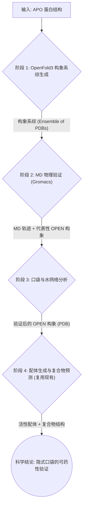

> [English documentation](Case_Cryptic_Pocket_Discovery.EN.md)

# 案例：隐式口袋发现工作流 (Cryptic Pocket Discovery Workflow)

## 1. 案例构想与科学问题

### 1.1 背景与挑战

在药物发现中，传统的结构优化工作流（Structure-Based Drug Design, SBDD）通常基于一个静态的蛋白结构（通常是 apo 态或与已知配体结合的复合物）来进行。然而，许多重要的药物靶点，如 **KRAS G12C**、**SHP2** 和 **BTK**，存在一种特殊的结合位点——**隐式口袋（Cryptic Pocket）**。

隐式口袋的特点是：
- 在蛋白的静态结构中（特别是 apo 态）**不存在或完全暴露**。
- 口袋的形成是**配体诱导契合（Induced Fit）**的结果，或者来源于蛋白动力学上的稀有构象状态。
- 传统的分子对接（Docking）算法假设蛋白是刚性的，因此**系统性地漏掉**这类重要的可药位点。

### 1.2 科学问题

本案例旨在解决以下核心科学问题：

> **如何构建一个可计算、可验证的闭环工作流，来预测、验证并利用蛋白的隐式口袋？**

具体而言，我们探索：
1.  **构象系综生成**：能否利用 OpenFold3（AlphaFold3 的开源复现版）AI 模型，通过模板扰动和配体诱导策略，生成能代表蛋白"易打开"状态的构象系综（Conformational Ensemble），作为隐式口袋的候选来源？
2.  **物理验证**：能否使用分子动力学（MD）模拟，特别是增强采样技术，在物理层面验证这些候选构象是否真的能打开口袋？
3.  **配体诱导闭环**：一旦口袋在物理模拟中被验证，能否在这个"打开的"构象上进行配体生成和复合物预测，并通过 FEP 等方法量化其结合优势？

### 1.3 研究价值

- **科学价值**：回答了"AI 预测的构象是否具有物理真实性"这一 AI for Science 领域的核心问题。
- **工程价值**：提供了一套自动化的工具链，将隐式口袋的发现从"依赖专家直觉和手工试验"转变为"可重复、可量化的计算流程"。
- **应用价值**：为针对 KRAS、MYC 等靶点的 first-in-class 药物设计提供了新的策略。

---

## 2. 工作流设计与任务分解

为了实现上述构想，我们设计了一个包含四个核心阶段的闭环工作流。当前 WA-DD 平台通过现有 OpenFold3、GROMACS、PocketXMol、FEP 和标准资产体系支持这一流程；口袋分析能力作为 GROMACS `pocket_discovery` 协议的一部分输出标准 `pocket` 资产。

闭环验证的具体执行步骤见：[隐式口袋闭环验证执行参考](隐式口袋闭环验证执行参考.md)。

### 2.1 工作流数据流

### 2.2 任务分解与组件状态

| 阶段 | 任务描述 | WA-DD 组件 | 状态 |
| :--- | :--- | :--- | :--- |
| **1. OpenFold3 构象系综生成** | 利用 OpenFold3 模型，通过模板扰动和配体诱导策略，生成蛋白的多个候选构象。 | `wa-dd-openfold3` | ✅ 已接入（`AssetFile.size` worker bug 已修复，2026-08-20 后镜像可用）；闭环内尚未实测一轮 |
| **2. MD 物理验证** | 使用 GROMACS 对候选构象进行增强采样的 MD 模拟，验证口袋打开。 | `wa-dd-gromacs` (`pocket_discovery` / aMD / analysis) | ✅ 已接入；闭环内尚未实测一轮 |
| **3. 口袋与水网络分析** | 从 MD 输出中提取口袋候选事件、体积曲线和候选口袋结构，注册为标准 `pocket` 资产；并把聚类代表构象组装为 `pocket_ensemble`（动态口袋集合）资产，供对接页按口袋扇出。 | `wa-dd-gromacs` 内置 pocket analyzer + pocket ensemble | ✅ 已接入（`pocket_ensemble` 与 ensemble 对接 2026-08-25 上线）；深度 fpocket/MDAnalysis 评分待增强 |
| **4. 配体生成与复合物预测** | 在验证过的 OPEN 构象上生成配体，并通过 OpenFold3 预测复合物结构，FEP 验证。 | `wa-dd-molecule-gen`, `wa-dd-openfold3`, `wa-dd-fep` | ✅ 已接入；FEP 引擎已加固并于 2026-08-23 在 PI3KA H1047R 上完整跑通正式 RBFE |

### 2.3 OpenFold3 构象系综生成策略

OpenFold3 没有内置 MSA 子采样功能，但通过以下两种互补策略生成构象多样性：

| 策略 | 原理 | 实施方式 |
| :--- | :--- | :--- |
| **模板扰动法** | OpenFold3 支持模板输入，不同模板诱导不同构象 | 对 KRAS G12C 提供 5 个模板：APO (4OBE)、GTP 态 (5VQ2)、GDP 态 (4TQ9)、Switch II OPEN (6GJ8)、随机扰动 APO |
| **配体诱导法** | OpenFold3 可直接输入配体预测复合物，不同配体诱导不同构象 | 输入 KRAS + 已知活性配体 (ARS-1620, MRTX849) + 片段库，预测 ~10 个构象 |

两种策略结合，可生成约 15-20 个候选构象。

---

## 3. 验证过程（单服务器渐进式方案）

我们将以 **KRAS G12C** 作为模式靶点来验证这一工作流。KRAS G12C 的 Switch II 区域存在一个经典的隐式口袋，当与共价抑制剂（如 ARS-1620）结合时会打开。

鉴于当前可用资源为单服务器（tc232/server6），我们采用**"金字塔式渐进验证"**策略，确保每一步都可在短期内完成并产出确定性证据。

### 3.1 四层渐进验证计划

| 层级 | 目标 | 计算任务 | 单服务器耗时 | 验证产出 |
| :--- | :--- | :--- | :--- | :--- |
| **L0: 基准验证** | FEP 能区分 Open vs APO 构象吗？ | 用 KRAS G12C 已知 OPEN (6GJ8) 和 APO (4OBE) 结构，计算配体 ARS-1620 类似物的 ΔΔG | 1-2 天 | FEP ΔΔG 结果表（显示 OPEN 构象 ΔG 显著优于 APO） |
| **L1: AI 预测** | OpenFold3 能预测出 OPEN 构象吗？ | OpenFold3 模板扰动 + 配体诱导，生成 ~15 个候选构象 | 半天 | 构象系综 + 与 6GJ8 的 RMSD 对比 |
| **L2: 物理验证** | AI 预测的构象在物理上稳定吗？ | 对 AI 最优构象 + 基准构象跑 5ns aMD，对比 RMSD 漂移 | 1-2 天 | MD 轨迹 + RMSD 演化曲线 |
| **L3: 闭环发现** | AI 发现的构象能诱导配体结合吗？ | 在 AI 验证构象上，PocketXMol 生成 10 个分子，OpenFold3 预测复合物结构，选 Top 3 跑 FEP | 3-5 天 | 新分子的 ΔΔG < 0（验证可药性） |

### 3.2 各层级详细步骤

#### L0: 基准验证（Day 1-2）
- **目标**：证明 WA-DD 的 FEP 管线能物理区分 OPEN 与 APO 构象。
- **输入**：KRAS G12C APO (PDB: 4OBE), KRAS G12C OPEN (PDB: 6GJ8), 配体 ARS-1620 类似物。
- **步骤**：
    1. 用 `wa-dd-protein-prep` 处理 4OBE 和 6GJ8。
    2. 用 `wa-dd-ligand-prep` 准备 ARS-1620 类似物。
    3. 用 `wa-dd-fep` 分别计算配体在两个构象上的结合 ΔG。
- **通过标准**：OPEN 构象的 ΔG 比 APO 构象优 -1.0 kcal/mol 以上。

#### L1: AI 预测（Day 3-4）
- **目标**：生成能代表 Switch II 区域不同状态的候选构象。
- **输入**：KRAS G12C APO (PDB: 4OBE)，平台已接入的 OpenFold3 结构预测能力。
- **步骤**：
    1. 用 `wa-dd-openfold3` 对 4OBE 运行 OpenFold3 模板扰动（5 个模板），生成 5 个构象。
    2. 用 `wa-dd-openfold3` 对 4OBE 运行 OpenFold3 配体诱导（5 个配体），生成 5 个构象。
    3. 计算每个构象与 6GJ8 Switch II 区域的 RMSD。
    4. 筛选 RMSD < 3.0Å 的候选构象（作为 L2 的输入）。
- **通过标准**：至少找到 1 个与 6GJ8 RMSD < 3.0Å 的构象。

#### L2: 物理验证（Day 5-8）
- **目标**：验证 AI 预测构象的物理稳定性。
- **输入**：L1 筛选出的 AI 构象 + 6GJ8 基准构象。
- **步骤**：
    1. 用 `wa-dd-gromacs` 的 `pocket_discovery` / aMD 协议对 3 个构象各跑 5ns 模拟。
    2. 用 GROMACS 内置 pocket analyzer 输出 `pocket_analyzer_report.json`、`pocket_events.csv`、`pocket_volume.csv` 和标准 `pocket` 资产。
    3. 对比 AI 构象与 6GJ8 的 RMSD 漂移。
- **通过标准**：AI 构象的 RMSD 漂移 < 2.0Å（与 6GJ8 相当）。

#### L3: 闭环发现（Day 9-14）
- **目标**：验证 AI 发现的构象可被用于配体设计。
- **输入**：L2 验证过的 AI 构象。
- **步骤**：
    1. 用 `wa-dd-molecule-gen` (PocketXMol) 在 AI 构象上 de novo 生成 10 个分子。
    2. 用 OpenFold3 预测"蛋白 + 新配体"的复合物结构（替代原 Uni-Dock 对接）。
    3. 用 `wa-dd-fep` 计算 Top 3 的 ΔΔG。
- **通过标准**：至少 1 个新分子的 ΔΔG < 0（结合比基准配体更强）。

### 3.3 预期科学发现信号

1.  **AI 预测能力验证**：OpenFold3 通过模板扰动和配体诱导生成的构象中有多少比例能在 MD 模拟中稳定存在，且能观察到口袋打开。
2.  **动力学熵贡献**：通过对比不同构象的 FEP 结果，量化构象变化对结合自由能的贡献。
3.  **水分子角色**：分析 MD 轨迹中口袋打开时水分子的进出模式，识别可能的"不利水"（Unhappy Water）。
4.  **OpenFold3 复合物预测精度**：对比 OpenFold3 预测的复合物结构与 FEP 物理验证结果的一致性。

---

## 4. 开发进度

### 4.1 已完成
- **科学问题定义**：明确了隐式口袋发现的科学价值和技术路径。
- **工作流设计**：完成了从 OpenFold3 构象生成到 FEP 验证的完整数据流设计，以及单服务器渐进式验证方案。
- **现有组件集成**：`openfold3`、`gromacs`、`molecule-gen`、`fep` 等组件已纳入同一资产链。
- **Pocket analyzer MVP**：GROMACS `pocket_discovery` 输出可登记 `md_result`、候选 `pocket` 资产和可打包下载的完整结果文件。
- **FEP 引擎加固与全流程贯通（2026-08-23，server6）**：修复三连环根因（受体原子冲突进入传播、映射原子 3D 偏差过大进入 hybrid topology、openmmtools FIRE 最小化对高应变体系松弛不足），并追加受体温和加固（辅因子预检、末端自动重建、未解析侧链自动截 ALA）。PI3KA H1047R 正式 RBFE 首次完整跑通（任务 `42bdf7f8`，ΔΔG = 19.02 ± 10.60 kcal/mol），修复已固化为代码（`bfba633`、`1775440`、`378060f`）并部署 amd/thor 双端镜像。
- **动态口袋集合与 ensemble 对接（2026-08-25，`133acb5`）**：GROMACS `pocket_discovery` 解析 `cluster.log` 聚类表、拆分聚类代表构象并按构象重新计算口袋残基组成，登记 `pocket_ensemble` 资产（含聚类占比、每口袋代表结构/口袋 PDB）。对接页口袋选择器可直接选择动态口袋集合，Uni-Dock 按"口袋 × 配体"扇出，pose library 记录 `WA_DD_POCKET_*` 属性并输出跨口袋共识排序；MD 派生 `md_structure` 也可直接作为对接/生成受体。amd/thor 镜像已构建并部署 server6。

### 4.2 进行中
- **KRAS G12C L0 基准验证（server6，已完成 2026-08-24）**：L0 两个正式 RBFE 全流程跑通（APO `6273dcd5`、OPEN `484407ba`，可复现流程见执行参考 5.1 节）。Adagrasib 边 ΔΔΔG = **-1.91 kcal/mol**（OPEN 优于 APO，方向支持隐式口袋假设；合并误差 ±7.6，统计不显著，需更长采样或更同源配体对加强）。Sotorasib 边两次结果均发散（-99 / 3e+13），已触发“低可靠性标注”开发（`7a55400`，已部署）。
- **OpenFold3 构象生成验证**：`AssetFile.size` worker bug 已修复（`a43b816`，2026-08-20 后镜像包含），模板扰动和配体诱导预测待在 server6 重提并筛选——这是闭环的下一步（L1）。

### 4.3 规划中
- **Pocket analyzer 深度增强**：聚类代表构象→`pocket_ensemble` 已交付（见 4.1）；在标准 `pocket` 资产合同不变的前提下，继续补充 `fpocket`、`MDAnalysis`、水网络和逐帧口袋事件评分。
- **案例验证数据**：用 KRAS G12C 示例补齐 L0-L3 的实际输出、截图和阈值证据。
- **蛋白准备源头修复**：默认准备产物输出链内式末端（缺 H1/H2/H3、OXT）；当前由 FEP worker 运行时兜底重建，源头修复待做。
- **ABFE 评估**：当前 FEP 仅支持 RBFE，构象间比较依赖同配体对双 RBFE 差值；如需绝对 ΔG 需评估引入 ABFE 协议。

### 4.4 里程碑
| 时间 | 里程碑 | 状态 |
| :--- | :--- | :--- |
| **第一阶段 (Week 1)** | 用 `wa-dd-openfold3` 跑通 L1 构象生成和候选筛选。 | 待开始（bug 已修复，可重试） |
| **第二阶段 (Week 2)** | 用 `wa-dd-gromacs` 跑通 L0 基准 FEP + L2 物理验证。 | ✅ L0 完成（2026-08-24，APO+OPEN 两个正式 RBFE 全流程，ΔΔΔG = -1.91 kcal/mol 方向正确但不确定度大）；L2 待 L1 产出 |
| **第三阶段 (Week 3)** | 基于 GROMACS pocket analyzer 输出标准 `pocket` 资产并跑通 L3 闭环发现。 | 待开始 |
| **第四阶段 (Week 4)** | 增强 fpocket/MDAnalysis 评分、补齐水网络分析和完整案例证据。 | 待开始 |
| **(2026-08-23 插入)** | FEP 引擎加固 + PI3KA 全流程贯通。 | ✅ 完成 |

---

## 5. 平台界面操作与资产流

当前案例面向 WA-DD 已部署实例。普通用户不需要手工安装 OpenFold3、下载模型权重、编写 Dockerfile 或进入容器执行命令；这些属于平台组件运维范围。案例中的 L0-L3 工作应尽量通过 Web 界面完成，并把每一步输出登记为项目资产。

### 5.1 界面入口

| 工作 | 页面入口 | 主要输入 | 主要输出 |
| :--- | :--- | :--- | :--- |
| 结构准备 | 蛋白处理 | PDB ID 或上传 PDB/CIF | `protein` / `prepared_protein` 资产 |
| 配体准备 | 配体处理 | SDF、SMILES、表格或手绘分子 | `ligand` / `prepared_ligand` 资产 |
| 构象生成 | 结构预测 | 蛋白资产、模板/配体诱导参数 | OpenFold3 结构结果资产 |
| MD 与口袋分析 | GROMACS / MD | 蛋白/复合物/拓扑/轨迹资产，`pocket_discovery` 协议 | `md_result`、`pocket_analyzer_report.json`、`pocket_events.csv`、`pocket_volume.csv`、标准 `pocket` 资产、动态口袋集合 `pocket_ensemble` 资产 |
| 分子生成 | 分子生成 | 标准 `pocket` 资产和生成约束 | 候选分子 SDF 资产 |
| FEP 验证 | FEP / 分析 | 同系列配体、复合物或对接/生成结果 | FEP 结果表和可下载结果资产 |

### 5.2 标准资产衔接

- GROMACS `pocket_discovery` 会把口袋分析结果写入同一个任务输出，并在存在代表结构时生成标准 `pocket` 资产。
- `pocket_discovery` 同时登记 `pocket_ensemble`（动态口袋集合）资产；“对接任务”页的口袋选择器可直接选择它，无需再选蛋白，系统按每个口袋的聚类代表构象扇出对接，并在 pose library 中标注口袋来源与聚类占比。
- 标准 `pocket` 资产可直接被“对接任务”和“分子生成”页面选择，不需要手动复制中心坐标或文件路径。
- 任务右上角的输出按钮会列出任务登记的资产；“打包下载全部输出”会下载该任务的全部结果文件。
- 每个结果文件仍可在资产详情中单独打开或下载，适合检查 `json`、`csv`、`xvg`、`pdb`、`gro`、`log` 等输出。

### 5.3 仍需人工判断的部分

平台可以完成数据流和计算调度，但隐式口袋案例仍需要研究者根据科学问题做筛选：

- 选择 APO、OPEN、配体诱导或模板扰动构象作为对照。
- 判断 RMSD、口袋体积、候选残基和 FEP ΔΔG 是否支持“口袋可药”结论。
- 对当前 MVP pocket analyzer 的几何候选口袋进行人工复核；更深入的 fpocket、MDAnalysis、水网络和多帧事件评分仍属于后续增强。
